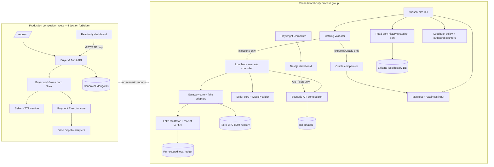
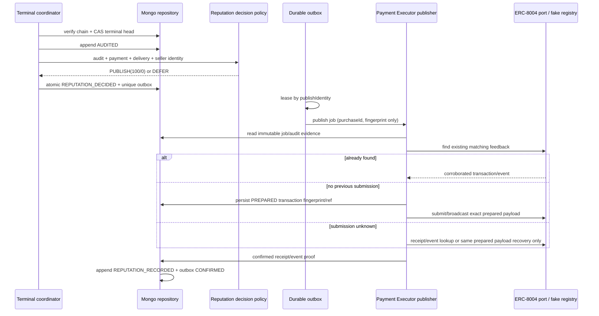

# Phase 6 설계 개정 릴레이 아티팩트

- 작성 역할: Planner lane
- 기준 저장소: `/Users/vien/MyProjects/PBL`
- 기준 시점: 2026-09-04, `main@8886745`
- upstream 요구사항 SHA-256: `65824ffab8bbc11a23d29fba7610b0c72e4426409c88eced1c0b8d109f4e5f4f`
- 현재 design SHA-256: `f611d7a3e50d5f19cb742a1fe4f8261dfa082d4b37a620e414ed8ff5f21c8d04`
- 의미상 대상 파일: `aidlc-docs/inception/design.md`
- 승인된 종료점: 정상·전체 비정상 LOCAL E2E와 AWS deploy-readiness 완료 후 실제 AWS mutation 직전에 정지

## 릴레이 계약

릴레이 담당자는 아래 `BEGIN`과 `END` 사이의 Markdown을 **바이트 단위로 그대로** `aidlc-docs/inception/design.md`의 마지막 줄 뒤에 한 번만 추가한다. 기존 설계 본문·결정·승인 문구를 수정, 이동, 삭제, 요약하거나 아래 블록을 의미상 재작성하지 않는다.

릴레이 전 다음을 확인한다.

1. 대상 파일이 `## 17. Design Approval`을 포함한다.
2. 대상 파일에 `P6-DES-01` 또는 `BEGIN PHASE6 DESIGN APPEND`가 없다.
3. upstream `aidlc-docs/inception/requirements.md`에 hash-verified Phase 6 block과 `P6-US-01`이 존재한다.
4. 기준선이 다르거나 이미 릴레이된 경우 자동 병합하지 않고 Planner에게 반환한다.

릴레이 후에는 기존 design bytes가 새 파일의 exact prefix인지, 아래 marker block이 source와 byte-for-byte 같은지, `P6-DES-*` 정의가 중복되지 않는지 확인한다. 이 outbox 아티팩트 자체는 canonical design이 아니다.

<!-- BEGIN PHASE6 DESIGN APPEND -->

## 18. Phase 6 Design Revision — Safe Local Scenario Evidence and Reputation Loop

### 18.1 Amendment contract

이 절은 1–17절의 승인된 설계를 보존하는 append-only 개정이다. 기존 production 아키텍처, PBLC V2 ERC-3009 단일 실행 경로, provider/model adapter 경계, `purchaseId` 상관관계, Commerce Gateway만의 chain-write 권한, MongoDB append-only history, dashboard read-only 경계를 약화하지 않는다.

Phase 6의 구현 대상은 **격리된 LOCAL E2E와 그에 필요한 production-safe seam**이다. 다음은 설계상 명시적 비대상이다.

- Base Sepolia anomaly transaction, ERC-8004 live feedback, 새 PBLC transfer
- Gemini/Nemotron live credential 또는 필수 외부 호출
- dashboard/user request flow의 scenario runner 또는 experiment page
- AWS/Atlas 리소스 create/update/delete와 `terraform apply/import/destroy`
- 기존 MongoDB 성공·실패·미완결 문서의 mutation/backfill

### 18.2 Phase 6 design decisions

| ID | 결정 | 근거와 보존 효과 |
|---|---|---|
| **P6-DES-01** | scenario harness는 production app의 feature flag가 아니라 별도 dev-only composition root와 CLI/workspace다. | injection field가 production HTTP/config에 도달하지 않으며 dashboard에 runner를 만들지 않는다. |
| **P6-DES-02** | catalog의 `injections`와 `expectedOracle`을 로드 직후 분리한다. test doubles에는 injection만, comparator에는 expected oracle만 전달한다. | fake가 expected result를 그대로 되돌리는 self-fulfilling test를 막는다. |
| **P6-DES-03** | production guard를 먼저 실행하고, 의도적 위반은 guard 결과가 확인된 뒤 scenario-only evidence seam 또는 fake boundary에서 만든다. | runtime 예산·견적·서명·idempotency 검증을 약화하지 않는다. |
| **P6-DES-04** | `lifecycleStatus`, `paymentStatus`, `auditStatus`, `evidenceSource`를 순수 projection으로 계산한다. GET handler는 audit/reconciliation/reputation을 실행하지 않는다. | 상태 의미를 직교화하고 read side effect를 제거한다. |
| **P6-DES-05** | payment terminal outcome은 payment-intent CAS와 모든 신규 terminal event가 공유하는 `terminalOutcomeKey` unique index로 이중 보호한다. | `SETTLED`, `FAILED`, `MISMATCH_CONFIRMED`, `RECONCILED_NO_TRANSFER`의 동시 중복을 막는다. |
| **P6-DES-06** | terminal audit, reputation decision, durable outbox 생성은 Mongo transaction과 recovery sweep으로 연결한다. | process crash·worker race에서도 audit/feedback 의도가 유실되거나 중복되지 않는다. |
| **P6-DES-07** | ERC-8004 selection signal은 provider-level seller agent snapshot이며 hard filter 후 기존 reputation 10% component에만 들어간다. | reputation이 budget/identity/capability 등 hard constraint를 우회하지 못한다. |
| **P6-DES-08** | synthetic transaction은 discriminated union의 `LOCAL` variant와 `localtx:` namespace만 사용한다. | EVM hash 필드와 BaseScan link로 승격될 수 없다. |
| **P6-DES-09** | scenario DB와 history reader는 서로 다른 client capability와 database를 사용한다. cleanup capability는 attested ephemeral DB만 drop할 수 있다. | canonical history를 cleanup 코드에서 구조적으로 분리한다. |
| **P6-DES-10** | actual browser E2E에는 Playwright Chromium 하나만 새 dev dependency로 도입하고 나머지는 현재 Pytest, Node test, FastAPI/httpx, native Mongo, npm scripts를 재사용한다. | source-regex test만으로 UI E2E를 대체하지 않으면서 dependency 증가를 제한한다. |
| **P6-DES-11** | AWS readiness는 local files를 읽는 pure renderer로 만든다. AWS SDK/CLI 또는 Terraform 실행 capability를 주입하지 않는다. | checklist 생성 자체가 AWS mutation을 일으킬 수 없다. |

### 18.3 Component and data-flow design



정상 production entrypoint인 `buyer_audit_api.main`, `services/commerce-gateway/src/main.ts`, `services/seller-service/src/main.ts`는 scenario module을 import하지 않는다. scenario entrypoint는 기존 core/port를 import할 수 있지만 반대 방향 import는 금지한다. Docker/AWS build context에는 test-support entrypoint를 실행 명령으로 포함하지 않는다.

### 18.4 Exact module and file plan

#### 18.4.1 Shared schemas and catalog

| 상태 | 경로 | 책임 |
|---|---|---|
| NEW | `packages/schemas/common/phase6-scenario-envelope.schema.json` | catalog/version/run metadata, injection discriminant, oracle envelope의 JSON Schema Draft 2020-12 계약 |
| NEW | `packages/schemas/domains/ai_inference/phase6-scenario.schema.json` | AI 후보·설명·결제·semantic injection의 allow-list와 conditional fields |
| NEW | `tools/phase6-e2e/catalog/phase6.v1.json` | `P6-N00` 및 `P6-A01..A11`의 승인된 seed, frozen clock, injection, expected oracle |
| MODIFY | `scripts/validate_schemas.mjs` | 새 schema의 domain/common 분리와 catalog version/hash 검증; 실제 instance validation은 아래 Pydantic model이 수행 |

catalog instance는 각 scenario마다 다음 필드를 가진다. 모든 object는 `additionalProperties: false`다.

```json
{
  "scenarioId": "P6-A04-WRONG-AMOUNT",
  "catalogVersion": "phase6.v1",
  "seed": "p6-a04-v1",
  "frozenClock": "2026-09-04T12:00:00Z",
  "domain": "ai_inference",
  "requestFixture": "two-eligible-candidates",
  "injections": [{"kind": "PAYMENT_PROOF_WRONG_AMOUNT", "actualAmountUnits": 200000}],
  "expectedOracle": {
    "paymentStatus": "PAYMENT_MISMATCH_CONFIRMED",
    "auditStatus": "AUDITED_RISK",
    "ruleIds": ["AUD-QUOTE-PAYMENT-MISMATCH"],
    "mismatchedFields": ["amount"],
    "acceptedTransfers": 1,
    "rejectedTransfers": 0,
    "feedbackValues": [0]
  }
}
```

CLI는 `--all`, `--scenario <allow-listed ID>`, `--keep-artifacts`만 받는다. catalog 경로, expected oracle, URL, DB name, RPC URL, shell command, wallet key는 CLI 입력으로 받지 않는다. `catalogHash = sha256(RFC8785(catalog))`를 manifest에 고정한다.

#### 18.4.2 Buyer/Audit API modules

| 상태 | 경로 | 책임 |
|---|---|---|
| MODIFY | `services/buyer-audit-api/src/buyer_audit_api/core/models.py` | 신규 event enum과 source/scenario metadata value objects |
| MODIFY | `services/buyer-audit-api/src/buyer_audit_api/core/payment.py` | terminal states, reconciliation check, mismatch/no-transfer transition과 actual-spend accounting |
| MODIFY | `services/buyer-audit-api/src/buyer_audit_api/core/audit.py` | pure deterministic evaluation, structured finding, Phase 6 ruleset |
| NEW | `services/buyer-audit-api/src/buyer_audit_api/core/projections.py` | append-only events → canonical orthogonal status/transaction projection; side-effect 없음 |
| NEW | `services/buyer-audit-api/src/buyer_audit_api/core/reputation.py` | reputation snapshot DTO, aggregation policy, feedback decision, publish identity/fingerprint |
| NEW | `services/buyer-audit-api/src/buyer_audit_api/core/terminal.py` | terminal eligibility, audit finalize, reputation decision/outbox coordinator, recovery sweep |
| MODIFY | `services/buyer-audit-api/src/buyer_audit_api/core/ports.py` | projection/read, atomic terminal/outbox, snapshot repository ports 분리 |
| MODIFY | `services/buyer-audit-api/src/buyer_audit_api/adapters/repositories/memory.py` | 신규 port의 unit-test reference 구현 |
| MODIFY | `services/buyer-audit-api/src/buyer_audit_api/adapters/repositories/mongo.py` | 신규 events/states, indexes, atomic audit+outbox, lease/CAS, snapshots |
| NEW | `services/buyer-audit-api/src/buyer_audit_api/adapters/reputation_gateway.py` | Payment Executor의 read-only ERC-8004 query와 publish dispatcher HTTP adapter |
| MODIFY | `services/buyer-audit-api/src/buyer_audit_api/domains/ai_inference/models.py` | `ReputationScoreEvidence`, candidate/decision snapshot references |
| MODIFY | `services/buyer-audit-api/src/buyer_audit_api/domains/ai_inference/ports.py` | `SellerReputationProvider` port |
| MODIFY | `services/buyer-audit-api/src/buyer_audit_api/domains/ai_inference/workflow.py` | identity 확인 후 reputation snapshot 조회·QUOTED 고정; faithful decision writer seam |
| MODIFY | `services/buyer-audit-api/src/buyer_audit_api/domains/ai_inference/selection.py` | benchmark의 legacy reputation 대신 candidate seller snapshot을 10% component에 사용 |
| MODIFY | `services/buyer-audit-api/src/buyer_audit_api/api/schemas.py` | canonical projection, transaction union, structured finding, provenance response DTO |
| MODIFY | `services/buyer-audit-api/src/buyer_audit_api/api/app.py` | read-only query service, 신규 internal terminal/outbox endpoints, terminal coordinator 호출 |
| MODIFY | `services/buyer-audit-api/src/buyer_audit_api/composition.py` | production adapters만 wiring; scenario env rejection |
| NEW | `services/buyer-audit-api/src/buyer_audit_api/core/runtime_guard.py` | reserved injection env/field fail-closed 검사 |
| MODIFY | `services/buyer-audit-api/src/buyer_audit_api/main.py` | production root에서 runtime guard 실행 |

scenario code는 production core의 하위가 아니라 바깥쪽 adapter다.

| 상태 | 경로 | 책임 |
|---|---|---|
| NEW | `services/buyer-audit-api/src/buyer_audit_api/scenarios/models.py` | Pydantic catalog/injection/oracle model; extra forbid |
| NEW | `services/buyer-audit-api/src/buyer_audit_api/scenarios/catalog.py` | fixed path catalog load, schema/version/hash/ID validation, oracle 분리 |
| NEW | `services/buyer-audit-api/src/buyer_audit_api/scenarios/injections.py` | decision evidence decorator와 budget-rejection 후 synthetic lifecycle writer |
| NEW | `services/buyer-audit-api/src/buyer_audit_api/scenarios/repository.py` | 모든 repository port 호출의 event payload에 attested scenario metadata를 주입하는 local-only decorator |
| NEW | `services/buyer-audit-api/src/buyer_audit_api/scenarios/mongo_guard.py` | ephemeral DB attestation, sentinel, exact cleanup, history snapshot read capability |
| NEW | `services/buyer-audit-api/src/buyer_audit_api/scenarios/composition.py` | frozen clock, deterministic IDs, fake identity/reputation/gateway clients를 주입한 scenario container |
| NEW | `services/buyer-audit-api/src/buyer_audit_api/scenarios/control.py` | random bearer token의 loopback-only control API; production OpenAPI에 미포함 |
| NEW | `services/buyer-audit-api/src/buyer_audit_api/scenarios/main.py` | `127.0.0.1` 전용 scenario entrypoint; `buyer_audit_api.main`과 별개 |

#### 18.4.3 Payment Executor and Seller modules

| 상태 | 경로 | 책임 |
|---|---|---|
| MODIFY | `services/commerce-gateway/src/contracts.ts` | terminal proof, local/EVM transaction union, reconciliation and reputation job ports |
| MODIFY | `services/commerce-gateway/src/gateway.ts` | receipt mismatch 분류, bounded reconciliation result 전달; exact settlement guard 유지 |
| MODIFY | `services/commerce-gateway/src/erc8004.ts` | durable job identity, prepared submission/recovery, query provenance |
| MODIFY | `services/commerce-gateway/src/adapters/http.ts` | 신규 evidence/outbox/reputation query endpoints |
| MODIFY | `services/commerce-gateway/src/adapters/viem-erc8004.ts` | matching feedback log query, block/log/client/tags provenance, prepared EVM submission adapter |
| MODIFY | `services/commerce-gateway/src/main.ts` | production env guard, live publisher default disabled until external gate; injection key 거부 |
| NEW | `services/commerce-gateway/src/runtime-guard.ts` | `PBL_SCENARIO_*`, `SCENARIO_INJECTIONS`, `localtx:` configuration 거부 |
| NEW | `services/commerce-gateway/tests/support/local-ledger.ts` | 6-decimal balances, ERC-3009 nonce set, accepted/rejected attempt journal |
| NEW | `services/commerce-gateway/tests/support/fake-boundaries.ts` | fake facilitator, receipt reader, identity, ERC-8004 registry; loopback/in-process only |
| NEW | `services/commerce-gateway/tests/support/scenario-server.ts` | real `CommerceGateway` core를 fake ports로 조합하는 local-only server |
| REUSE | `services/seller-service/src/adapters/mock.ts` | deterministic inference provider; seed-derived prefix/version |
| NEW | `services/seller-service/src/runtime-guard.ts` | production root injection configuration 거부 |
| MODIFY | `services/seller-service/src/main.ts` | runtime guard를 production composition 전에 호출 |
| NEW | `services/seller-service/tests/support/scenario-server.ts` | `SellerEngine`, `SellerApplication`, `SellerHttpTransport`, `MockProviderAdapter`, deterministic clock/ID, fake facilitator client 조합 |

test-support files는 service TypeScript build/test에는 포함하지만 Docker runtime entrypoint와 package public export에는 포함하지 않는다. Gemini/Nemotron adapters에는 scenario branch를 추가하지 않는다.

#### 18.4.4 Dashboard, E2E tool, and readiness

| 상태 | 경로 | 책임 |
|---|---|---|
| MODIFY | `apps/dashboard/src/lib/types.ts` | projection/transaction/provenance discriminated DTO |
| MODIFY | `apps/dashboard/src/components/status.tsx` | payment와 audit badge를 별도 렌더링 |
| NEW | `apps/dashboard/src/components/evidence-source.tsx` | synthetic/history/Base source label과 safe transaction link |
| MODIFY | `apps/dashboard/src/components/{overview,purchase-list,purchase-detail,alerts,agents}.tsx` | read-only Phase 6 fields와 structured finding/provenance 표시 |
| MODIFY | `apps/dashboard/src/components/Nav.tsx` | 기존 메뉴 불변; test가 `/request`, `/experiments`, scenario route 부재를 재검증 |
| MODIFY | `apps/dashboard/tests/request-boundary.test.mjs` | runner/write control 및 raw `localtx:` BaseScan interpolation 금지 |
| NEW | `tools/phase6-e2e/package.json` | private dev-only workspace; 유일한 신규 외부 dev dependency `@playwright/test` |
| NEW | `tools/phase6-e2e/tsconfig.json` | strict NodeNext build |
| NEW | `tools/phase6-e2e/src/{orchestrator,process-manager,port-allocator,network-policy,manifest}.ts` | one-command process graph, deterministic ports, teardown, counters, report |
| NEW | `tools/phase6-e2e/playwright.config.ts` | Chromium, single worker, retry 0, trace/screenshot on failure |
| NEW | `tools/phase6-e2e/tests/phase6-dashboard.spec.ts` | authenticated actual browser assertions for every scenario |
| MODIFY | `package.json` | workspace 등록과 `test:e2e:local`; 기존 scripts 의미 불변 |
| NEW | `scripts/generate_aws_deploy_readiness.mjs` | local manifest/Terraform text/env-name inventory의 pure renderer |
| NEW | `docs/AWS_DEPLOY_READINESS.md` | generated deployment checklist와 `AWAITING_AWS_DEPLOYMENT_APPROVAL` stop status |

### 18.5 Ports, interfaces, and canonical data types

#### 18.5.1 Scenario identities and deterministic factories

- `runId = sha256(catalogVersion + ":" + scenarioId + ":" + seed)[0:32]`: 같은 catalog/ID/seed에서 동일하다.
- `executionId = random UUID`: 동시에 같은 scenario를 실행해도 DB/temp/process namespace가 충돌하지 않게 한다. 결과 oracle에는 영향을 주지 않는다.
- `purchaseId`, `eventId`, quote IDs, fake receipt IDs는 `runId`를 namespace로 한 UUIDv5/counter factory로 만든다.
- DB 이름은 `pbl_phase6_<executionIdHex>`이며 regex `^pbl_phase6_[0-9a-f]{32}$`를 만족해야 한다.
- local transaction ID는 `^localtx:[0-9a-f]{32}:(payment|feedback):[0-9]{6}$`다.
- frozen clock은 Python `Clock.now()`와 Node `Clock.nowSeconds()`에 같은 instant를 주입하며 scenario step마다 catalog가 정한 tick만 진행한다.

#### 18.5.2 Transaction reference union

Python Pydantic와 dashboard TypeScript는 같은 discriminated union을 사용한다.

```text
EvmTransactionRef {
  kind: "EVM", hash: /^0x[0-9a-f]{64}$/,
  chainId: 84532, evidenceSource: "BASE_SEPOLIA_VERIFIED" | "HISTORICAL_ON_CHAIN",
  blockNumber?: integer, logIndex?: integer
}
LocalTransactionRef {
  kind: "LOCAL", id: /^localtx:/,
  evidenceSource: "SYNTHETIC_LOCAL", runId: string
}
```

`transactionHash` persistence/API field에는 EVM regex만 허용한다. `localTransactionId`에는 `0x` 값을 거부한다. 한 payload에 두 필드가 함께 있으면 validation error다. legacy `transaction_hash` response는 EVM variant에만 채우고 local variant에서는 항상 `null`이다.

#### 18.5.3 Core ports

```text
PurchaseProjectionService.project(events, paymentIntent?) -> PurchaseProjection
AuditEvaluator.evaluate(events, rulesetVersion) -> AuditDraft
TerminalAuditCoordinator.finalizeIfEligible(purchaseId) -> TerminalResult
ReputationDecisionPolicy.decide(audit, paymentProof, delivery, sellerIdentity)
  -> Publish(value, reasonCodes) | Defer(reasonCode)
ReputationSnapshotProvider.snapshot(sellerAgentId, erc8004AgentId, queryScope)
  -> ReputationSnapshot
ReputationOutboxRepository.enqueueAtomic(auditEvent, decisionEvent, job)
ReputationOutboxRepository.claim(workerId, leaseUntil) -> PublishJob | None
ReputationOutboxRepository.markPrepared(jobId, payloadFingerprint, transactionRef)
ReputationOutboxRepository.markConfirmed(jobId, receiptProof)
HistorySnapshotPort.capture() -> HistorySnapshotDigest
ScenarioRunStore.attest/create/cleanup(executionId, databaseName, sentinelHash)
```

`EvidenceRepository`에는 generic scenario bypass를 추가하지 않는다. scenario-only `SyntheticLifecycleWriter`는 `buyer_audit_api.scenarios`에 있고 `ScenarioRunStore` attestation token 없이는 생성할 수 없다. production container type에는 이 port가 없다.

Gateway `EvidenceApi`에는 다음 typed operations를 추가한다.

```text
recordReconciliationCheck(ReconciliationCheck) -> PaymentIntent
confirmMismatch(ConfirmedMismatchProof) -> PaymentIntent
reconcileNoTransfer(NoTransferProof) -> PaymentIntent
claimReputationJob(publishIdentity, workerId) -> ReputationPublishJob
markReputationPrepared(jobId, fingerprint, transactionRef) -> ReputationPublishJob
confirmReputation(jobId, receiptProof) -> void
recordRejectedPaymentAttempt(RejectedAttemptProof) -> void  # scenario root only
```

`recordRejectedPaymentAttempt`는 production `EvidenceHttpClient`/server route에 노출하지 않는다. scenario server가 attested run repository에 직접 쓰는 test-support port다.

`PaymentRepository.transition_payment_intent`의 reservation action은 기존 `hold|settle|release`에 `replace_with_actual`을 추가한다. 이 action은 quoted-token reservation `Q`를 제거하고 같은 token의 actual outflow `A`를 spent에 더하며 `confirmedOutflows` insert와 terminal event를 한 transaction에서 수행한다. wrong-token이면 quoted reservation은 `release`, actual token outflow는 immutable `confirmedOutflows`로 기록한다.

#### 18.5.4 Reputation snapshot

```text
ReputationSnapshot {
  snapshotId, sellerAgentId, erc8004AgentId,
  chainId, registryAddress, trustedClients[], tag1, tag2,
  fromBlock, toBlock, queriedAt, eventCount,
  rawValues[{value, valueDecimals, clientAddress, blockNumber, logIndex, transactionRef}],
  aggregationMethod: "ARITHMETIC_MEAN_V1",
  derivedScore: 0..100,
  freshness: {status: "FRESH"|"STALE"|"NO_EVIDENCE", ageSeconds?},
  evidenceSource, snapshotHash
}
```

matching trusted event가 없으면 `derivedScore=50`, `eventCount=0`, `freshness.status=NO_EVIDENCE`다. seller agent의 여러 model은 같은 `snapshotId`를 참조한다. `BenchmarkSnapshot.reputation_score`는 historical document 해석용으로만 남고 신규 `DECIDED` 계산에는 쓰지 않는다.

### 18.6 Append-only events, documents, and indexes

#### 18.6.1 New event types and payloads

| Event type | payload 필수 필드 | 반복/terminal |
|---|---|---|
| `PAYMENT_RECONCILIATION_CHECKED` | `attemptNumber`, `checkedAt`, `checkedChainId`, `submissionRef`, `verifierOutcome`, `receiptStatus?`, `blockNumber?`, `finalityConfirmations`, `authorizationState?`, `proofRef`, `evidenceSource`, `scenario?` | 반복 가능; 같은 attempt 번호는 불가 |
| `PAYMENT_MISMATCH_CONFIRMED` | `terminalOutcomeKey`, `quoteBinding{amountUnits,token,payTo}`, `actualTransfer{amountUnits,token,from,to}`, `mismatchedFields[]`, `transactionRef`, `proofRef`, `reconciliationAttempts`, `evidenceSource`, `scenario?` | terminal singleton |
| `PAYMENT_RECONCILED_NO_TRANSFER` | `terminalOutcomeKey`, `reasonCode`, `checkedChainId`, `attemptCount`, `firstCheckedAt`, `lastCheckedAt`, `submissionRef?`, `authorizationNonceHash`, `finalityEvidence`, `proofRef`, `evidenceSource`, `scenario?` | terminal singleton |
| `PAYMENT_ATTEMPT_REJECTED` | `attemptId`, `reasonCode`, `authorizationNonceHash`, `transactionRef?`, `guardOutcome`, `evidenceSource`, `scenario` | 반복 가능; scenario-only |
| `REPUTATION_DECIDED` | `publishIdentity`, `publishIdentityHash`, `decision`, `value?`, `reasonCodes`, `sellerAgentId`, `erc8004AgentId`, `auditBundleHash`, `rulesetVersion`, `tag1`, `tag2`, `payloadFingerprint`, `evidenceSource` | singleton |
| `REPUTATION_PUBLICATION_CONFLICT` | `publishIdentityHash`, `existingFingerprint`, `requestedFingerprint`, `reasonCode`, `evidenceRefs` | append-only conflict |

기존 `REPUTATION_RECORDED` payload는 `clientAddress`, `tag1`, `tag2`, `value`, `valueDecimals`, `feedbackUri`, `feedbackHash`, `transactionRef`, `blockNumber?`, `logIndex?`, `receiptProofRef`, `publishIdentityHash`, `evidenceSource`를 추가한다. 기존 필드는 parser에서 그대로 읽는다.

모든 Phase 6 synthetic event의 `scenario`는 `{runId, scenarioId, catalogVersion, catalogHash}`다. 이 metadata는 event hash에 포함된다. raw prompt, response, private key, signature, complete authorization nonce는 포함하지 않는다.

#### 18.6.2 Payment transitions

```text
CLAIMED -> AUTHORIZED -> RECONCILIATION_REQUIRED
                               |-> SETTLED
                               |-> FAILED
                               |-> MISMATCH_CONFIRMED
                               `-> RECONCILED_NO_TRANSFER
```

- `SETTLED`: receipt status 1, exact token/from/to/amount Transfer 1개, matching `AuthorizationUsed` 1개.
- `FAILED`: bound transaction의 authoritative receipt status 0 또는 catalog의 fake equivalent.
- `MISMATCH_CONFIRMED`: receipt/local ledger가 buyer outflow를 확정하지만 quote의 amount/token/recipient가 다르다. 실제 outflow amount/token bucket을 `spent`에 정확히 한 번 반영하고 자동 retry/refund하지 않는다.
- `RECONCILED_NO_TRANSFER`: 순간적인 not-found가 아니라 bounded checks 종료 후 성공 receipt에 matching transfer/authorization이 없거나, 만료+finality 뒤 authorization unused가 확정된 경우다. reservation을 정확히 한 번 release한다.
- `PAYMENT_RECONCILIATION_CHECKED`는 state를 바꾸지 않고 evidence head만 전진한다. CAS는 최신 head로 다시 시도한다.
- terminal state에서 같은 proof는 기존 결과를 반환하고 다른 proof는 `409 PaymentConflictError`다.

#### 18.6.3 Canonical projection

`core/projections.py`는 verified event list만 받고 I/O하지 않는다. 모순되는 terminal event가 둘 이상이면 `EvidenceIntegrityError`를 내고 정상 상태를 만들지 않는다.

| 우선순위 | evidence | `paymentStatus` |
|---|---|---|
| 1 | `PAYMENT_MISMATCH_CONFIRMED` | `PAYMENT_MISMATCH_CONFIRMED` |
| 1 | `PAYMENT_RECONCILED_NO_TRANSFER` | `RECONCILED_NO_TRANSFER` |
| 1 | `PAYMENT_FAILED` | `PAYMENT_FAILED` |
| 1 | `PAYMENT_SETTLED` | `PAYMENT_SETTLED` |
| 2 | `PAYMENT_RECONCILIATION_REQUIRED` 또는 submission identity | `PAYMENT_CONFIRMATION_UNKNOWN` |
| 3 | claimed/authorized | `PAYMENT_PENDING` |
| 4 | 그 이전 | `PAYMENT_NOT_STARTED` |

`auditStatus`는 persisted `AUDITED` event만 본다: 없음 → `PENDING_AUDIT`, `NORMAL` → `AUDITED_NORMAL`, `CAUTION` → `AUDITED_WARNING`, `RISK` → `AUDITED_RISK`. preview는 별도 internal diagnostic DTO이며 user read model에 감사 완료처럼 넣지 않는다.

`evidenceSource`는 scenario metadata가 있으면 `SYNTHETIC_LOCAL`, legacy Permit2/PBLC V1 record면 `HISTORICAL_ON_CHAIN`, verified Base Sepolia proof면 `BASE_SEPOLIA_VERIFIED`다. 아직 검증된 source가 없으면 field는 `null`이며 이는 네 번째 truth state가 아니라 **verified source 부재**다. `PAYMENT_CONFIRMATION_UNKNOWN`에 tx-shaped 문자열이 있어도 Base source로 승격하지 않는다. 하나의 purchase에 synthetic와 Base/historical source가 섞이면 integrity error다.

#### 18.6.4 MongoDB documents and indexes

| Collection | 추가 문서/인덱스 |
|---|---|
| `purchaseEvents` | existing `purchaseId+sequence` unique 유지; `payload.terminalOutcomeKey` unique partial; `purchaseId+type+payload.attemptNumber` unique partial for reconciliation checks; `purchaseId+type+payload.attemptId` unique partial for rejected attempts; Phase 6 singleton event partial indexes |
| `paymentIntents` | states `MISMATCH_CONFIRMED`, `RECONCILED_NO_TRANSFER`; `reconciliation{attemptCount,firstCheckedAt,lastCheckedAt}`; `actualTransfer`; `terminalProofRef`; 기존 unique purchase 유지 |
| `walletPolicies` | 기존 `(buyerWalletAddress,policyDate,token)` unique 유지; quoted token reservation은 terminal transaction에서 정확히 한 번 해제한다. actual token이 policy token과 같으면 actual amount를 spent에 반영하고 초과 상태도 읽을 수 있게 한다. |
| `confirmedOutflows` | immutable `{terminalOutcomeKey,purchaseId,buyerWallet,policyDate,token,amountUnits,recipient,transactionRef,proofRef}`; unique terminalOutcomeKey와 transaction reference. wrong-token outflow도 별도 token으로 집계하며 존재하지 않는 wallet policy를 조작해 만들지 않는다. |
| `reputationSnapshots` | unique `snapshotId`; index `(sellerAgentId,queriedAt desc)`; unique query fingerprint+toBlock; raw provenance는 immutable |
| `reputationOutbox` | unique `(chainId,registryAddress,purchaseId,sellerAgentId,tag1,tag2)`; unique `publishIdentityHash`; partial unique EVM tx hash/local tx ID; `(status,leaseExpiresAt)` worker index |
| `scenarioRunMetadata` | scenario DB sentinel `{executionId,runId,databaseName,catalogHash,createdAt}`; unique executionId/databaseName |

기존 per-type partial indexes는 유지한다. 신규 cross-terminal index는 새 event payload의 `terminalOutcomeKey`에만 적용하므로 historical rows를 backfill하지 않고 생성 가능하다. repository transaction은 payment intent CAS, policy delta, event append, evidence head insert를 한 원자 단위로 유지한다.

신규 index 이름과 key는 다음으로 고정한다.

- `unique_phase6_terminal_outcome`: `purchaseEvents.payload.terminalOutcomeKey`, unique partial on the four terminal event types.
- `unique_phase6_reconciliation_attempt`: `(purchaseId,type,payload.attemptNumber)`, unique partial on `PAYMENT_RECONCILIATION_CHECKED`.
- `unique_phase6_rejected_attempt`: `(purchaseId,type,payload.attemptId)`, unique partial on `PAYMENT_ATTEMPT_REJECTED`.
- `unique_reputation_decision_per_purchase`: `purchaseId`, unique partial on `REPUTATION_DECIDED`.
- `unique_confirmed_outflow_terminal`: `confirmedOutflows.terminalOutcomeKey`, unique.
- `unique_confirmed_outflow_transaction`: EVM hash 또는 `(runId,localTransactionId)`, mutually exclusive partial unique indexes.
- `unique_reputation_publish_identity`: `reputationOutbox.publishIdentityHash`, unique.
- `unique_reputation_evm_transaction`와 `unique_reputation_local_transaction`: transaction variant별 partial unique.
- `reputation_publish_lease`: `(status,leaseExpiresAt)` non-unique worker index.

`WalletPolicy` value object는 configured limits와 counters가 non-negative인지 검증하되, 이미 발생해 proof로 확정된 mismatch 때문에 `spent > dailyLimit`인 상태를 거부해서는 안 된다. authorization guard는 이 상태에서 모든 추가 claim을 거부한다. actual token이 quoted token과 다르면 quoted reservation만 release하고 실제 outflow는 `confirmedOutflows`에서 별도 집계한다.

`reputationOutbox.status`는 `PENDING`, `LEASED`, `PREPARED`, `SUBMITTED_UNKNOWN`, `CONFIRMED`, `DEFERRED`, `CONFLICT`다. lease 변경은 operational mutable state지만 `REPUTATION_DECIDED`, conflict, confirmed record는 purchase event chain에 append-only로 남는다.

### 18.7 Deterministic audit design

`AuditService.audit()`의 평가와 저장 책임을 분리한다.

1. `AuditEvaluator.evaluate(events)`는 pure function으로 `AuditDraft`를 만든다.
2. `TerminalAuditCoordinator.finalizeIfEligible()`만 `AUDITED`를 append한다.
3. `AuditReportReader.persisted(events)`는 기존 event를 parse할 뿐 쓰지 않는다.
4. `/purchases`, `/purchases/{id}`, `/audit-alerts`, `/agents`, SSE는 reader/projection만 사용한다.
5. payment terminal endpoint와 settled delivery endpoint가 coordinator를 호출한다. crash recovery sweep은 terminal evidence는 있으나 `AUDITED`가 없는 purchase만 다시 처리한다.

`AuditFinding` canonical fields:

```text
ruleId, rulesetVersion, severity, authority,
title, detail, expected, observed, mismatchedFields[], evidenceRefs[]
```

- `authority`: `DETERMINISTIC` 또는 `SEMANTIC_ADVISORY`.
- compatibility parser는 기존 `code`, `deterministic`, `semantic`을 새 DTO로 map하되 저장 문서를 고치지 않는다.
- `rulesetVersion = phase6.rules.v1`.
- `AUD-QUOTE-PAYMENT-MISMATCH`는 actual terminal proof를 사용해 field별 expected/observed를 남긴다.
- 신규 deterministic rules: `AUD-ELIGIBLE-CANDIDATE-EXCLUDED`, `AUD-DUPLICATE-PAYMENT-ATTEMPT`, `AUD-ERC3009-NONCE-REUSE`, `AUD-FACILITATOR-SUCCESS-WITHOUT-TRANSFER`, `AUD-PAYMENT-RECONCILED-NO-TRANSFER`.
- semantic test adapter는 `SEM-REQUEST-RATIONALE-UNCERTAIN`만 advisory로 낸다. deterministic risk를 낮추거나 제거하지 못한다.
- final eligibility는 `FAILED`, `MISMATCH_CONFIRMED`, `RECONCILED_NO_TRANSFER`, 또는 `SETTLED + DELIVERED`다. confirmation unknown은 preview만 가능하고 terminal audit/outbox를 만들지 않는다.

### 18.8 Terminal audit to reputation flow



publish identity는 `(chainId, registryAddress, purchaseId, sellerAgentId, tag1, tag2)`이고 SHA-256 canonical hash를 unique key로 쓴다. immutable payload fingerprint는 identity, agent ID, audit bundle hash, ruleset, value, reason codes, feedback hash를 포함한다. 같은 identity의 다른 fingerprint는 제출하지 않고 `CONFLICT`와 append-only finding을 만든다.

production EVM adapter는 broadcast 전 exact nonce, chain, to, calldata hash, gas fields, signed transaction hash를 `PREPARED`로 저장한다. unknown 상태에서는 새 nonce/새 payload를 만들지 않고 동일 prepared transaction 조회 또는 재방송만 허용한다. receipt와 matching `NewFeedback` event가 확인되기 전 `REPUTATION_RECORDED`를 append하지 않는다.

Phase 6 runner는 `ERC8004_WRITE_MODE=fake`를 scenario root 내부에서만 설정한다. production root의 기본은 `disabled`; `fake`를 거부한다. `live`는 후속 외부 승인 전 실행하지 않는다. fake registry도 publish identity unique index를 가져 concurrent calls 중 한 건만 accept한다.

### 18.9 Reputation query and selection flow

1. quote signature와 ERC-8004 identity binding을 기존 방식으로 검증한다.
2. `SellerReputationProvider`가 seller agent ID/agent ID별 query를 Payment Executor read endpoint에 요청한다.
3. query adapter는 trusted client, matching `pbl-audit/payment-outcome` tags, block range의 raw events와 summary를 대조한다.
4. `ReputationAggregationPolicy`가 decimals를 정규화하고 산술 평균 또는 neutral 50을 계산한다.
5. immutable snapshot을 `reputationSnapshots`와 `QUOTED.reputationSnapshots`에 저장한다.
6. `Candidate.reputation`이 snapshot을 참조하고 `SelectionEngine`은 hard filter 후 `components.reputation`에 derived score를 넣는다.
7. `DECIDED`에는 `reputationSnapshotId`, `sellerAgentId`, derived score, weight 10, provenance hash를 저장한다.

query failure는 stale confirmed snapshot이 configured freshness 안에 있으면 명시적으로 `STALE`로 사용하고, 없으면 `NO_EVIDENCE/50`을 사용한다. identity failure나 hard constraint를 neutral score로 우회하지 않는다. sequential E2E는 fake feedback 이후 다음 query의 `toBlock`, raw values, derived score와 winner가 예상대로 변하는지 검증한다.

### 18.10 Scenario harness safety and cleanup

#### 18.10.1 Process/config boundary

`tools/phase6-e2e`가 유일한 user-invoked runner다. 내부 controller는 random bearer token을 요구하고 `127.0.0.1`에만 bind한다. control surface는 다음뿐이며 production FastAPI/OpenAPI와 dashboard client에 존재하지 않는다.

- `POST /__scenario/runs/{scenarioId}/prepare`
- `POST /__scenario/runs/{scenarioId}/advance` — `P6-A09` pause/resume 포함
- `GET /__scenario/runs/{scenarioId}/actual`
- `DELETE /__scenario/executions/{executionId}`

production roots는 reserved keys `PBL_SCENARIO_*`, `SCENARIO_INJECTIONS`, `SCENARIO_CATALOG`, `LOCAL_LEDGER_URL`, `FAKE_ERC8004_URL`을 발견하면 startup error다. production request schemas는 `extra="forbid"`를 유지해 `scenarioId`, `injections`, `expectedOracle`을 422로 거부한다.

#### 18.10.2 Mongo isolation and history protection

runner는 두 capability를 절대 같은 object에 넣지 않는다.

- `HistorySnapshotPort`: configured local canonical database의 read-only projection만 조회한다. collection counts, purchase ID set, `purchaseEvents(eventId,purchaseId,sequence,eventHash,payloadHash)`, evidence heads, payment state/tx refs의 canonical digest를 계산하고 manifest에는 count/digest만 쓴다.
- `ScenarioRunStore`: runner가 시작한 native Mongo replica set의 `pbl_phase6_<executionIdHex>`만 쓰고 지울 수 있다.

cleanup 전 다음 조건을 모두 확인한다.

1. environment가 `local-e2e`이고 Mongo host가 loopback이다.
2. database가 regex를 만족하고 `pbl_audit`, `admin`, `local`, `config` deny-list에 없다.
3. database name이 현재 `executionId`로 계산한 exact expected name과 같다.
4. `scenarioRunMetadata` sentinel의 executionId/runId/catalogHash/databaseName이 process memory의 attestation과 같다.
5. cleanup API body의 executionId가 exact match다.

하나라도 실패하면 drop하지 않고 suite를 실패시킨다. DB cleanup 뒤 native `mongod` process를 종료하고, `/private/tmp/pbl-phase6-<executionId>.*` exact prefix를 확인한 후에만 temp directory를 제거한다. history before/after digest가 다르면 cleanup 성공 여부와 관계없이 전체 gate를 실패시킨다.

#### 18.10.3 Outbound policy

scenario config builder는 모든 HTTP base URL을 parse해 `127.0.0.1`, `localhost`, `::1`만 허용한다. real RPC/facilitator/provider/AWS endpoint나 non-loopback bind를 발견하면 process 시작 전에 실패한다. 각 fake port는 category별 `attempted`, `accepted`, `rejected` counter를 제공하고 manifest에는 다음을 분리한다.

- allowed loopback/Mongo calls
- real provider attempts
- real RPC/facilitator attempts
- real ERC-8004 attempts
- AWS/Atlas attempts

후자 네 category는 모두 0이어야 한다. child process에는 AWS credential env, provider key, buyer production key, real RPC URL을 전달하지 않는다. AWS SDK는 E2E workspace dependency에 추가하지 않는다.

### 18.11 Scenario injection placement and oracle ownership

catalog loader는 scenario를 `{fixture, injections}`와 `expectedOracle`로 분리한다. actual-producing process는 expected oracle를 받지 않는다. comparator는 processes가 종료 직전 sealed한 actual manifest만 읽는다.

| Scenario | production guard/baseline 먼저 확인 | scenario-only injection 위치 | actual oracle owner |
|---|---|---|---|
| `P6-N00-NORMAL` | quote, identity, hard filters, x402 binding, exact receipt 모두 통과 | 없음; deterministic mock/fakes만 사용 | local ledger + projection + audit + fake registry |
| `P6-A01-BUDGET-IGNORED` | real `PaymentService.claim()`이 `B < Q`를 거부함을 먼저 assert | attested `SyntheticLifecycleWriter`가 ephemeral DB에 rejected guard reference, synthetic intent/settlement/delivery를 append하고 fake ledger outflow를 기록 | PaymentService rejection, ledger delta, audit rules; catalog는 비교만 |
| `P6-A02-BETTER-ELIGIBLE-EXCLUDED` | real `SelectionEngine`이 객관적 최고 eligible 후보를 계산 | scenario `DecisionEvidenceDecorator`가 persistence 직전 better candidate를 rejected로 이동; engine 코드는 불변 | audit의 hard-filter 재계산과 score ordering |
| `P6-A03-EXPLANATION-CONTRADICTS-SELECTION` | real winner/score/preset을 계산 | scenario explanation decorator가 winner/provider/score와 모순되는 문구만 저장 | structured DECIDED evidence + audit rule |
| `P6-A04-WRONG-AMOUNT` | exact signed authorization과 quote/402 binding 통과 | fake facilitator가 검증 뒤 alternate amount local transfer를 journal; fake receipt reader가 actual proof 제공 | local ledger + `confirmMismatch` + audit mismatched field |
| `P6-A05-WRONG-TOKEN` | exact PBLC V2 authorization 검증 통과 | fake boundary가 alternate local token transfer를 journal | per-token ledger + mismatch transition/audit |
| `P6-A06-WRONG-RECIPIENT` | quoted recipient binding 검증 통과 | fake boundary가 wrong recipient local transfer를 journal | per-wallet ledger + mismatch transition/audit |
| `P6-A07-DUPLICATE-OR-REUSED-NONCE` | 첫 execute는 exact settle; 두 번째 `CommerceGateway.execute`는 기존 result를 반환하고 seller call 0 증가 | harness가 동일 captured authorization을 fake facilitator replay port에 직접 한 번 제출; fake ledger가 nonce를 거부하고 scenario writer가 rejected attempt를 append | gateway call counter, nonce set, accepted/rejected ledger journal, audit |
| `P6-A08-FACILITATOR-SUCCESS-NO-TRANSFER` | challenge와 signed authorization 검증 통과 | fake facilitator가 success claim/local transaction identity만 반환하고 ledger transfer/authorization을 만들지 않음; fake receipt는 status 1/no logs | bounded verifier + no-transfer transition + two audit rules |
| `P6-A09-INCOMPLETE-RECONCILIATION-TERMINAL` | authorization 후 hashless/pending response로 reconciliation 진입 | controller가 pause하고 API/UI snapshot 후 frozen clock/finality를 advance; fake verifier가 unused/no-transfer를 확정 | projection의 unknown→no-transfer, reservation delta, audit/outbox |
| `P6-A10-SEMANTIC-WARNING` | deterministic evaluation은 finding 0 | scenario semantic advisor가 allow-listed caution 한 건 반환 | AuditEvaluator가 warning ceiling/authority를 enforce |
| `P6-A11-CONFIRMED-PAYMENT-FAILURE` | submitted transaction binding 통과 | fake receipt reader가 bound status 0 proof 반환 | `failConfirmed`, reservation release, audit, fake feedback 0 |

scenario writers는 original events를 update/delete하지 않고 항상 새 event를 append한다. injection metadata는 proof에 남지만 deterministic audit engine은 `expectedOracle`를 읽지 않는다. production negative tests는 같은 injection/config/body가 startup 또는 schema validation에서 거부되는지 별도로 검증한다.

### 18.12 API contracts and read-only dashboard

#### 18.12.1 User read responses

`PurchaseSummaryResponse`와 dashboard `PurchaseSummary`에 다음을 추가한다.

```text
lifecycle_status: string
payment_status: PaymentStatus
audit_status: AuditStatus
evidence_source: EvidenceSource | null
transaction_ref: EvmTransactionRef | LocalTransactionRef | null
scenario: {run_id, scenario_id, catalog_version} | null
```

compatibility 기간 동안 기존 `status`, `audit_severity`, `transaction_hash`는 유지하지만 새 projection에서만 파생한다. synthetic에서 `transaction_hash=null`이다. `PurchaseDetailResponse`는 같은 projection과 persisted audit만 반환한다.

`EventResponse`에도 `evidence_source`, `scenario`, typed `transaction_ref`를 추가한다. payload 안의 raw `transactionHash`를 UI가 직접 링크하지 않으며 response mapper가 validated union으로 승격한 값만 transaction component가 받는다.

`AuditFindingResponse`는 기존 `code`를 compatibility alias로 유지하며 `rule_id`, `ruleset_version`, `expected`, `observed`, `mismatched_fields`, `evidence_refs`, `authority`를 추가한다. `SellerAgentSummaryResponse`는 `reputation_snapshot` 전체 provenance, `derived_score`, `event_count`, `freshness`, `evidence_source`, safe `transaction_ref`를 추가한다.

#### 18.12.2 Internal mutation endpoints

기존 bearer-protected Evidence API에 다음을 추가한다.

- `POST /internal/evidence/payment-intents/reconciliation-checks`
- `POST /internal/evidence/payment-intents/confirm-mismatch`
- `POST /internal/evidence/payment-intents/reconcile-no-transfer`
- `POST /internal/evidence/purchases/{purchaseId}/audit/finalize`
- `POST /internal/evidence/reputation-outbox/claim`
- `GET /internal/evidence/reputation-outbox/{jobId}`
- `POST /internal/evidence/reputation-outbox/{jobId}/prepared`
- `POST /internal/evidence/reputation-outbox/{jobId}/submitted-unknown`
- `POST /internal/evidence/reputation-outbox/{jobId}/confirmed`

모든 body는 `extra="forbid"`, typed proof, expected state/head, worker lease identity를 검증한다. stale lease/head는 409, malformed proof는 422, missing purchase/job은 404, disabled writer는 503이다. same proof retry는 200 with existing result다.

#### 18.12.3 Dashboard rendering

- `StatusTriplet`은 lifecycle, payment, audit badge를 독립 표시한다.
- `EvidenceSourceBadge`는 synthetic에서 고정 문구 “Synthetic local scenario — not an on-chain transaction”을 모든 summary/detail/alert/agent surface에 표시한다.
- `TransactionReference` component만 explorer URL을 만들 수 있다. 조건은 `kind=EVM`, chainId 84532, evidence source가 verified/history, hash regex 통과다. local variant는 text만 표시한다.
- overview의 “검증된 결제”는 `payment_status=PAYMENT_SETTLED && kind=EVM`만 count한다. synthetic totals는 별도 label/filter이며 live totals에 합산하지 않는다.
- GET components에는 form, mutation hook, audit/reconcile/reputation call, scenario control client가 없다.
- 현재 overview의 “시연 화면으로 추가 예정” 문구는 “시나리오는 별도 개발용 CLI에서만 실행”으로 바꾸며 user-facing page를 약속하지 않는다.
- `/experiments` redirect와 Nav route set은 그대로다.

### 18.13 One-command LOCAL E2E architecture

`npm run test:e2e:local`의 고정 순서:

1. tool/service TypeScript build와 catalog validation.
2. required binaries `mongod`, `mongosh`, Chromium availability 확인. 없으면 skip하지 않고 actionable failure.
3. reserved env/non-loopback URL/AWS credential pass-through 검사.
4. canonical local history read-only snapshot `before`.
5. deterministic port block 선택, temp path와 native single-node replica set 시작.
6. run DB 생성과 sentinel attestation.
7. scenario API, two seller scenario servers, fake-boundary/gateway server, Next.js production server를 process group으로 시작하고 health poll.
8. deterministic fake SIWE wallet로 실제 nonce/challenge/signature verification을 거쳐 session cookie 획득; private key는 memory only이며 log/manifest에 없음.
9. 각 scenario 실행. `P6-A09`는 intermediate API와 browser assertion 뒤 advance.
10. API list/detail/alerts/agents assertions와 Playwright Chromium overview/list/detail/alerts/agents assertions.
11. event-chain, ledger, feedback, outbound counter actual manifest seal 후 expected oracle와 독립 비교.
12. scenario DB exact cleanup, all child process teardown, temp path cleanup.
13. canonical local history snapshot `after`와 exact digest 비교.
14. `artifacts/phase6-e2e/<executionId>/manifest.json` 기록; 하나라도 실패하면 non-zero.
15. pure readiness renderer 입력을 갱신하고 최종 status `AWAITING_AWS_DEPLOYMENT_APPROVAL`로 정지.

port allocator는 `20000 + (uint32(sha256(runId)) % 20000)`을 base로 고정된 service offset을 배정한다. 전체 block을 loopback bind-probe하고 충돌하면 service-count 크기만큼 최대 32회 이동한다. 선택된 ports와 collision count를 manifest에 남긴다. parallel Phase 6 run은 금지하고 Playwright worker는 1이다.

process manager는 각 child의 PID/process group, command name, start time, log path를 추적한다. 종료 시 SIGTERM → bounded health/exit poll → 남은 child만 SIGKILL 순서로 처리하고, 종료되지 않은 process가 있으면 suite를 실패시킨다. raw env와 command argument secret은 log하지 않는다.

manifest 필수 필드:

```text
commit, dirtyPaths, catalogVersion, catalogHash, runId, executionId,
frozenClock, serviceVersions, portMap, configHash,
historyBefore, historyAfter, historyEqual,
scenarios[{id,purchaseId,projection,ruleIds,eventChain,balanceDeltas,
           acceptedTransfers,rejectedTransfers,feedbacks,apiAssertions,uiAssertions}],
outboundCounters, cleanup, processTeardown, suiteResults, finalStatus
```

### 18.14 Test architecture

| Layer | Tools and target | Required proof |
|---|---|---|
| Python unit | existing Pytest | status projection precedence/conflict, structured audit rules, terminal eligibility, feedback mapping, neutral/mean reputation, catalog forbid-extra, DB cleanup guard pure logic |
| TypeScript unit | existing `node:test` | local ledger amount/token/recipient/nonce, fake receipt/facilitator, fake registry unique identity, runtime env guards, transaction union |
| Domain unit | Pytest | hard filter precedes reputation, provider-level snapshot shared across models, legacy benchmark field not used for new decision |
| Repository integration | in-memory + Pytest | atomic audit/decision/outbox behavior, idempotent retries, read calls cause zero append |
| Native Mongo | existing `scripts/test_mongo_local.sh` extended tests | indexes, transaction/CAS races, lease recovery, terminal exclusivity, reservation settle/release, attested cleanup refusal, old documents readable |
| Service HTTP | FastAPI httpx ASGI + existing Node HTTP tests | typed endpoints/status codes, production injection rejection, read-only GET head unchanged, seller/gateway retry/recovery |
| Browser E2E | Playwright Chromium | actual rendered status/source/provenance, no write controls, no BaseScan for localtx, all 12 scenarios including A09 intermediate state |
| Broad gate | existing root scripts + `test:e2e:local` | lint/type/build/unit/integration/contracts/schema/browser/manifest/history/outbound zero |

High-assurance scoped tests include two-worker terminal audit race, two-worker outbox claim, crash after PREPARED, retry in SUBMITTED_UNKNOWN, duplicate fake feedback, conflicting fingerprint, payment nonce replay, mismatch actual-spend accounting, no-transfer single release, event mutation/gap detection, secret/log scan, synthetic/EVM type confusion, cleanup deny-list.

Playwright가 필요한 이유는 현재 dashboard test가 source regex뿐이며 P6-AC-09.2가 실제 browser automation을 요구하기 때문이다. `@playwright/test` 외에 Ajv, test DB ORM, process supervisor는 추가하지 않는다. catalog instance validation은 현재 Python/Pydantic을 재사용한다.

최종 command gate는 요구사항의 순서와 의미를 보존한다.

1. `npm run lint`
2. `npm test`
3. `npm run test --workspace @pbl/dashboard`
4. `npm run test:mongo:local`
5. `npm run build --workspace @pbl/seller-service`
6. `npm run build --workspace @pbl/commerce-gateway`
7. `npm run build --workspace @pbl/dashboard`
8. `npm run test:e2e:local`
9. `docker compose -f infra/docker/compose.yml config`
10. `npm audit --omit=dev`
11. `git diff --check`

E2E 내부 outbound-zero 판정은 8번 명령의 scenario process group에 적용한다. dependency audit의 registry 조회는 별도 10번 gate로 보고 manifest의 provider/RPC/facilitator/ERC-8004/AWS counter와 섞지 않는다.

### 18.15 Migration and compatibility

Phase 6에는 data migration job이 없다.

1. 새 enum/parser는 기존 event/document를 그대로 읽는다.
2. 기존 document에 없는 projection field는 read time에만 파생하고 저장하지 않는다.
3. 기존 audit finding은 `code→ruleId`, missing ruleset→`legacy.pre-phase6`, authority 문자열을 compatibility map으로 읽는다.
4. 기존 reputation event는 available fields만으로 `HISTORICAL_ON_CHAIN` provenance를 만들고 raw event를 backfill하지 않는다.
5. existing Permit2 intent는 execution/reconciliation에서 계속 fail closed하고 history projection만 제공한다.
6. 기존 incomplete `PAYMENT_RECONCILIATION_REQUIRED`는 `PAYMENT_CONFIRMATION_UNKNOWN + PENDING_AUDIT`로 읽지만 자동 terminal event를 append하지 않는다.
7. 신규 indexes는 absent Phase 6 payload를 대상으로 하지 않는 partial expression만 사용한다. index creation 전 read-only collision report를 만들며 old row를 수정하지 않는다.
8. scenario runner는 canonical DB를 clone, seed, migrate, cleanup 대상으로 사용하지 않는다. history reader는 digest-only capability다.
9. old API fields는 dashboard 전환 동안 유지하고 new fields와 invariant consistency test를 둔다. 제거는 Phase 6 밖의 별도 versioned API 결정이다.

### 18.16 AWS deploy-readiness generation and exact stop

`scripts/generate_aws_deploy_readiness.mjs`는 다음 local inputs만 읽는다.

- successful Phase 6 manifest와 hash
- `infra/aws/terraform/*.tf`, Dockerfiles/compose, package manifests
- env example에서 **key names only**
- existing PBLC/ERC-3009 deployment evidence references

renderer는 network module, AWS SDK, shell executor를 import하지 않는다. output은 `docs/AWS_DEPLOY_READINESS.md`이며 ap-northeast-2 topology, image digest plan, secrets-name matrix, ECR/ALB/HTTPS/WAF/Atlas/alarms gaps, IAM review, chain verification plan, retention blocker, backup/rollback/runbook, SLO, cost/owner, provider gate, future commands/resource list, approver field를 포함한다.

future command는 fenced documentation일 뿐 실행 대상이 아니다. test는 fake `aws`, `terraform`, SDK hook 호출 count가 0이고 renderer가 credentials를 읽지 않음을 검증한다. `enable_services=false`도 apply 금지다. 완료 상태는 `AWAITING_AWS_DEPLOYMENT_APPROVAL`; 이후 automation/process는 종료한다.

### 18.17 Delivery sequence and merge boundaries

한 isolated coder worktree에서 순차 구현 가능하다. file overlap과 high-assurance 경계 때문에 병렬 worktree보다 다음 네 coherent packets가 안전하다. 각 packet은 focused suite와 review가 끝난 뒤 다음 packet으로 간다.

| Packet | 구현 범위 | merge boundary / exit evidence |
|---|---|---|
| **P6-DES-WO-01 — Core truth model** | schemas, transaction union, events/states, projection, structured audit, Mongo indexes/atomic transitions, read-side-effect 제거 | Python/Node type+unit, native Mongo terminal/concurrency, old fixture compatibility; canonical status API contract 고정 |
| **P6-DES-WO-02 — Reputation loop** | terminal coordinator, decision/outbox/lease/recovery, gateway publisher/query provenance, provider-level selection snapshot | concurrent/restart/recovery tests, fake registry exactly once, hard-filter negative and sequential selection influence |
| **P6-DES-WO-03 — Safe scenario surfaces** | catalog, scenario composition roots, deterministic seller/provider, fake facilitator/receipt/ledger/registry, injection placement, cleanup/history guard | 12 scenario service-HTTP actual manifest, production injection negative tests, history before/after equality |
| **P6-DES-WO-04 — Read-only UI and final gate** | API response completion, dashboard render/filter/link safety, Playwright runner, process teardown, manifest, readiness renderer/doc | full command matrix, actual browser all scenarios, outbound zero, AWS mutation zero, final `AWAITING_AWS_DEPLOYMENT_APPROVAL` |

모든 Phase 6 requirement는 위 네 packet 안에 schedule된다. Phase 6 내부 기능을 후속 work order로 미루지 않는다. 다음만 AWS gate 이후 external work로 defer한다: actual Gemini/Nemotron calls, live ERC-8004 write/reputation confirmation, 새로운 Base Sepolia payment, retention-policy 승인, AWS/Atlas resource mutation. production viem adapter의 compile/unit/recovery logic은 Phase 6 안에서 완성하지만 live write 성공으로 보고하지 않는다.

### 18.18 Requirements-to-components/tests traceability

#### 18.18.1 Status requirements

| Requirement | Components | Tests |
|---|---|---|
| `P6-REQ-STATUS-01` | `core/projections.py`, API schemas, dashboard status/source components | projection table unit, API contract, Playwright status distinction |
| `P6-REQ-STATUS-02` | payment service, Mongo repository, gateway proofs | transition/CAS/native Mongo/concurrency/mismatch/no-transfer E2E |

#### 18.18.2 P6-US and P6-AC

| Requirement | Components | Tests |
|---|---|---|
| `P6-US-01`, `P6-AC-01.1` | shared schema, scenario Pydantic models, catalog | schema/Pydantic valid+invalid fixtures |
| `P6-AC-01.2` | deterministic factories/frozen clock | same seed repeat manifest comparison |
| `P6-AC-01.3` | catalog loader, CLI allow-list | arbitrary field/URL/code/secret/oracle override rejection |
| `P6-AC-01.4` | phase6.v1 catalog, comparator | all 12 scenarios enumerated and non-zero on diff |
| `P6-AC-01.5` | three production runtime guards, request schemas | production startup/body injection negative tests |
| `P6-US-02`, `P6-AC-02.1` | CLI/control server, unchanged Nav/routes | loopback auth and browser no-runner assertions |
| `P6-AC-02.2` | fake boundary servers/local ledger/registry | non-loopback/real key/RPC fail-closed tests |
| `P6-AC-02.3` | network policy/counters/manifest | outbound categories all zero |
| `P6-AC-02.4` | scenario Mongo guard | DB regex/deny-list/different-host refusal |
| `P6-AC-02.5` | exact cleanup + history snapshot ports | wrong sentinel refusal and before/after digest equality |
| `P6-AC-02.6` | scenario metadata, transaction union, source component | API/browser label; localtx never hash/link |
| `P6-AC-02.7` | manifest redactor/writer | secret/raw payload scan after cleanup |
| `P6-US-03`, `P6-AC-03.1` | structured `AuditFinding`, ruleset | serialization and evidence reference tests |
| `P6-AC-03.2` | actual transfer comparison rule | A04/A05/A06 exact mismatched fields |
| `P6-AC-03.3` | terminal coordinator, audit reader | GET event/head count unchanged tests |
| `P6-AC-03.4` | projection and final eligibility | A09 intermediate API/browser, no outbox |
| `P6-AC-03.5` | audit unique index/head CAS | concurrent finalize/re-audit conflict tests |
| `P6-AC-03.6` | severity combiner/semantic port | A10 warning ceiling and deterministic risk precedence |
| `P6-US-04`, `P6-AC-04.1` | reconciliation check events | attempts/order/proof-ref append-only tests |
| `P6-AC-04.2` | bounded verifier policy | transient missing stays unknown; final proof required |
| `P6-AC-04.3` | no-transfer transition/audit rule | A08/A09 terminal status/rule/release |
| `P6-AC-04.4` | compatibility projection/history port | canonical incomplete row digest unchanged |
| `P6-AC-04.5` | controller pause/advance, projection/UI | A09 unknown+pending → no-transfer+risk browser E2E |
| `P6-US-05`, `P6-AC-05.1` | decision policy + atomic outbox | non-AUDITED/preview produces no job |
| `P6-AC-05.2` | objective attribution mapping | table-driven 100/0/DEFER unit + scenario feedback values |
| `P6-AC-05.3` | unique publish identity/fingerprint/CAS | workers/re-audit conflict native Mongo |
| `P6-AC-05.4` | prepared/submitted-unknown recovery | crash/restart/find-before-submit tests |
| `P6-AC-05.5` | receipt confirmer + extended reputation event | tx-only rejected; block/log/client/tags persisted |
| `P6-AC-05.6` | fake registry/write-mode guard | real registry calls 0; localtx only |
| `P6-AC-05.7` | outbox lease + fake registry unique identity | concurrent/retry/restart accepted=1, recorded=1 |
| `P6-US-06`, `P6-AC-06.1` | reputation query/aggregation/snapshot | provenance/raw values/decimals/block range contract |
| `P6-AC-06.2` | agents/detail API and UI | provenance/freshness browser assertions |
| `P6-AC-06.3` | arithmetic mean v1/neutral policy | numeric normalization/no-evidence unit tests |
| `P6-AC-06.4` | workflow + SelectionEngine | reputation 100 hard-ineligible candidate remains rejected |
| `P6-AC-06.5` | fake registry sequential scenario | later snapshot/score/selection changes as expected |
| `P6-AC-06.6` | sellerAgentId snapshot mapping | multiple models share agent snapshot, benchmarks separate |
| `P6-US-07`, `P6-AC-07.1` | existing MockProvider + deterministic seller root | all catalog inference repeatable without credentials |
| `P6-AC-07.2` | existing provider ports/adapters | adapter contract/startup tests unchanged |
| `P6-AC-07.3` | external-gate config/reporting | no response means no live-success assertion test |
| `P6-AC-07.4` | loopback network policy | Gemini/Nemotron outbound attempts 0 |
| `P6-US-08`, `P6-AC-08.1` | dashboard DTO/status triplet | all surfaces same enum/label Playwright assertions |
| `P6-AC-08.2` | source badge/transaction component | synthetic banner, no chain badge/BaseScan |
| `P6-AC-08.3` | Nav/API client/read components | source-boundary + browser no mutation controls |
| `P6-AC-08.4` | structured finding renderer/redaction | rule/expected/observed shown; sensitive fields absent |
| `P6-AC-08.5` | source filter and safe aggregation | mixed-source UI fixture/browser grouping test |
| `P6-US-09`, `P6-AC-09.1` | root script/orchestrator/process graph | one command actual services+browser+cleanup |
| `P6-AC-09.2` | Playwright Chromium | DOM/navigation/network assertions, not regex-only |
| `P6-AC-09.3` | event chain and manifest collector | every stage same purchaseId for 12 scenarios |
| `P6-AC-09.4` | list/detail/alerts/agents APIs and pages | HTTP+browser coverage matrix |
| `P6-AC-09.5` | manifest schema/writer | required fields/hash/balances/counters/snapshots present |
| `P6-AC-09.6` | comparator/cleanup/process manager | injected failure returns non-zero |
| `P6-US-10`, `P6-AC-10.1` | pure readiness renderer | local-input-only unit test |
| `P6-AC-10.2` | no AWS capability, process allow-list | forbidden command/API call tripwire |
| `P6-AC-10.3` | readiness warning/static Terraform inspection | `enable_services=false` never authorizes apply |
| `P6-AC-10.4` | readiness template | checklist section completeness test |
| `P6-AC-10.5` | readiness gate model | retention unresolved → BLOCKED |
| `P6-AC-10.6` | orchestrator final state/teardown | final status exact, no child/AWS process remains |

#### 18.18.3 P6-NFR groups

| Requirement | Components | Tests |
|---|---|---|
| `P6-NFR-SEC-01` | sensitive store, redactors, manifest | artifact/log secret and raw prompt scan |
| `P6-NFR-SEC-02` | auth/payment/audit/outbox boundaries | negative/replay/concurrency/restart suites |
| `P6-NFR-SEC-03` | quote/402 guard + receipt classifier | amount/token/recipient/expiry/identity/purchase binding tests |
| `P6-NFR-SEC-04` | all event/DTO/job factories | cross-purchase rejection and manifest correlation |
| `P6-NFR-AUD-01` | event repository, terminal coordinator | update/delete absent; correction/attempt append-only |
| `P6-NFR-AUD-02` | transaction union/source projection/UI link | unverified/synthetic cannot appear on-chain |
| `P6-NFR-AUD-03` | scenario composition/network policy/write modes | public chain accepted writes 0 |
| `P6-NFR-IDEM-01` | payment claim/terminal key/nonce ledger | one accepted transfer max per purchase |
| `P6-NFR-PRIV-01` | readiness gate | retention decision unresolved blocks AWS |

### 18.19 Design completion gate

구현 task revision은 다음 설계 사실을 바꾸지 않고 work order로 분해해야 한다.

- production roots에는 scenario injection과 fake write mode가 없다.
- abnormal evidence는 guard 이후 test doubles에서만 생성된다.
- read APIs/UI는 persisted evidence만 읽는다.
- synthetic/local, historical, verified Base evidence는 type과 label로 분리된다.
- existing history는 mutation/backfill 없이 read-time compatibility projection만 받는다.
- audit→decision→outbox→publisher는 durable identity와 recovery를 가진다.
- reputation은 hard filter 뒤 provider-level 10% signal이다.
- 실제 browser 포함 12 scenario와 full command matrix가 AWS gate 전에 끝난다.
- AWS/public-chain/provider external work는 실행하지 않고 명시된 stop 상태에서 끝난다.

<!-- END PHASE6 DESIGN APPEND -->

## Planner self-check

- [x] 릴레이된 전체 Phase 6 요구사항과 기존 design 1–17절을 기준으로 작성했다.
- [x] exact component/data flow, production/scenario composition separation, run DB cleanup guard를 정의했다.
- [x] 변경·신규 파일, ports, DTO, event payload, Mongo indexes, state transitions, errors를 고정했다.
- [x] bad decision/payment evidence가 production guard 뒤 test doubles에서만 생기도록 scenario별 seam을 명시했다.
- [x] terminal audit→reputation decision→durable outbox→publisher recovery와 later selection influence를 설계했다.
- [x] synthetic transaction이 EVM hash/BaseScan link가 될 수 없는 discriminated type과 validation을 포함했다.
- [x] unit, integration, native Mongo, service HTTP, actual browser E2E, deterministic port/process teardown을 포함했다.
- [x] historical documents를 migration/backfill하지 않는 compatibility 전략을 포함했다.
- [x] 한 coder worktree의 4개 coherent packet과 모든 Phase 6 요구사항의 AWS 이전 schedule을 포함했다.
- [x] 모든 `P6-US`, 57개 `P6-AC`, 9개 `P6-NFR`, 두 status requirement를 components/tests에 추적했다.
- [x] Gemini/Nemotron credential, live-chain 성공, AWS mutation, user-facing experiment page를 설계에 추가하지 않았다.
- [x] canonical file, 코드, 상태 문서, Git history를 수정하지 않았다.

**정확한 다음 Planner 단계:** 이 block을 `aidlc-docs/inception/design.md`에 byte-preserving 방식으로 relay한 뒤, Planner가 Phase 6 task/work-order revision artifact를 작성한다.
