# Phase 6 Tasks Revision Relay Artifact

- 상태: **RELAY-READY**
- 작성 권한: Planner lane 전용
- canonical target: `aidlc-docs/inception/tasks.md`
- upstream requirements SHA-256: `65824ffab8bbc11a23d29fba7610b0c72e4426409c88eced1c0b8d109f4e5f4f`
- upstream design SHA-256: `e89ab0566592ae2b997729097eed35a2530d6daddeee76c4ad7921621962e768`
- target before-relay SHA-256: `6028ad49fa5e48bb371fbd04adc1aca48116052f6c77c46c6f02bd2cda2f2816`

## Exact relay contract

1. `aidlc-docs/inception/requirements.md`와 `aidlc-docs/inception/design.md`의 SHA-256이 위 값과 정확히 같은지 확인한다.
2. `aidlc-docs/inception/tasks.md`에 `## 4. Task Approval Gate`가 정확히 한 번 있고, task definition `**P6-01 —`과 `BEGIN PHASE6 TASKS APPEND`가 없는지 확인한다.
3. canonical target의 relay 전 SHA-256을 기록한다. 위 target hash와 다르면 append하지 않고 Planner에게 보고한다.
4. 아래 `<!-- BEGIN PHASE6 TASKS APPEND -->`부터 `<!-- END PHASE6 TASKS APPEND -->`까지 두 marker를 포함한 exact bytes만 target EOF에 append한다. 의미 수정, 줄바꿈 재작성, 기존 task 변경은 금지한다.
5. relay 후 old bytes가 exact prefix인지, source block과 target suffix가 byte-for-byte 같은지, begin/end marker가 각각 1개인지, task ID `P6-01..04` 정의가 각 1개인지, `git diff --check`가 통과하는지 검증한다.
6. 네 Work Order target이 모두 absent인지 먼저 확인한다. 하나라도 존재하면 overwrite하지 말고, source와 이미 byte-identical한 경우에만 이미-relayed 상태로 보고한다. absent인 경우 source를 의미·줄바꿈 수정 없이 다음 target으로 relay하고 source/target SHA-256 및 byte equality를 검증한다.
   - `.agent/outbox/WO-P6-01-core-truth-model.md` → `work-orders/WO-P6-01-core-truth-model.md`
   - `.agent/outbox/WO-P6-02-reputation-loop.md` → `work-orders/WO-P6-02-reputation-loop.md`
   - `.agent/outbox/WO-P6-03-safe-scenario-surfaces.md` → `work-orders/WO-P6-03-safe-scenario-surfaces.md`
   - `.agent/outbox/WO-P6-04-read-only-ui-final-gate.md` → `work-orders/WO-P6-04-read-only-ui-final-gate.md`
7. relay 작업은 canonical tasks와 위 네 target 외 파일을 수정하지 않으며 commit하지 않는다. 별도 relay receipt에 before/after hash와 검증 결과를 기록한다.

<!-- BEGIN PHASE6 TASKS APPEND -->

## Phase 6 — 격리 LOCAL E2E, 비정상 감사, 평판 자동화

이 절은 기존 완료 task를 변경하지 않는 append-only 추가 계획이다. Phase 1–5의 모든 task와 증거는 그대로 유지한다. Phase 6는 승인된 design의 `P6-DES-WO-01..04`를 정확히 네 coherent packet으로 승계한다.

### Phase 6 실행 계약

- **phase packet-count:** 4
- **phase review-boundaries:** packet별 focused 독립 리뷰 4회. 각 reviewer verdict가 `APPROVE`이고 Orchestrator가 검증 SHA를 통합하기 전에는 다음 packet을 시작하지 않는다.
- **phase broad-suite-count:** WO-P6-04 종료 시 full command matrix 1회. 이후 수정이 증거를 무효화한 경우에만 무효화 이유를 기록하고 재실행한다.
- **baseline:** Standard
- **scoped high-assurance:** 결제 terminal truth/예약 정산/감사 무결성(WO-P6-01), feedback exactly-once/복구/평판 provenance(WO-P6-02), scenario DB 격리/production injection 차단/역사 보호(WO-P6-03), synthetic/EVM 혼동·read-only UI·outbound/AWS stop gate(WO-P6-04).
- **soft checkpoint:** Phase 6 milestone active 90분 또는 신뢰 가능한 telemetry가 있을 때 300k observable tokens. 이는 성공 기준이 아니라 재분해 점검점이다.
- **continue-past limit:** active 3시간 또는 신뢰 가능한 telemetry 기준 750k tokens 전에 사용자 확인. 같은 blocker/finding category가 두 fix cycle 뒤에도 남거나 packet 수가 하나 넘게 증가하면 다음 packet 전에 Planner 재분해가 필요하다.
- **execution workspace:** 하나의 isolated coder worktree `../PBL-coder`를 재사용한다. packet별 branch는 `wo/P6-01`, `wo/P6-02`, `wo/P6-03`, `wo/P6-04`다. Orchestrator만 직전 승인·통합 SHA에서 다음 branch를 준비한다.
- **commit/review cadence:** 각 packet은 unrelated change 없는 coherent commit을 만든다. Coder는 main commit/push/merge/rebase/stash/reset을 하지 않는다. Reviewer는 base/tip SHA, changed-file allow-list, focused suite, 보존 검사를 독립 확인한다.
- **hard stop:** WO-P6-04의 로컬 검증·문서화가 끝나면 정확히 `AWAITING_AWS_DEPLOYMENT_APPROVAL`에서 정지한다.

### Packet dependency

```mermaid
flowchart LR
  W1["P6-01 / WO-P6-01\nCore truth model"] --> R1["Focused review 01"]
  R1 --> W2["P6-02 / WO-P6-02\nReputation loop"]
  W2 --> R2["Focused review 02"]
  R2 --> W3["P6-03 / WO-P6-03\nSafe scenario surfaces"]
  W3 --> R3["Focused review 03"]
  R3 --> W4["P6-04 / WO-P6-04\nRead-only UI + final gate"]
  W4 --> R4["Focused review 04 + full matrix"]
  R4 --> STOP["AWAITING_AWS_DEPLOYMENT_APPROVAL"]
```

### Scoped high-assurance overrides

| Packet/component | 구체적 위험 | 임시 assurance | 종료 조건 |
|---|---|---|---|
| WO-P6-01 payment/audit truth | terminal race, actual-spend 오계상, read가 evidence를 쓰는 동작이 history와 결제 상태를 왜곡할 수 있음 | High-assurance negative/concurrency/native-Mongo | terminal exclusivity, same-proof idempotency, conflicting-proof 거부, single release/settle, GET zero-write, old-document read 검증 |
| WO-P6-02 audit→reputation | restart/race가 duplicate on-chain feedback 또는 잘못된 seller score를 만들 수 있음 | High-assurance idempotency/recovery/provenance | atomic decision/outbox, lease recovery, find-before-submit, confirmed-only record, hard-filter precedence 검증 |
| WO-P6-03 harness/isolation | synthetic injection 또는 cleanup이 production guard나 역사 DB를 침범할 수 있음 | High-assurance deny-list/attestation/outbound-negative | production injection reject, loopback-only fake boundary, exact sentinel cleanup, history digest equality, service-HTTP 12-scenario oracle |
| WO-P6-04 UI/final gate | synthetic transaction이 실제 chain truth로 보이거나 final runner가 AWS/chain/provider를 호출할 수 있음 | High-assurance type-confusion/browser/outbound tripwire | actual browser no-write/no-link, outbound counters zero, full matrix, zero AWS mutation, final stop status |

### Phase 6 tasks

- [ ] **P6-01 — canonical core truth model과 append-only payment/audit terminal 경계를 구현**
  - **Design packet:** `P6-DES-WO-01`; Work Order: `work-orders/WO-P6-01-core-truth-model.md`.
  - **Requirements:** `P6-REQ-STATUS-01`, `P6-REQ-STATUS-02`; `P6-US-03`, `P6-AC-03.1`, `P6-AC-03.2`, `P6-AC-03.3`, `P6-AC-03.4`, `P6-AC-03.5`, `P6-AC-03.6`; `P6-US-04`, `P6-AC-04.1`, `P6-AC-04.2`, `P6-AC-04.3`, `P6-AC-04.4`, `P6-AC-04.5`; `P6-NFR-SEC-02`, `P6-NFR-SEC-03`, `P6-NFR-SEC-04`, `P6-NFR-AUD-01`, `P6-NFR-AUD-02`, `P6-NFR-IDEM-01`.
  - **Dependency:** relayed Phase 6 requirements/design/tasks와 clean `wo/P6-01` branch.
  - **Exact module scope:** buyer/audit `core/{models,payment,audit,ports,projections}.py`, repository `{memory,mongo}.py`, `api/{schemas,app}.py`; Payment Executor `src/{contracts,gateway}.ts`; 해당 Python/Node/API/native-Mongo tests와 schema validator. 신규 terminal event, transaction union, projection, structured finding, mismatch/no-transfer CAS/index, actual-spend accounting, read-side-effect 제거만 포함한다.
  - **Done when:** orthogonal `paymentStatus/auditStatus/evidenceSource`가 legacy 포함 event에서 순수 파생되고, `PAYMENT_MISMATCH_CONFIRMED`·`PAYMENT_RECONCILED_NO_TRANSFER`가 append-only/CAS/unique index로 배타적이며, same proof retry는 동일 결과, conflicting proof는 409, reservation/spent는 정확히 한 번 처리된다. GET/list/detail/alerts/agents/SSE가 event head를 바꾸지 않고 Phase 6 structured audit rule과 A09 intermediate state가 unit/integration/native Mongo에서 검증된다.
  - **Preservation:** historical Permit2/PBLC V2/live purchase IDs와 `docs/ERC3009_DEPLOYMENT_GATE.md`는 read-only다. old documents는 backfill 없이 읽히며 canonical history DB에 write/cleanup하지 않는다.
  - **Non-goals:** reputation outbox/publisher, scenario catalog/fakes, dashboard UI, Playwright, AWS readiness.
  - **Focused verification:** Python Ruff+mypy; Phase 6 projection/audit/payment/API Pytest; Gateway build와 `gateway.test.js + phase6-truth-model.test.js`; `npm run test:mongo:local`; `git diff --check`. 정확한 인자는 WO-P6-01의 순서 고정 command block을 사용한다.
  - **Rollback/handoff:** 실패·설계 차이는 history를 되돌리거나 수정하지 않고 branch를 미통합 상태로 보존해 blocked report로 Planner에게 반환한다. 승인 tip만 Orchestrator가 통합한다.
  - **Commit boundary:** `feat(phase6): implement canonical truth model`; focused reviewer verdict `APPROVE` 전 `P6-02` 금지.

- [ ] **P6-02 — terminal audit 기반 ERC-8004 reputation loop와 제한된 선택 영향 구현**
  - **Design packet:** `P6-DES-WO-02`; Work Order: `work-orders/WO-P6-02-reputation-loop.md`.
  - **Requirements:** terminal orchestration portion of `P6-AC-03.3`, `P6-AC-03.5`; `P6-US-05`, `P6-AC-05.1`, `P6-AC-05.2`, `P6-AC-05.3`, `P6-AC-05.4`, `P6-AC-05.5`, `P6-AC-05.6`, `P6-AC-05.7`; `P6-US-06`, `P6-AC-06.1`, `P6-AC-06.2`, `P6-AC-06.3`, `P6-AC-06.4`, `P6-AC-06.5`, `P6-AC-06.6`; `P6-NFR-SEC-02`, `P6-NFR-SEC-04`, `P6-NFR-AUD-01`, `P6-NFR-AUD-02`, `P6-NFR-AUD-03`, `P6-NFR-IDEM-01`.
  - **Dependency:** approved/integrated WO-P6-01 SHA; clean `wo/P6-02`.
  - **Exact module scope:** buyer/audit `core/{reputation,terminal,ports}.py`, repositories, `adapters/reputation_gateway.py`, `api/{schemas,app}.py`, `composition.py`, AI domain `{models,ports,workflow,selection}.py`; Payment Executor `src/{contracts,erc8004,main}.ts`, `src/adapters/{http,viem-erc8004}.ts`; matching Python/Node/domain/API/native-Mongo tests.
  - **Done when:** persisted terminal audit만 atomic `REPUTATION_DECIDED + reputationOutbox`를 만들고 100/0/DEFER mapping, immutable publish fingerprint, unique publish identity, lease/PREPARED/SUBMITTED_UNKNOWN recovery, find-before-submit, confirmed-only `REPUTATION_RECORDED`가 race/restart에서 exactly-once 효과를 보인다. query snapshot은 trusted client/tag/block/raw-value/decimals/freshness provenance를 보존하고 provider-level score는 hard filter 뒤 기존 reputation 10% component에만 영향을 준다.
  - **Preservation:** live publisher 기본은 `disabled`; fake mode는 production root가 거부한다. 실제 ERC-8004/chain/provider call과 기존 feedback mutation은 0이다.
  - **Non-goals:** live feedback 성공 주장, team-level reputation policy 확정, scenario runner, dashboard rendering.
  - **Focused verification:** Python Ruff+mypy; reputation/terminal/domain/API Pytest; Gateway build와 `erc8004.test.js + phase6-reputation-loop.test.js + runtime.test.js`; `npm run test:mongo:local`; `git diff --check`. 정확한 인자는 WO-P6-02를 따른다.
  - **Rollback/handoff:** duplicate/conflict/live-write 가능성이 있으면 제출·history cleanup 없이 branch를 미통합으로 유지하고 blocked report를 낸다. Reviewer-approved tip만 다음 branch의 base가 된다.
  - **Commit boundary:** `feat(phase6): automate reputation loop`; focused reviewer verdict `APPROVE` 전 `P6-03` 금지.

- [ ] **P6-03 — versioned catalog와 production-safe local scenario surfaces 구현**
  - **Design packet:** `P6-DES-WO-03`; Work Order: `work-orders/WO-P6-03-safe-scenario-surfaces.md`.
  - **Requirements:** `P6-US-01`, `P6-AC-01.1`, `P6-AC-01.2`, `P6-AC-01.3`, `P6-AC-01.4`, `P6-AC-01.5`; `P6-US-02`, `P6-AC-02.1`, `P6-AC-02.2`, `P6-AC-02.3`, `P6-AC-02.4`, `P6-AC-02.5`, `P6-AC-02.6`, `P6-AC-02.7`; `P6-US-07`, `P6-AC-07.1`, `P6-AC-07.2`, `P6-AC-07.3`, `P6-AC-07.4`; service/API 범위의 `P6-AC-09.3`, `P6-AC-09.5`; `P6-NFR-SEC-01`, `P6-NFR-SEC-02`, `P6-NFR-SEC-03`, `P6-NFR-SEC-04`, `P6-NFR-AUD-01`, `P6-NFR-AUD-02`, `P6-NFR-AUD-03`, `P6-NFR-IDEM-01`.
  - **Dependency:** approved/integrated WO-P6-02 SHA; clean `wo/P6-03`.
  - **Exact module scope:** shared Phase 6 JSON schemas, `tools/phase6-e2e/catalog/phase6.v1.json`, schema validation; buyer/audit `scenarios/*`, `core/runtime_guard.py`, production `composition.py/main.py`; Gateway/Seller `runtime-guard.ts`, production `main.ts`, `tests/support/{local-ledger,fake-boundaries,scenario-server}.ts`; scenario service-HTTP, catalog, guard, cleanup/history tests.
  - **Done when:** catalog는 정상 1+비정상 11을 allow-list/seed/frozen-clock으로 고정하고 injection과 expected oracle를 프로세스 경계에서 분리한다. 실제 production guard의 거부를 먼저 확인한 뒤 attested test double에서만 anomaly evidence를 append한다. loopback-only service HTTP가 12개 actual oracle를 만들고, synthetic metadata/localtx type, outbound category 0, exact cleanup sentinel, canonical history before/after digest equality를 증명한다.
  - **Preservation:** scenario DB는 `^pbl_phase6_[0-9a-f]{32}$`와 sentinel exact match만 drop한다. `pbl_audit/admin/local/config`, non-loopback Mongo, 역사 purchase/event/head는 절대 cleanup 대상이 아니다.
  - **Non-goals:** browser E2E, dashboard route/control, real provider/RPC/facilitator/ERC-8004, public-chain anomaly, AWS mutation.
  - **Focused verification:** `npm run test:schemas`; Python Ruff+mypy와 catalog/runtime-guard/mongo-guard/scenario-HTTP Pytest; Gateway/Seller build와 Phase 6 scenario/runtime Node tests; `npm run test:mongo:local`; `git diff --check`. 정확한 인자는 WO-P6-03을 따른다.
  - **Rollback/handoff:** cleanup/history/outbound 검사가 실패하면 canonical data를 고치지 않고 attested scenario resource만 정리한 뒤 hard-stop report를 남긴다. approved service manifest와 tip만 WO-P6-04로 넘긴다.
  - **Commit boundary:** `test(phase6): add isolated scenario harness`; focused reviewer verdict `APPROVE` 전 `P6-04` 금지.

- [ ] **P6-04 — read-only dashboard, one-command actual-browser E2E, 문서와 AWS stop gate 완성**
  - **Design packet:** `P6-DES-WO-04`; Work Order: `work-orders/WO-P6-04-read-only-ui-final-gate.md`.
  - **Requirements:** final UI/E2E evidence portion of `P6-AC-02.6`, `P6-AC-02.7`, `P6-AC-03.4`, `P6-AC-04.5`, `P6-AC-05.6`, `P6-AC-05.7`, `P6-AC-06.2`, `P6-AC-06.5`, `P6-AC-07.4`; `P6-US-08`, `P6-AC-08.1`, `P6-AC-08.2`, `P6-AC-08.3`, `P6-AC-08.4`, `P6-AC-08.5`; `P6-US-09`, `P6-AC-09.1`, `P6-AC-09.2`, `P6-AC-09.3`, `P6-AC-09.4`, `P6-AC-09.5`, `P6-AC-09.6`; `P6-US-10`, `P6-AC-10.1`, `P6-AC-10.2`, `P6-AC-10.3`, `P6-AC-10.4`, `P6-AC-10.5`, `P6-AC-10.6`; 모든 12.5 scenario oracle; `P6-NFR-SEC-01`, `P6-NFR-SEC-02`, `P6-NFR-SEC-03`, `P6-NFR-SEC-04`, `P6-NFR-AUD-01`, `P6-NFR-AUD-02`, `P6-NFR-AUD-03`, `P6-NFR-IDEM-01`, `P6-NFR-PRIV-01`.
  - **Dependency:** approved/integrated WO-P6-03 SHA; clean `wo/P6-04`.
  - **Exact module scope:** dashboard `src/lib/{types,api}.ts`, status/source 및 overview/list/detail/alerts/agents/Nav components와 tests; private `tools/phase6-e2e` Playwright/orchestrator/process/port/network/manifest workspace; root `package.json/package-lock.json/.gitignore`; readiness renderer; `README.md`, `README.en.md`, `docs/{HANDOFF,ROADMAP,AWS_DEPLOY_READINESS}.md`; architecture/data-flow 설명; `.agent/{CURRENT_STATE,HANDOFF,TURN_LOG}.md`와 non-planning evidence reports.
  - **Done when:** `npm run test:e2e:local`이 native isolated Mongo, 실제 loopback services, 실제 SIWE, Next.js production server, Playwright Chromium으로 12 scenarios의 overview/purchases/detail/alerts/agents와 A09 intermediate state를 검증한다. UI는 세 status 축과 provenance를 동일하게 표시하고 synthetic에는 고정 label만 보여 BaseScan/EVM hash/live badge/write control을 만들지 않는다. manifest의 history equality, accepted/rejected transfers, feedback, cleanup, process teardown, provider/RPC/facilitator/ERC-8004/AWS outbound count가 정확히 기대값/0이다.
  - **Documentation:** README/HANDOFF/ROADMAP의 현재 기능·명령·architecture/data flow·mock/live boundary를 실제 구현과 일치시킨다. project state/log에는 검증 SHA, 명령 결과, local manifest hash, 보존 결과, unresolved retention/provider/AWS gates만 기록한다. `docs/AWS_DEPLOY_READINESS.md`는 local pure renderer 산출물이며 retention을 `BLOCKED`, final status를 `AWAITING_AWS_DEPLOYMENT_APPROVAL`로 둔다.
  - **Preservation:** infra/contracts, Terraform, AWS/Atlas, Base Sepolia, ERC-8004 live state, Gemini/Nemotron live endpoints, canonical/역사 MongoDB는 read-only 또는 무접촉이다.
  - **Non-goals:** user-facing experiment page, live credentials/calls, AWS/Atlas resource mutation, ECR push, public-chain write, retention policy 최종 결정.
  - **Focused verification:** dashboard test/build; Seller/Gateway/tool build; tool unit; `npm run test:e2e:local`; pure readiness renderer; `git diff --check`. 이어서 아래 11개 final broad command를 순서대로 한 번 실행한다.
  - **Rollback/handoff:** failure/reject이면 deployment로 진행하지 않고 branch와 manifest를 미통합으로 보존한다. exact tested SHA를 문서에 결속하는 경우 executable primary commit 뒤 docs/state/evidence-only follow-up만 허용하며, Reviewer가 둘을 함께 검증한다.
  - **Commit boundary:** `feat(phase6): complete read-only local e2e gate`; focused reviewer와 final broad gate가 `APPROVE`여야 Phase 6 local-complete다.

### Packet별 공통 Coder/Reviewer gate

1. Coder는 Work Order의 allowed-write 목록 밖 변경이 필요하면 즉시 중단하고 `.agent/outbox/WO-P6-0N-blocked.md`에 실제 구현 차이, 영향 requirement/design ID, 최소 결정 필요사항을 기록한다. 기존 구현에 맞추기 위해 requirement, design, oracle, 보안 검사를 조용히 약화하지 않는다.
2. Coder는 명령과 exit code, base/tip SHA, changed files, 미실행 항목, 보존 해시를 `.agent/outbox/WO-P6-0N-coder.done.md`와 append-only `.agent/TURN_LOG.md`에 기록한다. 이 파일은 구현 handoff이며 planning artifact가 아니다.
3. Reviewer는 Coder report를 신뢰 입력으로 사용하지 않고 exact commit range와 파일, 테스트, DB/프로세스/outbound 증거를 재확인해 `.agent/outbox/WO-P6-0N-review.md`에 `APPROVE` 또는 `REJECT`를 기록한다.
4. Reviewer가 `REJECT`하면 다음 packet을 시작하지 않는다. 승인된 acceptance criteria 안의 correction만 같은 branch에서 수행하고 전체 affected suite를 재검증한다. 범위/설계 변경이면 Planner로 돌린다.
5. Orchestrator만 reviewer가 검증한 tip을 main에 통합하고 다음 branch를 준비한다. Coder는 merge/push/deploy를 하지 않는다.

### Final broad command matrix

WO-P6-04의 focused 검증 뒤 깨끗한 coder/reviewer 환경에서 다음 순서를 한 번 실행한다. 어느 한 항목도 skip을 pass로 바꾸지 않는다.

1. `npm run lint`
2. `npm test`
3. `npm run test --workspace @pbl/dashboard`
4. `npm run test:mongo:local`
5. `npm run build --workspace @pbl/seller-service`
6. `npm run build --workspace @pbl/commerce-gateway`
7. `npm run build --workspace @pbl/dashboard`
8. `npm run test:e2e:local`
9. `docker compose -f infra/docker/compose.yml config`
10. `npm audit --omit=dev`
11. `git diff --check`

`npm run test:e2e:local`은 `mongod`, `mongosh`, Chromium, deterministic free port, exact cleanup, history equality, outbound-zero가 하나라도 충족되지 않으면 non-zero다. 현 Mac에서는 Docker Mongo가 아니라 native replica set을 사용하고 backend/port/process teardown을 manifest에 기록한다.

### Requirements coverage

| Requirement group | Owning packet | Final evidence |
|---|---|---|
| `P6-REQ-STATUS-01..02` | WO-P6-01; UI/API completion WO-P6-04 | projection/API/native Mongo/browser |
| `P6-US-01 / P6-AC-01.1..01.5` | WO-P6-03 | catalog schema/hash/repeatability/production rejection |
| `P6-US-02 / P6-AC-02.1..02.7` | WO-P6-03; process/browser completion WO-P6-04 | loopback/attestation/history/label/artifact scan |
| `P6-US-03 / P6-AC-03.1..03.6` | WO-P6-01; finalize/idempotent coordinator WO-P6-02 | structured audit, terminal coordinator, GET zero-write |
| `P6-US-04 / P6-AC-04.1..04.5` | WO-P6-01; A09 browser WO-P6-04 | reconciliation events/CAS/release/intermediate-final E2E |
| `P6-US-05 / P6-AC-05.1..05.7` | WO-P6-02 | atomic outbox, recovery, fake registry exactly once |
| `P6-US-06 / P6-AC-06.1..06.6` | WO-P6-02; provenance UI WO-P6-04 | snapshot/aggregation/hard-filter/sequential/UI |
| `P6-US-07 / P6-AC-07.1..07.4` | WO-P6-03 | mock repeatability, real-adapter contract, outbound zero |
| `P6-US-08 / P6-AC-08.1..08.5` | WO-P6-04 | read-only actual browser, synthetic label/link safety |
| `P6-US-09 / P6-AC-09.1..09.6` | WO-P6-04; service foundation WO-P6-03 | root one-command HTTP+browser manifest |
| `P6-US-10 / P6-AC-10.1..10.6` | WO-P6-04 | pure readiness renderer, tripwire, exact stop |
| `P6-NFR-SEC-01..04` | WO-P6-01..04 by owned boundary | redaction, binding, auth/replay/race/restart, purchaseId |
| `P6-NFR-AUD-01..03` | WO-P6-01..04 by owned boundary | append-only, typed truth, public writes 0 |
| `P6-NFR-IDEM-01` | WO-P6-01..03; final E2E WO-P6-04 | successful transfer ≤1 and duplicate/replay rejection |
| `P6-NFR-PRIV-01` | WO-P6-04 | retention unresolved blocks readiness |

### External deferrals and exact stop

다음은 모든 Phase 6 packet 뒤에도 외부 gate로 남는다: actual Gemini/Nemotron call, live ERC-8004 write/confirmation, 새 Base Sepolia payment 또는 anomaly, retention-policy 승인, AWS/Atlas create/update/delete, ECR push, Amplify/ECS 실행. production adapters의 compile/unit/readiness는 Phase 6 안에서 유지하지만 외부 성공으로 보고하지 않는다.

local manifest와 deploy-readiness가 검증되면 모든 child process를 종료하고 `AWAITING_AWS_DEPLOYMENT_APPROVAL`을 기록한 뒤 멈춘다. `terraform apply/import/destroy`, AWS CLI/SDK/Console mutation, Atlas mutation은 어떤 flag/workspace에서도 실행하지 않는다.

### Self-check

- [x] 기존 task는 삭제·수정하지 않고 Phase 6 append block만 제공한다.
- [x] 네 packet 순서와 경계는 `P6-DES-WO-01..04`와 일치한다.
- [x] 각 packet에 exact scope, requirement IDs, dependency, non-goal, verification/preservation, commit/reviewer/rollback handoff가 대응되는 self-contained WO가 있다.
- [x] 정상 1+비정상 11, native Mongo, actual browser, history pre/post, outbound zero, full matrix가 AWS gate 전에 schedule됐다.
- [x] dashboard runner, public-chain anomaly, live provider credential/call, AWS mutation을 허용하지 않는다.
- [x] 기존 구현이 승인 설계와 다르면 Coder가 멈추고 보고하도록 고정했다.

### Exact next step

Phase 6 task block과 네 Work Order를 byte-preserving relay한 뒤, isolated coder worktree에서 WO-P6-01을 시작한다.

<!-- END PHASE6 TASKS APPEND -->
