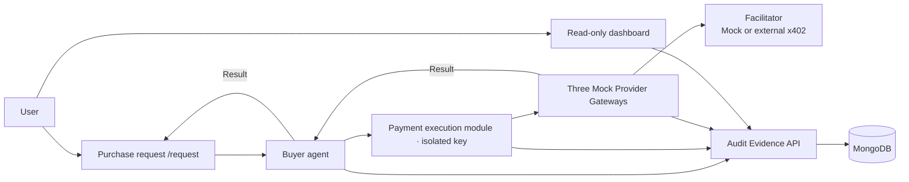

[한국어](README.md) | [English](README.en.md)

# PBLC V2 — AI Model Purchasing and Audit

## Why

A system connecting a buyer agent's model selection, PBLC fixed-price payment request, and result through one `purchaseId`. The default is a Mock local demo; explicit consent can enable a Base Sepolia PBLC payment attempt. Provider output remains Mock, and paid Provider APIs and AWS are out of scope.

## Features

Model comparison, fixed-price payment requests, result delivery, and selection audits share one purchase record. Use `/request` to purchase and `/dashboard` to inspect evidence.

## Architecture



OpenAI, Anthropic Claude, and Google Gemini Gateways are ordinary code modules. The buyer analyzes the request, reads AA data, calculates prices, filters candidates, and selects a model. An isolated payment execution module signs x402 v2 exact + ERC-3009 authorizations; the Gateway releases the result after Facilitator verify/settle confirmation.

The default uses Mock Providers and a Mock Facilitator. The server-side `live` mode can settle PBLC through an external x402 Facilitator after a consented request, while Provider output remains explicitly Mock. AA uses fixtures by default; only a server-side `AA_API_KEY` plus an exact configured `AA_MODEL_CATALOG_PATH` enables a live Artificial Analysis snapshot. See the [architecture](docs/AEGIS_ARCHITECTURE.md) and [live PBLC request flow](docs/LIVE_PBLC_REQUEST_FLOW.md).

## Getting Started

Prerequisites: Node.js 20+, installed npm dependencies, Python 3.12 with uv, and local `mongod` and `mongosh`. From the repository root:

```bash
npm run setup:python
npm run aegis:stack
```

The runner owns a temporary MongoDB replica set, evidence API, three Gateways, Mock Facilitator, and payment execution module. It generates temporary test credentials instead of loading existing environment files or databases. **Ctrl-C removes this run's temporary database and records.** Existing PBLC transactions and user MongoDB records are not accessed.

Copy the printed `evidence API` URL. In another terminal, replace the placeholder below with that exact URL:

```bash
API_ORIGIN="http://127.0.0.1:PRINTED_PORT" npm run dev --workspace @pbl/dashboard -- --hostname 127.0.0.1 --port 3000
```

Open `http://localhost:3000/request` for the request, budget, optional priority, and execution consent. `/dashboard` is a read-focused audit view. The new flow requires no SIWE login. This local single-user scope is not completed public multi-user authentication; internal API protection and encrypted sensitive payloads remain.

## Usage

With actual temporary MongoDB and local HTTP services, a request restricted to `allowed_providers: ["openai"]` passed AA-fixture selection → Mock payment → result → `AUDITED` evidence. Claude and Gemini each passed the same flow. Actual focused E2E output on 2026-09-10:

```text
ok 1 - openai is selected, paid once and delivered
ok 2 - anthropic is selected, paid once and delivered
ok 3 - google is selected, paid once and delivered
ok 4 - a budget below every candidate leaves no eligible model and no payment
ok 5 - two concurrent runs of one purchase settle exactly once
# tests 5
# pass 5
# fail 0
```

Each Provider flow restricts eligibility through an allowlist. These are integration checks, not actual model benchmark experiments or blockchain transactions.

Fixed `aa-three-factor-v1` weights:

| priority | Price | Completion time | Intelligence |
|---|---:|---:|---:|
| default | 40% | 30% | 30% |
| price | 60% | 20% | 20% |
| speed | 20% | 60% | 20% |
| intelligence | 20% | 20% | 60% |

Explicit priority wins; otherwise request wording selects the preset. Budget, capabilities, maximum allowed time, and allowed Providers are hard filters applied before scoring. Reputation, freshness, and manual quality scores are excluded from new selection.

`quotePBLC = (estimated input tokens × input price + maximum output tokens × output price) / 1,000,000`

There is no markup. The amount is rounded up to integer 6-decimal units. This is fixed prepayment based on maximum output, not actual-usage settlement. **1 PBLC = 1 USD is a nominal conversion rule, not dollar backing or redemption value.**

The current standard task reserves a maximum 8,000 output tokens before payment. Exact model IDs, seller recipients, rates, and short-request examples in the 0.01–0.04 PBLC range are documented in [model task pricing](docs/MODEL_TASK_PRICING.md).

The data contract comes from [Artificial Analysis](https://artificialanalysis.ai/data-api/docs). Completion time is a benchmark reference, normally based on 500 answer tokens, not a completion guarantee. Invalid snapshots, missing required values, or failed exact mapping stop purchasing before payment.

## Audit and checks

The evidence API owns MongoDB access and connects requests, snapshots, all candidates, decisions, payments, and results with ordered hash-chained events. Gateways and the payment execution module do not access MongoDB directly. New payment status relies on Facilitator responses; it does not claim independent RPC Transfer verification or an on-chain Anchor guarantee. Mock duration and unqueried balances are not represented as real measurements.

```bash
npm run build --workspace @pbl/commerce-gateway
node --test --require ./scripts/aegis_outbound_guard.cjs --test-name-pattern='(openai is selected|anthropic is selected|google is selected|budget below every candidate|two concurrent runs)' scripts/aegis_phase6_scenarios.test.mjs
node --test --test-name-pattern='tampered 402|gateway refuses a payment payload' services/commerce-gateway/dist/tests/aegis-runtime.test.js
npm run lint
npm run build --workspace @pbl/dashboard
```

Five focused E2Es, two 402-mismatch checks, dashboard build, and basic lint passed. Full Python outbound instrumentation, broad historical zero-write regression, Mongo failure-cleanup stress, repeated full suites, and additional security/performance hardening remain follow-up work. This demo does not claim those checks or production security are complete.

## Roadmap

The [roadmap](docs/ROADMAP.md) and [verification record](docs/AEGIS_VERIFICATION.md) track remaining implementation and validation.

### History and external gates

Historical PBLC, Permit2, ERC-3009, reputation, Anchor, and independent RPC evidence retains its original token names and contract addresses. See the [handoff and historical evidence](docs/HANDOFF.md).

The default Mock path uses the user-owned ERC-3009 PBLC at `0xe75013d333bebb90b321dd658440c10b5a0face8` (Base Sepolia, 6 decimals). Its owner wallet received the initial 1,000,000 PBLC mint. After explicit enablement, the local `live` path can submit one consented `/request` through an external x402 Facilitator; Provider output remains Mock. See the [live PBLC request flow](docs/LIVE_PBLC_REQUEST_FLOW.md). **AWS deployment is not being performed.**

The current local-run catalog maps recipients as OpenAI → seller1 `0xF00E…97a0`, Anthropic → seller2 `0xC774…26d8`, and Google → seller3 `0x5363…80E4`. Mock mode records this mapping only; live mode offers the selected recipient the exact fixed PBLC amount.

### Wallet payment preflight (read-only)

The read-only preflight uses `PBLC_USER_ADDRESS` from `.env.local` and never reads or uses a private key.

```bash
npm run pblc:payment:preflight
```

The preflight reads only the wallet public address, ETH/PBLC balances, PBLC V2 name/symbol/decimals, and Facilitator support for `exact + Base Sepolia`. It never signs, calls `/verify` or `/settle`, or broadcasts a transaction. A separate approval is required before verifying that the Facilitator accepts the custom PBLC token.
