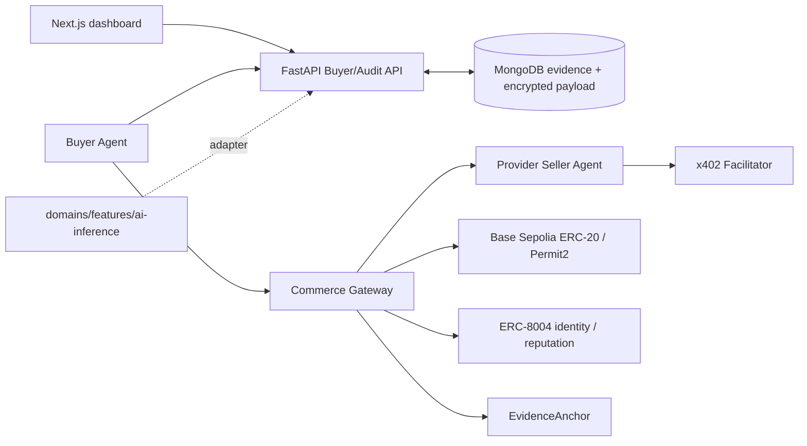

[한국어](README.md) | [English](README.en.md)

# AI Agent M2M Payment Audit

An audit system that connects a buyer agent's selection evidence to its actual blockchain payment so the user can verify both.

## Why

A successful payment does not prove that an AI agent selected a service that matched the user's request, budget, and policy. The system links request, candidates, quotes, decision, payment, delivery, and audit evidence under one `purchaseId`, then cross-checks the actual Base Sepolia transaction.

## Features

Implemented locally:

- SIWE challenge and signature verification with atomic nonce consumption and replay/domain/URI/chain/expiry rejection
- Unique binding between the user's MetaMask address and a programmatic buyer wallet
- RFC 8785 append-only event hash chains with mutation detection
- Separate sensitive-payload storage using AES-256-GCM envelope encryption
- Owner-authorized raw-payload access with an appended access-audit event
- A reusable core that cannot import AI-inference implementations, proven with a fake domain
- Real MongoDB atomicity and concurrency integration tests using PyMongo Async
- Deterministic manual benchmark normalization, hard filters, and four scoring presets
- One provider-level seller engine shared by Gemini and Nemotron mock/HTTP adapters
- Recoverable EIP-712 seller quotes with Buyer-side signer and tamper verification
- At most one idempotent in-provider counteroffer per request ID
- Protocol-neutral payment quote schema separated from the AI-inference extension
- `/health`, `/internal/quotes`, and x402-gated `/v1/inference` transport shell
- Authenticated `/purchases/{id}/run` orchestration across decision, payment, delivery, and audit
- Durable seller `CLAIMED → SUBMITTED → SETTLED → PROVIDER_SUBMITTED → DELIVERED` journal with restart recovery and at-most-once provider attempts
- Gas-sponsored x402 Permit2 payments using exact-amount EIP-2612 permits on the project-issued PBLC token, without buyer-funded approvals
- Delivery integrity checks that bind seller/provider/model/version to the selected signed quote
- Independent Base Sepolia receipt and exact ERC-20 `Transfer` verification
- Objective ERC-8004 reputation and confirmed external evidence anchors
- Read-only Next.js dashboard for wallet balance, transactions, selection rationale, reputation, and audit warnings
- `/experiments` operator runner outside the user-dashboard navigation and shell, with a fixed `0.1 PBLC` cap, explicit acknowledgement, and cross-tab duplicate-run protection
- MongoDB/API/dashboard/two sellers/Gateway Compose plus a cost-disabled AWS Terraform handoff
- Hidden local handoff scripts for seller-wallet and external provider keys

Live Base Sepolia x402 payment, ERC-8004 feedback, and EvidenceAnchor evidence is complete. Remaining real-provider, AWS, and dashboard-capture gates plus transaction links are tracked in the [handoff](docs/HANDOFF.md).

## Architecture



`core/` cannot import `domains/ai_inference/`, Gemini, or Nemotron. A future purchase domain connects through domain ports, schemas, a seller adapter, and a UI renderer without changing the core.

## Getting Started

```bash
cd /Users/vien/MyProjects/PBL
npm run setup:python
npm run lint
npm test
npm run test:mongo:local
```

To run the API, generate local internal keys in a separate terminal. Never paste them into chat.

After sign-in, the overview only reads evidence. Start a real normal-path transaction from
`/experiments` after acknowledging the Base Sepolia payment. With the default
`PROVIDER_MODE=mock`, payment, chain verification, and audit evidence are real while the AI
response body comes from the mock provider.

Public Base Sepolia addresses, balances, and x402 testnet Facilitator support can be checked without exposing keys.

```bash
cd /Users/vien/MyProjects/PBL
npm run chain:status
```

```bash
cd /Users/vien/MyProjects/PBL
python3 scripts/setup_keys.py
npm run api
```

Variable names are documented in `.env.example`; real values are excluded from Git.

The default `PROVIDER_MODE=mock` needs no Gemini/NVIDIA keys. Only when validating real provider calls, enter them invisibly in a separate terminal and switch to `PROVIDER_MODE=real`.

```bash
cd /Users/vien/MyProjects/PBL
python3 scripts/input_provider_keys.py
```

## Usage

Evidence from the current build:

```text
71 passed, 1 skipped  # Python; native Mongo is isolated by default
29 passed             # Seller Service
33 passed             # Commerce Gateway
6 passed              # Solidity Foundry
3 passed              # Dashboard runner safety
1 passed              # Native MongoDB replica-set integration
Success: no issues found in 43 source files  # strict mypy
```

After SIWE authentication, a fake-domain purchase stores only normalized data and a raw-content hash in public evidence. The raw request is encrypted and can be retrieved only through the owner-authorized endpoint.

## Technology Choices

- FastAPI exposes the existing Python buyer/audit logic behind an HTTP boundary.
- PyMongo Async replaces the deprecated Motor path with MongoDB's official async driver.
- RFC 8785 plus SHA-256 provides deterministic JSON evidence hashes.
- AES-256-GCM envelope encryption provides per-payload data keys and an AWS KMS seam.
- SIWE separates user ownership via MetaMask from the autonomous buyer wallet.
- Project-issued PBLC plus EIP-2612 and x402 Permit2 avoids token faucets and lets the Facilitator sponsor buyer payment approval gas.
- ERC-8004 provides provider-level seller-agent identity and objective payment reputation.
- Next.js separates the reusable audit shell from domain-specific renderers.

## Roadmap

[docs/ROADMAP.md](docs/ROADMAP.md)
