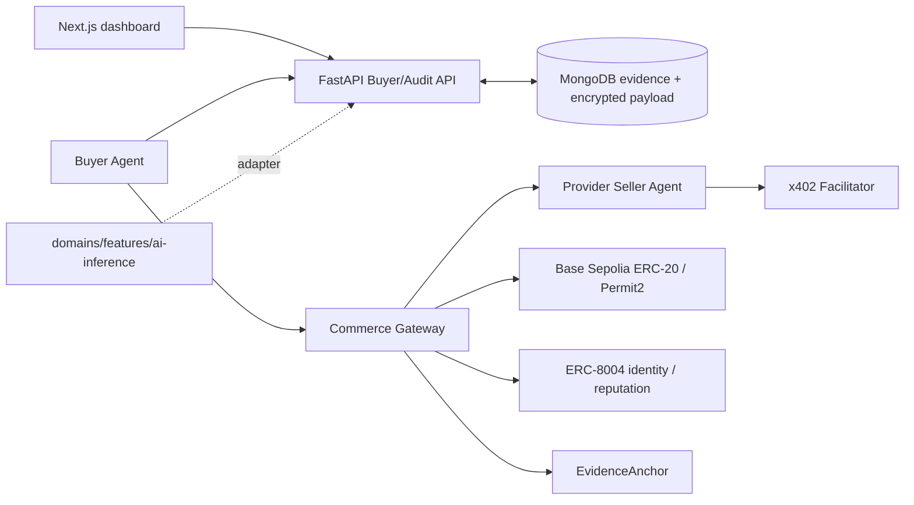

[한국어](README.md) | [English](README.en.md)

# AI 에이전트 M2M 결제 감사

구매 에이전트의 선택 근거와 실제 블록체인 결제를 연결해 사용자가 검증할 수 있게 하는 감사 시스템이다.

## 왜 만들었나

결제 성공만으로는 AI 에이전트가 사용자 요구·예산·정책에 맞는 서비스를 골랐는지 알 수 없다. 요청, 후보, 견적, 선택, 결제, 전달, 감사 증거를 하나의 `purchaseId`로 연결하고 실제 Base Sepolia 거래와 교차 검증한다.

## 주요 기능

현재 로컬 구현 범위:

- SIWE challenge와 서명 검증, nonce 원자 소비, replay·domain·URI·chain·expiry 거부
- 사용자 MetaMask 주소와 프로그램형 buyer wallet의 고유 바인딩
- RFC 8785 기반 append-only 이벤트 hash chain과 변조 검출
- AES-256-GCM envelope encryption을 사용한 민감 원문 분리 저장
- 인증된 소유자만 가능한 원문 열람과 열람 감사 이벤트
- AI 추론 구현을 import하지 않는 재사용 core와 fake-domain 검증
- PyMongo Async 기반 실제 MongoDB 원자성·동시성 통합 테스트
- 수동 benchmark snapshot 정규화·24시간 freshness와 결정적 hard filter
- balanced/quality/price/speed 네 가지 고정 가중치 선택과 근거 저장
- Gemini/Nemotron 공통 판매 엔진, mock 및 실제 HTTP provider adapter
- ERC-8004 agent ID까지 서명하는 EIP-712 seller quote와 필드 변조/만료 검출
- provider 내부 최대 1회 counteroffer와 request ID idempotency
- 공통 payment quote와 `ai_inference` 확장 schema 분리
- `/health`, `/internal/quotes`, x402-gated `/v1/inference` transport
- 인증된 `/purchases/{id}/run`으로 요청→선택→결제→전달→감사를 한 번에 실행하는 E2E
- 판매자 `CLAIMED → SUBMITTED → SETTLED → PROVIDER_SUBMITTED → DELIVERED` durable journal과 응답 유실·재시작 복구
- 전달 결과의 seller/provider/model/version을 선택된 서명 견적과 결속하는 무결성 감사
- x402 v2 Facilitator verify/settle, 실패 포함 PAYMENT-RESPONSE 보존, 고정 Permit2 nonce와 안전한 중단 후 재개
- 원자적 예산 예약과 독립 Base Sepolia receipt·정확한 ERC-20 Transfer 검증
- 결정적 normal/caution/risk 감사와 semantic advisor 권한 제한
- audit bundle hash에 결합된 ERC-8004 객관 100/0 평판 및 tx evidence
- 성공 receipt와 정확한 event 이후에만 기록하는 EvidenceAnchor
- 지갑·거래·선택 이유·평판·감사 경고를 보여주는 Next.js 대시보드와 SSE
- MongoDB·API·대시보드·두 Seller·Gateway Compose와 비용 기본 차단 AWS Terraform handoff

실제 provider·Base Sepolia·AWS 증거가 필요한 단계는 [인계 문서](docs/HANDOFF.md)에 분리했다.

## 구조



`core/`는 `domains/ai_inference/`, Gemini, Nemotron을 import하지 않는다. 다음 구매 도메인은 core를 수정하지 않고 domain port, schema, seller adapter, UI renderer로 연결한다.

## 시작하기

```bash
cd /Users/vien/MyProjects/PBL
npm run setup:python
npm run lint
npm test
npm run test:mongo:local
```

Compose 실행과 실제 체인 smoke 순서는 [docs/HANDOFF.md](docs/HANDOFF.md)에 있다.

API를 직접 실행하려면 시크릿을 채팅에 붙이지 말고 별도 터미널에서 한 번 생성한다.

```bash
cd /Users/vien/MyProjects/PBL
python3 scripts/setup_keys.py
npm run api
```

환경 변수 이름은 `.env.example`에 있으며 실제 값은 Git에서 제외된다.

실제 Gemini/NVIDIA 키가 준비된 뒤에는 값을 채팅에 보내지 말고 별도 터미널에서 숨김 입력한다.

```bash
python3 scripts/input_provider_keys.py
```

## 사용 예시

현재 빌드에서 수행한 검증:

```text
68 passed, 1 skipped  # Python; native Mongo is isolated by default
29 passed             # Seller Service
29 passed             # Commerce Gateway
4 passed              # Solidity Foundry
1 passed              # Native MongoDB replica-set integration
Success: no issues found in 43 source files  # strict mypy
```

SIWE 인증 후 fake domain purchase를 만들면 공개 이벤트에는 정규화 결과와 원문 hash만 남고, 원문은 암호화 저장소에서 소유자 인증 후 별도로 조회된다.

## 기술 선택

- FastAPI: Python 구매·감사 core를 인증된 HTTP/SSE 경계로 노출하는 API 프레임워크
- PyMongo Async: 폐기 예정 Motor 대신 공식 비동기 드라이버 사용
- RFC 8785 + SHA-256: 동일한 JSON 증거가 동일한 hash를 갖게 함
- AES-256-GCM envelope encryption: 원문별 data key와 이후 AWS KMS 교체 경계 제공
- SIWE: MetaMask 소유권과 자율 결제 buyer wallet을 분리
- x402 v2 + Permit2: seller 결제 요구와 고정 구매 결정을 서명·정산
- ERC-8004: provider 단위 판매 에이전트 신원과 객관적 결제 결과 평판
- Next.js: 공통 감사 shell과 도메인별 renderer를 분리한 대시보드

## 로드맵

[docs/ROADMAP.md](docs/ROADMAP.md)
