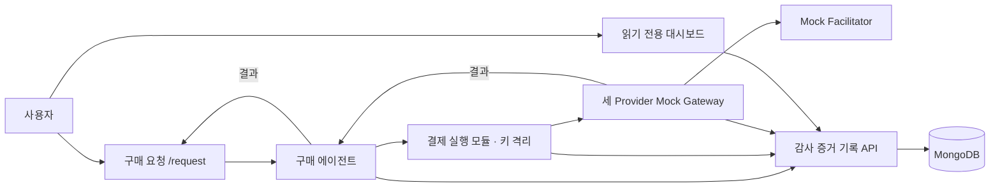

[한국어](README.md) | [English](README.en.md)

# PBLC V2 — AI 모델 구매와 감사

## 왜 만들었나

사용자 요청에 맞춰 구매 에이전트가 모델을 비교하고, PBLC V2 고정 가격 결제 요청과 결과를 같은 `purchaseId`로 연결하는 시스템입니다. 발표용 단일 사용자 로컬 데모의 핵심 검증을 완료했습니다. 실제 Provider·온체인 결제·공개 서비스 완성을 뜻하지 않습니다. 완료·미완료 범위는 [검증 기록](docs/AEGIS_VERIFICATION.md)을 확인하세요.

## 주요 기능

요청별 모델 비교, 고정 가격 결제 요청, 결과 반환과 선택 근거 감사를 하나의 기록으로 연결합니다. 구매는 `/request`, 감사 조회는 `/dashboard`에서 수행합니다.

## 구조



OpenAI·Anthropic Claude·Google Gemini Gateway는 선택된 모델의 결과를 반환하는 일반 코드입니다. 구매 에이전트가 요청 분석, AA 데이터 조회, 가격 계산, 필터·비교·선택을 담당합니다. 별도 프로세스의 **결제 실행 모듈**이 키를 격리하고 x402 v2 exact + ERC-3009 승인에 서명하며, Gateway가 Facilitator의 verify/settle 확인 후 결과를 제공합니다.

현재 Provider와 Facilitator는 모두 Mock입니다. 기본 실행은 AA fixture를 사용하며, 서버에 `AA_API_KEY`와 정확한 `AA_MODEL_CATALOG_PATH`를 함께 설정할 때만 실제 Artificial Analysis snapshot을 조회합니다. 실제 Provider·블록체인·AWS 호출은 하지 않습니다. [구조도와 책임 경계](docs/AEGIS_ARCHITECTURE.md)

## 시작하기

Node.js 20 이상, npm 의존성, Python 3.12/uv, 로컬 `mongod`·`mongosh`가 필요합니다. 저장소 루트에서 실행합니다.

```bash
npm run setup:python
npm run aegis:stack
```

runner는 전용 임시 MongoDB replica set과 증거 API, 세 Gateway, Mock Facilitator, 결제 실행 모듈을 시작합니다. 기존 환경 파일·MongoDB를 사용하지 않고 임시 테스트 키를 생성합니다. **Ctrl-C 종료 시 이 실행의 임시 DB와 기록이 제거됩니다.** 기존 PBLC 거래나 사용자 MongoDB 기록에는 접근하지 않습니다.

출력의 `evidence API` 주소를 복사하고 다른 터미널에서 다음을 실행합니다. `API_ORIGIN`에는 출력된 실제 주소를 넣습니다.

```bash
API_ORIGIN="http://127.0.0.1:출력된포트" npm run dev --workspace @pbl/dashboard -- --hostname 127.0.0.1 --port 3000
```

`http://localhost:3000/request`에서 요청·예산·선택적 우선순위와 실행 동의를 입력합니다. `/dashboard`는 읽기 중심 감사 화면입니다. SIWE 로그인은 신규 흐름에 없습니다. 단일 로컬 사용자 범위이며 공개 다중 사용자 인증 완성을 의미하지 않습니다. 내부 API 보호와 원문 암호화는 유지합니다.

## 사용 예시

실제 임시 MongoDB·로컬 HTTP 서비스에서 `allowed_providers: ["openai"]`인 요청은 AA fixture 기반 OpenAI 선택 → Mock 결제 → 결과 반환 → `AUDITED` 기록까지 통과했습니다. Claude·Gemini도 각각 같은 경로를 검증했습니다. 아래는 2026-09-10 집중 E2E 실제 출력입니다.

```text
ok 1 - openai is selected, paid once and delivered
ok 2 - anthropic is selected, paid once and delivered
ok 3 - google is selected, paid once and delivered
ok 4 - a budget below every candidate leaves no eligible model and no payment
ok 5 - two concurrent runs of one purchase settle exactly once
# tests 5
# pass 5
# fail 0
```

세 Provider 경로는 각각 허용 목록으로 선택 대상을 제한한 통합 검증입니다. 실제 모델 성능 비교 실험이나 실거래 결과가 아닙니다.

`aa-three-factor-v1`의 가격·완료시간·성능 가중치는 고정입니다.

| priority | 가격 | 완료시간 | 성능 |
|---|---:|---:|---:|
| default | 40% | 30% | 30% |
| price | 60% | 20% | 20% |
| speed | 20% | 60% | 20% |
| intelligence | 20% | 20% | 60% |

명시적 priority가 우선이며, 미지정이면 요청 문구를 분류합니다. 예산·기능·최대 허용시간·허용 Provider를 먼저 필터링한 뒤 통과 후보의 세 점수를 비교합니다. 평판·freshness·수동 품질 점수는 신규 선택에 쓰지 않습니다.

`quotePBLC = (예상 입력 토큰 × 입력 단가 + 최대 출력 토큰 × 출력 단가) / 1,000,000`

markup 없이 6-decimal 정수 단위로 올림합니다. 최대 출력량을 반영한 사전 고정 결제액이며 사용량 사후 정산이 아닙니다. **1 PBLC = 1 USD는 명목 환산이고 달러 담보·상환 약속이 아닙니다.**

현재 표준 작업은 최대 출력 8,000 tokens를 결제 전에 고정합니다. 모델 ID·seller 수신 지갑·단가와 짧은 요청 기준 0.01~0.04 PBLC 예시는 [모델별 표준 작업 결제 조건](docs/MODEL_TASK_PRICING.md)을 참고하세요.

데이터 계약 출처는 [Artificial Analysis](https://artificialanalysis.ai/data-api/docs)입니다. 완료시간은 기본 500 answer tokens 조건의 벤치마크 참고값이며 실제 완료 보장이 아닙니다. snapshot·정확한 mapping·필수 값 검증에 실패하면 결제 전 중단합니다.

## 감사와 검증

감사 증거 API가 MongoDB의 요청·snapshot·전체 후보·선택·결제·응답을 연결하고 이벤트 순서와 해시 체인을 검사합니다. Gateway와 결제 실행 모듈은 MongoDB에 직접 접근하지 않습니다. 신규 결제 상태 근거는 Facilitator 응답이며 독립 RPC Transfer 검증이나 온체인 Anchor 보장을 주장하지 않습니다. Mock 실행시간과 조회하지 않은 잔액은 실제 측정값으로 표시하지 않습니다.

```bash
npm run build --workspace @pbl/commerce-gateway
node --test --require ./scripts/aegis_outbound_guard.cjs --test-name-pattern='(openai is selected|anthropic is selected|google is selected|budget below every candidate|two concurrent runs)' scripts/aegis_phase6_scenarios.test.mjs
node --test --test-name-pattern='tampered 402|gateway refuses a payment payload' services/commerce-gateway/dist/tests/aegis-runtime.test.js
npm run lint
npm run build --workspace @pbl/dashboard
```

집중 E2E 5건·402 불일치 2건, dashboard build·기본 lint가 통과했습니다. Python 전체 outbound 계측, 과거 증거 광범위 zero-write 회귀, Mongo 실패 정리 스트레스, 전체 테스트 반복 및 추가 보안·성능 강화는 후속 과제입니다. 이를 완료하거나 운영 보안을 보장한다고 주장하지 않습니다.

## 로드맵

[작업 상태](docs/ROADMAP.md)와 [검증 기록](docs/AEGIS_VERIFICATION.md)에서 남은 구현과 검증을 추적합니다.

### 과거 기록과 외부 게이트

과거 PBLC·Permit2·ERC-3009 거래, 평판·Anchor·독립 RPC 증거는 당시 이름과 주소 그대로 보존합니다. [과거 증거와 인계](docs/HANDOFF.md)

신규 Mock 실행은 사용자 소유 PBLC ERC-3009 계약([`0xe75013d333bebb90b321dd658440c10b5a0face8`](https://base-sepolia.blockscout.com/address/0xe75013d333bebb90b321dd658440c10b5a0face8), Base Sepolia, 6 decimals)을 결제 조건으로 사용합니다. 사용자 지갑이 owner이며 초기 `1,000,000 PBLC` mint는 완료됐습니다. 과거 PBLC V2와 거래는 읽기 전용으로 보존합니다. 현재 Facilitator는 Mock이므로 이 앱의 구매 실행은 실제 자산 이동·실제 x402 결제가 아닙니다. AA 무료 목록에는 현재 세 Provider 정확 모델 mapping이 없어 fixture AA를 유지합니다. **AWS 배포는 진행하지 않습니다.**

현재 로컬 실행 catalog의 수신 지갑은 OpenAI→seller1 `0xF00E…97a0`, Anthropic→seller2 `0xC774…26d8`, Google→seller3 `0x5363…80E4`로 설정했다. 이 매핑은 Mock 실행의 결제 조건에도 기록되지만, Mock Facilitator는 자산을 전송하지 않는다.

### 지갑 결제 사전점검 (읽기 전용)

실제 전송 준비 상태만 확인하려면 개인 MetaMask 계정 대신 **전용 Base Sepolia 테스트 지갑**을 사용합니다. `.env.local`에 공개 주소만 설정합니다. 이 단계에서는 개인키를 입력하지 않습니다.

```bash
AEGIS_LIVE_PAYER_ADDRESS=0x...  # .env.local에 설정
npm run pblc:payment:preflight
```

사전점검은 지갑 공개 주소, ETH/PBLC 잔액, PBLC V2의 이름·심볼·decimals, Facilitator의 `exact + Base Sepolia` 지원만 읽습니다. 서명·`/verify`·`/settle`·트랜잭션 전송을 하지 않습니다. PBLC 커스텀 토큰의 실제 Facilitator 수락은 별도 승인 후에만 `verify/settle` smoke로 확인합니다.
