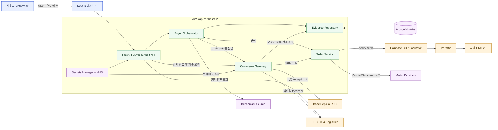
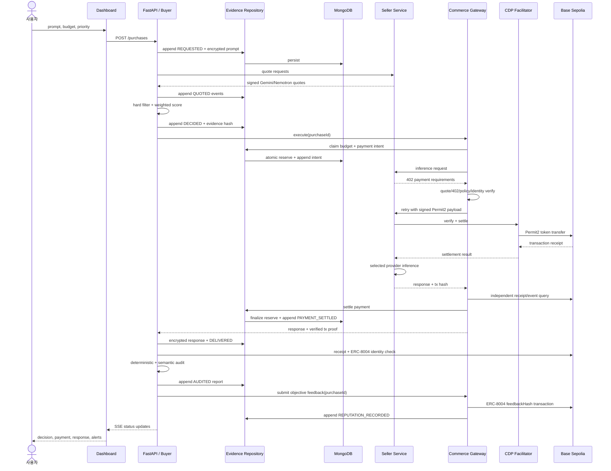
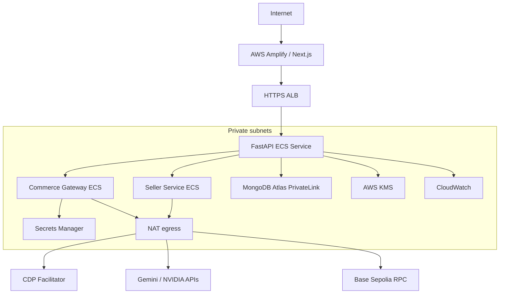

# 설계 — AI 에이전트 M2M 결제 감사

Status: Approved on 2026-09-02
Date: 2026-09-02
Upstream: `aidlc-docs/inception/requirements.md` (Approved 2026-09-02)

## 1. 설계 목표

한 번의 사용자 요청을 `purchaseId`로 묶어 다음 증거를 끊김 없이 연결한다.

1. 사용자의 원문 요청·예산·우선순위
2. 사용한 벤치마크 스냅샷과 판매 에이전트의 견적
3. 구매 에이전트의 필터·점수·선택 설명
4. 실제 x402 Permit2 결제와 Base Sepolia 영수증
5. 실제 AI 응답의 모델·지연시간·해시
6. 결정적 규칙 검사와 LLM 의미 감사 결과
7. ERC-8004 신원 및 객관적 피드백

설계 원칙은 **결제 전에 증거를 고정하고, 결제 후에는 독립 RPC 조회로 결과를 교차 검증하는 것**이다.

## 2. 전체 아키텍처



### 2.1 배포 단위

| 배포 단위 | 기술 | 책임 |
|---|---|---|
| Dashboard | Next.js 16, TypeScript, AWS Amplify | SIWE 연결, 요청 입력, 거래·평판·감사 화면, SSE 구독 |
| Buyer & Audit API | Python 3.12, FastAPI, ECS Fargate | 인증, 요청 오케스트레이션, 선택 엔진, Evidence Repository, 감사 엔진, 조회 API |
| Commerce Gateway | Node.js 20, TypeScript, ECS Fargate | 지갑 정책, 원자적 예산 예약, 견적 검증, Permit2 서명, x402 재시도, 체인 교차 검증 |
| Seller Service | Node.js 20, TypeScript, ECS Fargate | 공통 판매 엔진, Gemini/Nemotron 설정, 견적 서명, x402 유료 inference endpoint |
| MongoDB Atlas | AWS Seoul 인접 리전 | 구조화 증거, 암호화 원문, 정책·평판·감사 기록 |
| Base Sepolia | 외부 신뢰 경계 | Demo ERC-20, Permit2 정산, ERC-8004 Identity/Reputation |

FastAPI는 에이전트 자체가 아니라 기존 구매·감사 함수를 HTTP API로 감싸 대시보드와 다른 서비스가 안전하게 호출하게 하는 얇은 애플리케이션 계층이다.

### 2.2 기존 에이전트 구조에서 재사용할 부분

기존 구성도의 역할은 유지하되 책임을 다음처럼 나눈다.

| 기존 역할 | 새 위치 | 변경 이유 |
|---|---|---|
| Gateway / Request Parser | FastAPI Request Pipeline | 입력·세션·기본값을 한 경계에서 검증 |
| Clarification Handler | Request Policy Normalizer | MVP는 추가 대화보다 누락값 기본값과 결제 중단 조건에 집중 |
| Model Discovery | Buyer Orchestrator | 벤치마크와 판매 견적을 결합 |
| Model Selection Engine | Deterministic Selection Engine | 필터와 점수가 감사 가능한 코드가 되도록 LLM과 분리 |
| SDK Wrapper | Model Adapter + Commerce Gateway Client | 모델 호출과 결제 권한을 분리 |
| MongoDB Logger | Evidence Repository | 모든 서비스가 DB에 직접 접근하지 않도록 단일 기록 경계 제공 |
| On-chain Trigger | Commerce Gateway | 애플리케이션 내 유일한 서명·체인 쓰기 요청 경계 |

## 3. 주요 컴포넌트

### 3.1 Dashboard

- Next.js App Router를 사용한다.
- MetaMask가 필요한 로그인·지갑 연결만 Client Component로 둔다.
- 거래 목록·상세·판매자 평판은 서버 렌더링 가능한 읽기 화면으로 구성한다.
- 장시간 작업 상태는 `GET /api/events?after=<eventId>` SSE로 받는다.
- SSE가 끊기면 마지막 이벤트 ID 이후를 1초 간격으로 읽는 서버 측 폴링 스트림을 재연결한다. 별도 Redis는 MVP에 추가하지 않는다.

라우트:

| Route | 화면 | 주요 API |
|---|---|---|
| `/login` | MetaMask SIWE | `POST /auth/siwe/nonce`, `POST /auth/siwe/verify` |
| `/` | 읽기 전용 감사 개요 | `GET /wallet`, `GET /purchases`, `GET /audit-alerts`, SSE |
| `/experiments` | 발표·개발용 정상 거래 실행기; 사용자 대시보드 메뉴·공용 셸 미노출 | `POST /purchases`, `POST /purchases/{purchaseId}/run` |
| `/purchases` | 거래 목록 | `GET /purchases` |
| `/purchases/[purchaseId]` | 판단·결제·응답·감사 상세 | `GET /purchases/{purchaseId}` |
| `/agents` | ERC-8004 판매자 평판 | `GET /agents` |
| `/alerts` | 주의·위험 목록 | `GET /audit-alerts` |

개요 화면은 구매를 실행하지 않는다. PBLC 잔액, 실제 계정 범위의 거래·결제 해시, 감사 등급, 경고, RPC/SSE 상태를 모니터링한다. `/experiments`는 같은 Next.js 배포를 재사용하지만 사용자 대시보드 내비게이션과 공용 셸에서는 제거한 발표·개발용 실행 화면이다. 현재는 명시적 확인 뒤 `0.1 PBLC` 한도의 정상 거래만 만든다. 요청 생성에 성공한 `purchaseId`를 동일 출처의 `localStorage`에 보존해 새 탭이나 실행 실패 후에도 새 구매를 중복 생성하지 않고 같은 거래를 재개한다. 비정상 시나리오 제어는 검증 방법이 확정될 때까지 추가하지 않으며, 가짜 거래나 가짜 경고를 개요 데이터에 섞지 않는다.

### 3.2 Buyer Orchestrator

처리 파이프라인:

1. `RequestPolicyNormalizer`: prompt, budget, priority, 허용 판매자를 구조화한다.
2. `BenchmarkProvider`: 24시간 이내 스냅샷을 읽거나 갱신한다.
3. `SellerQuoteClient`: 상위 후보 최대 3개에 견적을 요청한다.
4. `HardFilter`: 예산, 가용성, 판매자 허용 정책, ERC-8004 신원을 검사한다.
5. `WeightedScorer`: 승인된 네 가지 가중치 프리셋으로 점수를 계산한다.
6. `BuyerExplanationAdapter`: Nemotron을 기본으로 설명을 만들고 최종 시연에서 Anthropic으로 교체할 수 있다.
7. `EvidenceRepository`: 전체 후보·탈락 이유·점수·승자를 `DECIDED` 이벤트로 고정한다.

LLM은 요청 분류와 설명에만 사용한다. 후보 탈락, 점수, 예산 통과 여부와 최종 감사 등급은 결정적 코드가 소유한다.

### 3.3 Benchmark Provider

MVP는 특정 웹사이트 스크래핑에 종속되지 않는다.

- `BenchmarkProvider` 인터페이스를 두고 `manual snapshot import`를 기본 구현으로 사용한다.
- 스냅샷에는 source URL, 수집 시각, 원본 필드, 정규화 방식, 콘텐츠 해시를 저장한다.
- 공식 API가 확인된 경우에만 자동 수집 어댑터를 추가한다.
- 24시간을 넘긴 스냅샷은 결제 근거로 사용하지 않는다.
- 졸업 시연 직전에 관리 명령으로 스냅샷을 새로 가져와 고정한다.

### 3.4 Seller Service

하나의 공통 판매 엔진에 제공자별 설정과 모델 어댑터를 주입한다.

- `GeminiSellerConfig`: Gemini 모델 목록, 가격, 제한, Google API 어댑터
- `NemotronSellerConfig`: Nemotron 모델 목록, 가격, 제한, NVIDIA API 어댑터
- 판매 에이전트 하나가 같은 제공자의 여러 모델을 제안할 수 있다.
- 처음 제안이 조건을 만족하지 못하면 같은 제공자 안에서 한 번만 역제안한다.
- 견적은 판매 에이전트 지갑으로 EIP-712 서명한다.
- Gateway는 복구된 서명 주소가 ERC-8004의 `agentWallet`과 같은지 확인한다.

견적 서명 필드:

```text
quoteId, purchaseId, sellerAgentId, providerId, modelId, modelVersion,
amount, token, payTo, expectedLatencyMs, inputLimit, outputLimit,
expiresAt, quoteNonce, counterofferOf
```

엔드포인트:

- `POST /internal/quotes`: 구조화 조건을 받고 서명 견적 반환
- `POST /v1/inference?purchaseId=&quoteId=`: x402로 보호되는 실제 모델 호출
- `GET /health`: 키 값 없이 제공자 연결 상태만 보고

### 3.5 Commerce Gateway

FastAPI는 Gateway에 금액·수신자를 신뢰 입력으로 보내지 않고 `purchaseId`만 보낸다. Gateway가 Evidence API에서 고정된 결정과 견적을 다시 읽어 결제 조건을 만든다.

검사 순서:

1. SIWE owner와 바인딩된 buyer agent wallet인지 확인
2. `DECIDED` 이벤트와 evidence hash가 존재하는지 확인
3. 견적 서명자와 ERC-8004 `agentWallet` 일치 확인
4. amount, token, payTo, chainId, expiry, quoteId 일치 확인
5. 사용자 예산, 1회 1토큰, 일 20토큰 한도 확인
6. MongoDB 원자적 예산 예약과 `PAYMENT_INTENT_CLAIMED` 이벤트 생성
7. seller endpoint의 402 요구사항이 저장된 견적과 완전히 같은지 확인
8. Gateway가 `DecisionAuthorization` EIP-712 서명을 만들고 `PAYMENT_AUTHORIZED` 이벤트로 저장
9. 같은 `purchaseId`용 Permit2 nonce와 PBLC EIP-2612 permit을 서명해 재요청
10. facilitator 응답만 믿지 않고 독립 Base RPC에서 receipt와 ERC-20 `Transfer` 이벤트 확인
11. 예약 금액을 settled로 전환하고 `PAYMENT_SETTLED` 이벤트 생성

감사가 끝나면 FastAPI는 `purchaseId`만 Gateway에 보내 객관적 ERC-8004 feedback 제출을 요청한다. Gateway는 Evidence API에서 감사 결과와 bundle hash를 다시 읽고, 허용된 100/0 결과만 buyer agent wallet로 서명한다.

#### 구매자 무가스 Permit2 승인

PBLC는 자체 6-decimal ERC-20을 유지하되 EIP-2612 `permit`을 구현한다. buyer wallet은 native ETH나 수동 `approve` 거래 없이 결제액과 같은 allowance만 오프체인 서명한다. x402 Facilitator가 permit과 Permit2 settlement를 한 거래로 제출하고 가스를 부담한다.

- Base Sepolia 배포 가스는 온라인 buyer와 분리된 Admin/Deployer wallet이 한 번 부담한다.
- 초기 PBLC 공급량은 배포 시 buyer wallet에 직접 mint한다. 이후 admin이 필요한 만큼 추가 mint할 수 있어 token faucet은 사용하지 않는다.
- EIP-2612 permit의 spender는 canonical Permit2, value는 해당 결제액, deadline은 견적/402 만료보다 길 수 없다.
- 결제 후 allowance가 남지 않도록 `uint256.max` 승인을 사용하지 않는다.
- Facilitator가 `eip2612GasSponsoring`을 실제로 지원하고 자체 PBLC settlement를 처리하는지는 Base Sepolia tx로 입증한다.

#### 중복·동시 결제 방지

- `PAYMENT_INTENT_CLAIMED`는 `purchaseId`당 하나만 허용하는 unique partial index를 둔다.
- 예산 예약은 `walletPolicies` 문서에서 조건부 `findOneAndUpdate`로 원자 처리한다.
- Permit2 nonce는 purchase 단위로 고정하고 재시도에서 새 nonce를 만들지 않는다.
- `PAYMENT_SETTLED` 역시 purchase당 하나만 허용한다.
- 결과가 모호한 timeout에서는 예약을 해제하지 않고 `PAYMENT_RECONCILIATION_REQUIRED`로 전환해 체인을 먼저 조회한다.

### 3.6 Evidence Repository

MongoDB 접근은 FastAPI 내부 Evidence Repository만 수행한다. Seller Service와 Commerce Gateway는 내부 API를 사용한다.

주요 내부 API:

- `POST /internal/evidence/events`
- `GET /internal/evidence/purchases/{purchaseId}/payment-view`
- `POST /internal/evidence/payment-intents/claim`
- `POST /internal/evidence/payment-intents/settle`
- `POST /internal/evidence/payment-intents/release`
- `POST /internal/evidence/audit-reports`
- `POST /internal/evidence/reputation-events`

내부 호출은 ECS 서비스 간 mTLS 또는 서명된 서비스 토큰으로 제한한다. MVP 로컬 환경에서는 회전 가능한 내부 토큰을 사용하고 AWS에서는 서비스별 Secrets Manager 값과 보안 그룹을 함께 적용한다.

### 3.7 Audit Engine

두 계층으로 분리한다.

1. **Deterministic Rules:** 예산·정책, 견적/결제 불일치, 중복/빠른 반복, 선택 근거 누락, ERC-8004 신원 불일치, 해시 체인 손상을 판정한다.
2. **Semantic Audit Adapter:** prompt와 선택 설명의 의미적 부합을 분석한다. 개발 중 mock을 사용하고 최종 시연에서는 비용이 낮은 OpenAI 모델로 교체할 수 있다.

결정적 규칙이 `risk`를 만들면 LLM이 이를 `normal`로 낮출 수 없다. LLM만 발견한 불확실성은 기본 `caution`이다.

Audit Engine은 bundle hash와 객관적 성공/실패 값을 결정하지만 지갑 키를 직접 사용하지 않는다. 보고서를 먼저 저장한 뒤 Gateway에 `purchaseId`만 전달하고, Gateway가 저장된 증거를 재검증해 ERC-8004 feedback을 제출한다.

## 4. 구매·결제·감사 시퀀스



## 5. 데이터 설계

### 5.1 공통 이벤트 봉투

```json
{
  "eventId": "uuid",
  "purchaseId": "uuid",
  "sequence": 6,
  "type": "DECIDED",
  "occurredAt": "2026-09-02T00:00:00Z",
  "actor": {"type": "buyer-agent", "id": "erc8004:..."},
  "payload": {},
  "payloadHash": "sha256:...",
  "previousEventHash": "sha256:...",
  "eventHash": "sha256:...",
  "evidenceRefs": []
}
```

- payload는 RFC 8785 JSON Canonicalization Scheme으로 정규화한 뒤 SHA-256 해시한다.
- `eventHash`는 purchaseId, sequence, type, occurredAt, actor, previousEventHash, payloadHash를 정규화해 계산한다.
- 같은 purchase의 sequence는 unique index로 직렬화한다. 충돌 시 최신 이벤트를 다시 읽어 재시도한다.
- 정정은 기존 이벤트 수정이 아니라 새 `CORRECTION_RECORDED` 이벤트로 남긴다.

### 5.2 MongoDB 컬렉션

| Collection | 핵심 내용 | 주요 인덱스 |
|---|---|---|
| `users` | owner wallet, buyer wallet binding, SIWE nonce hash·만료·소비 상태 | unique ownerAddress |
| `agents` | ERC-8004 registry/agentId/agentWallet, role, active | unique registry+agentId |
| `providers` | Gemini/Nemotron endpoint와 활성 상태 | unique providerId |
| `modelCatalog` | provider별 모델, limits, enabled | unique providerId+modelId+version |
| `benchmarkSnapshots` | source, observedAt, normalized metrics, contentHash | provider/model/observedAt |
| `purchaseEvents` | append-only 전체 상태와 해시 체인 | unique purchaseId+sequence; partial unique payment events |
| `auditReports` | rulesetVersion, findings, evidence refs, bundle hash | unique purchaseId+auditVersion |
| `walletPolicies` | perTxLimit, dailyLimit, spent, reserved, policyDate | unique buyerWallet+policyDate |
| `sensitivePayloads` | encrypted prompt/response envelope와 content hash | unique payloadId; purchaseId+kind |

### 5.3 민감 원문 암호화

- 각 payload마다 무작위 DEK를 만들고 AES-256-GCM으로 암호화한다.
- 로컬에서는 전용 입력 스크립트로 받은 master key가 DEK를 감싼다.
- AWS에서는 KMS envelope encryption으로 DEK를 감싸고 MongoDB에는 `ciphertext`, `iv`, `tag`, `encryptedDek`, `keyVersion`만 저장한다.
- 일반 거래 API는 원문을 반환하지 않는다. 상세 원문 열람은 인증된 사용자와 별도 endpoint로 제한하고 접근 이벤트를 남긴다.
- MVP는 자동 삭제하지 않는다. 공개 AWS 배포 전 TTL 또는 수동 삭제 정책을 다시 승인받는다.

## 6. 무결성·온체인 연결

### 6.1 세 종류의 증거

| 증거 | 위치 | 의미 |
|---|---|---|
| 구조화 이벤트 해시 체인 | MongoDB | 요청부터 감사까지 누락·수정 탐지 |
| Base Sepolia tx + Transfer event | 온체인 | 실제 token, amount, sender, recipient, 성공 여부 |
| ERC-8004 feedbackHash | 온체인 포인터 | 상세 오프체인 감사 bundle이 나중에 바뀌지 않았는지 검증 |

Gateway는 결제 전 `DecisionAuthorization` EIP-712 서명을 만들어 `decisionHash`와 함께 저장한다. 별도 DecisionLogger/AuditLogger 컨트랙트는 만들지 않는다.

감사 bundle은 정규화된 다음 항목의 keccak256이다.

```text
requestHash + benchmarkSnapshotHash + quotesHash + decisionHash +
transactionHash + responseHash + auditReportHash
```

객관적 성공은 ERC-8004 value 100, 확인된 실패는 0으로 기록하고 bundle URI/hash를 연결한다. 의미 감사의 `caution`은 온체인 점수를 변경하지 않는다.

판정은 Audit Engine, 제출 서명은 Commerce Gateway가 담당한다. Gateway는 감사 엔진이 보낸 점수를 신뢰하지 않고 Evidence Repository에서 `AUDITED` 이벤트와 bundle hash를 다시 읽는다.

ERC-8004는 현재 Draft이므로 주소와 ABI는 빌드에 고정 복사하지 않고 배포 환경 설정으로 주입한다. Base Sepolia 주소는 공식 `erc-8004-contracts` 저장소를 배포 시점에 다시 확인한다.

## 7. 인증과 지갑 모델

### 7.1 지갑 역할

| 지갑 | 역할 | 보관 |
|---|---|---|
| User Owner Wallet | MetaMask SIWE, buyer identity 소유 | 사용자 MetaMask |
| Buyer Agent Wallet | 결정·Permit2 서명, seller feedback 제출 | Gateway Secrets Manager |
| Admin/Minter Wallet | Demo ERC-20 배포·mint·초기 agent 등록 | 배포 전용 secret |
| Gemini Seller Wallet | 견적 서명, 결제 수신, ERC-8004 agentWallet | Seller secret |
| Nemotron Seller Wallet | 견적 서명, 결제 수신, ERC-8004 agentWallet | Seller secret |

판매자 identity owner와 buyer feedback 제출 주소가 같거나 해당 seller의 operator이면 ERC-8004 feedback을 제출하지 못한다. 배포 스크립트는 이 충돌을 사전에 검사한다.

### 7.2 SIWE

1. FastAPI가 domain, URI, Base Sepolia chainId, nonce, issuedAt, expirationTime을 포함한 challenge를 발급한다.
2. MetaMask가 서명한다.
3. FastAPI가 서명 주소, domain, chainId, 만료, nonce 미사용 여부를 확인한다.
4. nonce를 원자적으로 소비하고 짧은 수명의 httpOnly, secure, sameSite 쿠키를 발급한다.
5. owner wallet과 buyer agent wallet 바인딩은 admin이 만든 초기 레코드와 대조한다.

## 8. 위협 모델과 통제

### 8.1 보호 대상

- Buyer Agent private key와 Demo Credit 잔액
- 사용자의 raw prompt/response
- 선택·견적·결제·감사 증거의 연결 무결성
- 판매 에이전트 신원과 결제 수신자
- 관리자 mint 권한과 외부 API 키

### 8.2 주요 위협

| 위협 | 현실적 경로 | 통제 | 검증 |
|---|---|---|---|
| SIWE replay/위조 | 오래된 nonce 또는 다른 domain 서명 재사용 | nonce 원자 소비, domain/chain/expiry 검증, secure cookie | negative auth tests |
| 견적 바꿔치기 | amount/payTo/token을 결제 직전에 변경 | EIP-712 seller quote, ERC-8004 agentWallet 대조, 402 요구 재대조 | tampered quote tests |
| 중복·동시 결제 | 재시도/두 worker가 동시에 실행 | Mongo claim unique index, atomic budget reservation, 고정 Permit2 nonce | concurrency tests |
| facilitator 오판/거짓 응답 | 성공 응답이나 잘못된 tx 전달 | 독립 Base RPC receipt와 Transfer event 조회 | mismatched receipt tests |
| 결제 후 서비스 실패 | seller/provider timeout | 재구매·자동환불 금지, settled 증거 보존, risk alert | recovery E2E |
| 감사 증거 수정 | Mongo 레코드 덮어쓰기 | append-only hash chain, signed decision, feedbackHash anchor | mutation detection tests |
| 원문 유출 | 로그·API·DB snapshot 노출 | envelope encryption, redacted logs, 분리 endpoint, KMS | log scan + access tests |
| ERC-8004 평판 조작 | 자기 피드백·Sybil feedback | buyer/seller wallet 분리, raw feedback 출처 표시, 의미 경고 off-chain | owner/operator rejection test |
| 키 유출 | repo, 로그, 컨테이너 파일 | secret-input, Secrets Manager IAM, 메모리 로드, 값 로그 금지 | secret scan + startup tests |
| admin mint 오용 | 과도한 토큰 발행 | admin-only mint, testnet 한정, 배포 후 시연용 잔액 기록 | contract role tests |

### 8.3 수용한 위험

- Base Sepolia 토큰은 실제 금전 가치가 없는 데모 자산이다.
- 서버 보관 buyer key가 침해되면 승인 allowance 범위에서 손실될 수 있다. 제한 allowance와 잔액으로 피해를 제한한다.
- ERC-8004는 Draft이며 Sybil을 제거하지 않는다. 평판은 참고 증거이지 진실 판정값이 아니다.
- 결제 후 공급자 실패는 자동 환불하지 않는다.
- 민감 원문은 MVP 동안 자동 삭제하지 않는다.
- 단일 사용자 MVP라 조직·테넌트 격리는 제공하지 않는다.

## 9. 실패·재시도 상태

| 실패 지점 | 상태 | 자동 동작 | 사용자 표시 |
|---|---|---|---|
| benchmark 없음/만료 | `DISCOVERY_FAILED` | 한 번 refresh 후 중단 | 결제 전 실패, 다시 시도 |
| quote 만료/서명 실패 | `QUOTE_REJECTED` | 새 견적 가능 | 어떤 필드가 잘못됐는지 |
| 예산·잔액 부족 | `POLICY_REJECTED` | 결제·서명 없음 | 적용된 제한과 현재 값 |
| 402 요구 불일치 | `PAYMENT_BLOCKED` | 즉시 중단 | risk alert |
| facilitator/RPC timeout | `PAYMENT_RECONCILIATION_REQUIRED` | 체인 조회 전 재서명 금지 | 결제 확인 중 |
| on-chain revert | `PAYMENT_FAILED` | 예약 해제 후 수동 재시도 | revert 분류 |
| settled 후 provider 실패 | `DELIVERY_FAILED_AFTER_PAYMENT` | 재구매·환불 없음 | tx와 risk alert |
| audit LLM 실패 | `AUDIT_PARTIAL` | 결정적 규칙 결과는 게시, 의미 감사만 재시도 | 부분 감사 표시 |
| SSE 단절 | 화면 stale 상태 | Last-Event-ID 이후 재연결 | 새로고침 제공 |

## 10. AWS 배포 설계



- 외부에서 직접 접근 가능한 애플리케이션 서비스는 FastAPI ALB뿐이다.
- Gateway와 Seller Service는 private subnet과 서비스 디스커버리로만 접근한다.
- 보안 그룹은 API→Gateway/Seller의 필요한 포트만 허용한다.
- Atlas는 가능한 경우 PrivateLink를 사용하고, 배포 직전에 Seoul 리전 지원을 확인한다.
- CloudWatch 로그에는 `purchaseId`, eventId, provider, 상태만 기록하고 원문·서명·키는 기록하지 않는다.
- 로컬 E2E 통과 전 AWS 리소스를 만들지 않는다.

## 11. 로컬 개발 구조

```text
apps/
  dashboard/
    src/
      features/
        purchase-audit/
        ai-inference/
services/
  buyer-audit-api/
    src/buyer_audit_api/
      core/
      domains/
        ai_inference/
      adapters/
  commerce-gateway/
    src/
      core/
      adapters/
  seller-service/
    src/
      core/
      domains/
        ai-inference/
      adapters/
        providers/
contracts/
  demo-token/
packages/
  schemas/
    common/
    domains/
      ai-inference/
  generated-clients/
infra/
  docker/
  aws/
scripts/
  setup_keys.py
  bootstrap_testnet.*
aidlc-docs/
docs/
```

- Node 영역은 npm workspaces, Python 영역은 독립 virtual environment를 사용한다.
- Docker Compose는 MongoDB와 세 서비스의 로컬 연결만 담당한다.
- provider, facilitator, chain은 mock adapter와 실제 adapter를 같은 인터페이스로 교체한다.
- FastAPI OpenAPI에서 Dashboard/Gateway용 TypeScript client를 생성해 수동 계약 중복을 줄인다.
- `docs/ROADMAP.md`는 tasks 승인 후 coherent work packet 기준으로 만든다.

### 11.1 도메인 교체 경계

폴더 재사용의 목표는 범용 마켓플레이스 프레임워크가 아니라 **감사·결제 레일은 유지하고 구매 대상의 도메인 규칙만 교체할 수 있게 하는 것**이다.

도메인과 무관하게 유지되는 영역:

- SIWE 인증과 user/buyer wallet 바인딩
- purchase lifecycle, append-only evidence, 암호화 원문 저장
- 예산 예약, x402 Permit2 결제, 체인 교차 검증
- ERC-8004 identity/reputation 연결
- 공통 거래·경고·감사 조회 API와 대시보드 shell

`ai_inference` 안에만 두는 영역:

- prompt 조건 추출과 clarification
- 벤치마크 필드 정규화
- 모델 eligibility, scoring weight, 선택 설명 규칙
- provider/model 견적 확장 필드와 응답 metadata
- AI 모델 구매에 특화된 결정적·의미 감사 규칙
- 대시보드의 AI 요청 입력과 모델 비교 renderer

각 서비스의 `core`는 `domains/ai_inference`를 import하지 않는다. composition root가 다음 port 구현을 주입한다.

```text
DomainRequestNormalizer
CandidateDiscovery
EligibilityPolicy
CandidateScorer
QuoteExtension
DeliveryVerifier
DomainAuditRules
DomainResultPresenter
```

새 도메인을 추가할 때는 위 port와 `packages/schemas/domains/<domain>`만 구현한다. `if domain == ...` 분기를 공통 결제·증거 코드에 추가하지 않는다. 다만 서로 다른 도메인을 동시에 운영하는 플러그인 registry와 관리 UI는 MVP 범위 밖이다.

## 12. 검증 설계

### Standard baseline

- Request normalization, scoring, audit rules 단위 테스트
- API schema 및 Mongo repository 통합 테스트
- seller quote/counteroffer 계약 테스트
- 대시보드 핵심 흐름과 오류 상태 테스트
- 한 milestone당 독립 리뷰 1회

### High-assurance scoped boundary

- SIWE invalid domain/chain/expiry/replay negative tests
- quote amount/token/payTo/expiry/signer tamper tests
- payment claim 동시성 테스트
- facilitator timeout 전·후 복구 테스트
- 실제 receipt와 가짜 receipt 교차 검증 테스트
- hash-chain 중간 이벤트 수정/삭제 탐지 테스트
- sensitive payload 암복호화·권한·로그 누출 테스트
- ERC-8004 self-feedback/identity mismatch 테스트

### 실제 연동 증거

1. 자체 ERC-20 배포, buyer 직접 mint, EIP-2612 permit 기반 무가스 승인
2. Coinbase Facilitator를 통한 Base Sepolia x402 결제 tx
3. Gemini와 Nemotron 실제 응답 ID·model version·hash
4. MongoDB 저장 레코드 재조회
5. ERC-8004 Identity 및 feedback tx
6. 정상 흐름과 의도적 위반 흐름의 대시보드 캡처

## 13. 핵심 선택과 트레이드오프

| 선택 | 채택 이유 | 포기한 것 |
|---|---|---|
| 자체 ERC-20 + EIP-2612 + Permit2 | token faucet 없이 반복 시연하고 buyer의 native ETH·수동 승인 제거 | 계약에 permit 검증 로직과 실제 Facilitator 호환성 검증이 추가됨 |
| MetaMask owner + programmatic buyer wallet | 로그인 소유권과 자율 결제 분리 | 서버 key 관리 책임 |
| 제공자별 seller agent | 회사별 가격·정책 표현, 모델 증설 용이 | 모델별 완전 독립 에이전트 |
| Mongo append-only evidence | 판단 과정을 풍부하게 저장·검색 | 모든 근거를 온체인에 쓰는 단순성 |
| ERC-8004 feedbackHash anchor | 별도 logger contract 없이 신원·평판과 연결 | 모든 event의 온체인 보관 |
| 결정적 감사 우선 | 재현성과 판정 안정성 | LLM의 자유로운 단독 판정 |
| manual benchmark snapshot first | 비공식 scraping·API 불확실성 제거 | 완전 자동 최신화 |
| FastAPI 단일 buyer/audit 서비스 | 기존 Python 에이전트 로직 재사용, MVP 단순화 | 초기부터 독립 audit microservice |
| Mongo polling SSE | Redis 없이 다중 인스턴스 상태 공유 | 초저지연 push |

## 14. 요구사항 추적

| 요구사항 | 소유 컴포넌트 |
|---|---|
| US-01 | Dashboard, FastAPI Auth |
| US-02 | Dashboard, Request Pipeline, Evidence Repository |
| US-03 | Benchmark Provider, Seller Service, Buyer Orchestrator |
| US-04 | HardFilter, WeightedScorer, Explanation Adapter |
| US-05 | Commerce Gateway, walletPolicies, Seller x402 middleware |
| US-06 | Seller Service, Sensitive Payload Store |
| US-07 | Audit Engine |
| US-08 | Evidence Repository, Gateway signer, ERC-8004 adapter |
| US-09 | Dashboard, Query API, SSE |
| US-10 | Contracts, bootstrap scripts, deployment configuration |

## 15. 배포 전 확인 게이트

다음 항목은 설계상 가능하다는 것과 실제 성공했다는 것을 구분한다.

- [ ] CDP `/supported`에서 Base Sepolia exact/Permit2 지원 확인
- [ ] buyer native ETH 없이 자체 토큰 EIP-2612 permit 후 실제 x402 settlement 성공
- [ ] Permit2·token·recipient·amount Transfer event 독립 RPC 검증
- [ ] 공식 ERC-8004 Base Sepolia 주소/ABI 재확인
- [ ] buyer feedback 주소가 seller owner/operator가 아님을 확인
- [ ] 민감 원문 TTL/수동 삭제 정책 재결정

## 16. 공식 참고 자료

- [Coinbase CDP Facilitator](https://docs.cdp.coinbase.com/x402/seller/facilitator) — Base Sepolia, x402 v2, 모든 ERC-20의 Permit2 지원
- [MetaMask Agent Wallet x402](https://docs.metamask.io/agent-wallet/guides/pay-for-apis-x402/) — 제공 helper는 EIP-3009만 지원하며 Permit2는 지원하지 않음
- [ERC-8004 EIP](https://eips.ethereum.org/EIPS/eip-8004) — Identity, Reputation, feedbackHash, self-feedback 제한
- [ERC-8004 official contracts](https://github.com/erc-8004/erc-8004-contracts) — Base Sepolia 배포 주소의 배포 시점 source of truth

## 17. Design Approval

- **Decision:** Approve and Continue
- **Approved:** 2026-09-02
- **Approval clarification:** 공통 인증·증거·결제·평판 레일과 `ai_inference` 도메인 모듈을 분리해, 나중에 구매 대상 도메인을 바꿀 때 공통 레일을 재사용한다.
- **Scope guard:** 여러 도메인을 동시에 설치·운영하는 범용 플러그인 플랫폼은 MVP 범위 밖이다.
