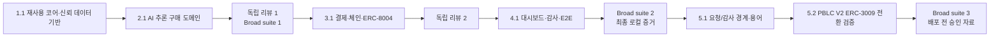

# 작업 분할 — AI 에이전트 M2M 결제 감사

Status: Approved on 2026-09-02; migration packet approved by explicit user direction on 2026-09-04
Date: 2026-09-04
Upstream:

- `aidlc-docs/inception/requirements.md` — Revised and approved 2026-09-04
- `aidlc-docs/inception/design.md` — Revised and approved 2026-09-04
- `aidlc-docs/inception/erc3009-impact.md` — Approved scope and compatibility map 2026-09-04

## 1. 실행 계약

- **packet-count:** 6 coherent work packets total (original 4 complete + migration 5.1 and 5.2)
- **review-boundaries:** original 2 complete; migration payment boundary receives focused diff/security review before deployment
- **broad-suite-count:** original 2 complete; one new broad suite before deployment approval
- **baseline:** Standard
- **soft checkpoint:** milestone당 active 90분. 신뢰 가능한 token telemetry가 있을 때만 300k observable tokens도 적용한다.
- **continue-past limit:** milestone당 active 3시간 또는 신뢰 가능한 telemetry 기준 750k tokens 전에 사용자 확인
- 같은 blocker/finding category가 두 fix cycle 뒤에도 남거나 packet 수가 하나 넘게 증가하면 새 packet을 시작하기 전에 재분해한다.
- 실제 secret, 유료 API, 외부 배포, 온체인 write 직전에는 사용자 handoff/승인을 받는다.

### Scoped high-assurance overrides

| 영향 packet/component | 구체적 이유 | 임시 assurance | 종료 조건 |
|---|---|---|---|
| 1.1 SIWE, Evidence Repository, sensitive payload encryption | 인증 재사용·증거 변조·원문 노출이 결제 감사의 신뢰 경계를 무너뜨림 | High-assurance negative, mutation, access-boundary tests | 인증 replay/도메인/체인/만료와 hash-chain 변조, plaintext 비노출 검증 통과 |
| 3.1 buyer wallet, budget reservation, x402/Permit2, chain write | 중복·재생·대체 결제가 실제 토큰 손실을 일으킴 | High-assurance concurrency, replay, reconciliation tests | 동시 중복, nonce replay, quote/402 치환, timeout 복구와 독립 receipt 검증 통과 |
| 4.1 audit integrity and encrypted payload presentation | 잘못된 판정 또는 원문 노출이 사용자에게 거짓 안전 신호를 줌 | High-assurance evidence-binding and authorization tests | 규칙 판정 재현성, bundle hash 연결, 원문 접근 통제와 redaction 검증 통과 |
| 5.2 PBLC V2, ERC-3009 signer, x402 settlement | 재생·위조·대체 서명이 실제 토큰 손실과 거짓 감사 증거를 만듦 | High-assurance signature, time-window, replay, exact-binding, reconciliation tests | 계약·wire·gateway negative tests와 broad suite 통과; 실거래는 별도 승인 |

## 2. 작업 순서

## Phase 1 — 재사용 코어와 신뢰 데이터 기반

- [x] **1.1 공통 구매 감사 골격, SIWE, Evidence Repository를 한 경로로 구현**
  - npm workspaces, Python virtual environment, Docker Compose, 공통 lint/typecheck/test 명령을 구성한다.
  - 승인된 네 packet을 `docs/ROADMAP.md`에 옮겨 구현 진척의 단일 체크리스트로 사용한다.
  - 설계 11장의 `core/`, `domains/ai_inference/`, `adapters/`, 공통/도메인 schema 경계를 만든다.
  - 공통 core가 AI 추론 도메인을 import하지 않는지 검사하고, 작은 fake domain conformance fixture로 교체 가능성을 증명한다.
  - SIWE nonce 발급·원자 소비·secure session과 owner/buyer wallet binding을 구현한다.
  - Evidence Repository만 MongoDB에 접근하도록 하고 append-only event hash chain, unique sequence, payment-event partial index 기반을 만든다.
  - 민감 원문을 구조화 이벤트와 분리하고 encryption port, local key handoff script, AWS KMS adapter seam을 만든다.
  - **Done when:** fake domain으로 인증→purchase 생성→암호화 payload→event 조회가 로컬에서 동작하며, wrong domain/chain/expiry/replay, hash mutation, 중복 sequence, plaintext 검색, core import-boundary 검사가 통과한다.
  - **Commit boundary:** 재사용 가능한 trusted foundation 한 개의 기능 커밋.

## Phase 2 — AI 추론 구매 도메인

- [x] **2.1 Gemini/Nemotron 판매자 견적과 구매 선택을 결제 직전까지 구현**
  - `domains/ai_inference`에 request normalization, clarification, benchmark normalization, eligibility, deterministic scoring, selection explanation port를 구현한다.
  - Seller Service 공통 quote/x402 shell과 AI inference quote extension을 분리한다.
  - provider adapter는 mock과 실제 Gemini/Nemotron 구현이 같은 계약을 따르게 하되, secret 없이 mock 경로를 먼저 완성한다.
  - EIP-712 seller quote, 만료, recipient/token/amount, provider 내 1회 counteroffer를 구현한다.
  - 저장된 benchmark snapshot과 signed quote만 사용해 `REQUESTED → QUOTED → DECIDED` 증거를 만든다.
  - **Done when:** 같은 입력과 snapshot은 같은 필터·점수를 만들고, budget/availability/identity 위반·견적 변조/만료·counteroffer 제한 테스트와 request-to-decision E2E가 통과한다.
  - **Commit boundary:** 결제 전까지 관통하는 AI inference marketplace 한 개의 기능 커밋.

### Verification boundary 1

- 새 컨텍스트 독립 리뷰로 core/domain import 방향, API/schema 계약, 인증·증거 경계를 검토한다.
- **Broad suite 1:** Phase 1–2 전체 lint, typecheck, unit, integration, request-to-decision E2E를 한 번 실행한다.
- 같은 범주의 수정이 두 번 실패하면 Phase 3으로 넘어가지 않고 packet을 재분해한다.

## Phase 3 — 결제, 체인 검증, ERC-8004 (과거 V1 구현 단계; 실행 경로 폐기)

- [x] **3.1 자체 ERC-20의 정확히 한 번 결제와 온체인 평판 연결을 로컬에서 구현**
  - 6-decimal EIP-2612 demo ERC-20, buyer 무가스 Permit2 승인, 분리된 deployer wallet, Base Sepolia bootstrap과 배포 주소 주입 방식을 구현한다.
  - Commerce Gateway가 `purchaseId`로 고정 decision/quote를 다시 읽고 예산을 원자 예약한 뒤 `DecisionAuthorization`을 저장하게 한다.
  - seller의 HTTP 402 조건과 quote를 완전히 대조하고 같은 Permit2 nonce로 x402 재요청한다.
  - Coinbase Facilitator 응답과 별도로 RPC receipt/status/contract/`Transfer` sender-recipient-amount를 검증한다.
  - 모호한 timeout은 재결제하지 않고 reconciliation 상태로 전환한다.
  - 공식 배포 주소를 환경에서 주입하는 ERC-8004 identity/reputation adapter와 객관적 100/0 feedbackHash 제출을 구현한다.
  - fake domain도 같은 Commerce Gateway mock 결제 경로를 통과시켜 공통 결제 레일이 AI 추론 구현에 의존하지 않음을 증명한다.
  - **Done when:** 로컬 mock 체인 경로와 실제 Base Sepolia smoke path에서 하나의 purchase가 최대 한 번 settled되고 tx hash가 evidence에 연결된다. 동시 중복, nonce replay, quote/402 치환, 예산 초과, wrong recipient/token/amount, timeout/revert, self-feedback 거부 검사가 통과한다.
  - **External gate:** 실제 tx 검증 전 사용자가 전용 입력 스크립트로 wallet/API 설정을 완료해야 하며, 키는 채팅·로그·Git에 노출하지 않는다.
  - **External smoke pending:** Base Sepolia deploy/EIP-2612 gas-sponsored approval/CDP Facilitator tx hash는 deployer gas가 준비된 뒤 수행한다. buyer wallet에 native ETH를 넣지 않으며, 이 외부 증거가 없다는 사실을 로컬 완료와 구분해 보고한다.
  - **Commit boundary:** 결제·체인·identity trust boundary 한 개의 보안 기능 커밋.

### Verification boundary 2

- 새 컨텍스트 독립 리뷰로 signing ownership, allowance 범위, idempotency, race/replay, reconciliation, chain evidence binding을 검토한다.
- 이후 Phase 4가 결제 경계 코드를 변경하면 이 리뷰 증거는 무효이며 해당 focused review를 다시 수행한다.

## Phase 4 — 감사 대시보드와 로컬 E2E

- [x] **4.1 사용자가 선택·결제·위험을 확인하는 전체 로컬 경로와 AWS handoff를 완성**
  - 승인된 목업을 기준으로 로그인, overview, 새 요청, 거래 목록/상세, 판매 에이전트 평판, 감사 경고 화면을 구현한다.
  - 공통 dashboard shell과 `features/ai-inference` 입력·후보 비교 renderer를 분리한다.
  - SSE resume, stale/degraded/partial states와 인증·소유권 기반 상세 원문 열람을 구현한다.
  - 결정적 감사 규칙을 권위 판정으로 두고 semantic audit adapter의 mock/최종 모델 교체 경계를 구현한다.
  - audit bundle hash와 ERC-8004 feedback 이벤트를 연결하고 일반 응답·로그에서 prompt/response/signature를 redaction한다.
  - 실제 Gemini/Nemotron 응답, MongoDB 재조회, Base Sepolia tx, ERC-8004 feedback을 한 purchase 상세에서 연결한다.
  - Docker Compose 로컬 실행, `docs/HANDOFF.md`, `docs/ROADMAP.md` 최종 상태, AWS IaC/환경 변수 계약을 정리한다. 실제 AWS 배포와 비용 발생은 별도 승인 전 수행하지 않는다.
  - **Done when:** 데스크톱/모바일 핵심 흐름, 키보드 접근, normal/caution/risk 및 주요 복구 상태가 검증되고, 한 실제 요청의 선택 근거·서명 견적·결제 tx·응답 hash·감사 보고서·평판 tx를 대시보드에서 추적할 수 있다.
  - **Local completion:** mock provider/facilitator와 실제 MongoDB로 코드 경로·복구·UI build·감사·평판 연결을 검증했고, API·Dashboard·두 Seller·Gateway Docker 이미지를 모두 빌드했다. 실제 provider ID와 Base Sepolia/ERC-8004 tx 및 화면 캡처는 외부 게이트다.
  - **Commit boundary:** 사용자에게 보이는 감사 제품과 로컬 운영 handoff 한 개의 기능 커밋.

### Final verification

- **Broad suite 2:** 전체 lint, typecheck, unit, integration, contract, local E2E, scoped security tests를 한 번 실행한다.
- 실제 제공자 응답 ID, Mongo record ID, Base Sepolia tx hash, ERC-8004 tx hash와 현재 빌드의 대시보드 캡처를 최종 증거로 남긴다.
- 공개 AWS 배포 전 민감 원문 TTL/수동 삭제 정책과 시연 증거 보존을 다시 승인받는다.
- GitHub remote가 준비되면 팀 저장소의 기본 브랜치를 확인하고 각 coherent packet을 PR 검토 가능한 커밋/브랜치로 전달한다.

## Phase 5 — 승인된 요청 경계와 PBLC V2 ERC-3009 전환

- [x] **5.1 `/request`와 읽기 전용 감사 대시보드, Buyer/Wrapper/Evidence 용어를 일치시킨다**
  - `/request`에 prompt, optional PBLC budget, priority, explicit testnet acknowledgement, pending `purchaseId` 재개를 구현한다.
  - `/`, `/dashboard`에는 조회만 남기고 `/experiments`는 데이터 변경 없이 `/request`로 리다이렉트한다.
  - 사용자 문서·화면·구조도는 `Audit Evidence API`, `Payment Executor`, Buyer/Seller SDK Wrapper를 사용한다. 내부 클래스/패키지 호환 이름은 유지한다.
  - 구매 에이전트가 분석→견적→선택→승인→결제 실행 요청→결과 반환을 소유한다는 경계를 composition과 설명에 반영한다.
  - 선택 감사가 priority/weights, 재계산한 hard filter, 최고 eligible score, winner, generated explanation을 검증하게 한다.
  - **Done when:** route/static tests와 audit adversarial tests가 통과하고 dashboard route에서 구매/실험 action이 검출되지 않는다.

- [x] **5.2 PBLC V2 ERC-3009와 x402 exact 전환 경로를 검증한다 (완료된 이행 단계)**
  - 전환 검증 중 기존 `DemoToken.sol`과 Permit2 runtime/default를 보존하고 별도 `DemoTokenV2.sol`을 추가했다. 5.3 완료 후 Permit2 runtime/default는 제거됐다.
  - EIP-712 `transferWithAuthorization`, random bytes32 nonce, `authorizationState`, time window, low-s/v, `AuthorizationUsed`를 구현한다.
  - 정상/오서명/만료/not-yet-valid/replay/잔액 부족 계약 테스트를 작성한다.
  - Seller 402와 Payment Executor에 `permit2 | eip3009` 전략을 추가하며 method/token/name/version substitution을 거부한다.
  - ERC-3009 intent nonce를 Mongo에 additive/backward-compatible하게 저장하고 재시도에서 고정한다.
  - receipt 검증에 정확한 Transfer와 AuthorizationUsed를 결속한다. 기존 Permit2 receipt는 과거 증거 조회 호환성으로 확인한다.
  - PBLC V2 status/plan/deploy 스크립트를 기존 v1 deploy와 분리하고 deploy는 실행하지 않는다.
  - **Done when:** 전체 lint/typecheck/unit/integration/contracts/Mongo/dashboard build가 통과하고 deployer/buyer/sellers/predicted address/gas/mint/0.1 PBLC 승인 자료가 준비된다.
  - **External gate:** 사용자 승인 전 Base Sepolia deploy, mint, verify, settle을 실행하지 않는다. 승인 후 성공한 경우에만 기본 method를 `eip3009`로 전환한다.
  - **Executed 2026-09-04:** 사용자 승인 후 PBLC V2를 배포하고 x402.org Facilitator `verify/settle`, 정확한 `0.1 PBLC` Transfer, `AuthorizationUsed`, 동일 nonce 재사용 거부를 확인했다.

- [x] **5.3 성공한 ERC-3009를 유일한 신규 결제 경로로 확정한다**
  - `PAYMENT_TRANSFER_METHOD`와 Permit2 signer/challenge/payload 실행 분기를 제거한다.
  - 신규 payment intent는 ERC-3009 nonce만 생성한다.
  - 기존 Permit2 성공·실패·미완결 증거는 그대로 조회하되 execute/reconcile을 거부한다.
  - 기존 Permit2 로컬 프로세스를 중지하고 기본 Compose·환경 예시를 PBLC V2로 전환한다.
  - **Done when:** Permit2 선택 설정이 없고, seller가 eip3009만 광고하며, legacy intent rejection·전체 회귀·기존 Mongo 증거 보존 검사가 통과한다.

## 3. 재사용성 완료 조건

다음 네 가지를 통과해야 “나중에 도메인을 바꿔도 재사용 가능”하다고 보고한다.

1. 공통 auth/evidence/payment/reputation core에 `ai_inference`, Gemini, Nemotron import가 없다.
2. fake domain이 공통 core에서 purchase 생성·증거 저장·mock 결제까지 통과한다.
3. AI 추론 전용 schema와 UI renderer는 `domains/ai_inference` 또는 `features/ai-inference` 아래에만 있다.
4. 새 도메인 추가 절차가 port 구현, domain schema, seller adapter, UI renderer 목록으로 문서화돼 있다.

이 기준은 “새 도메인 파일만 추가하면 무조건 동작한다”는 플러그인 플랫폼을 뜻하지 않는다. 공통 결제·감사 레일을 고치지 않고 새 도메인 구현을 연결할 수 있다는 뜻이다.

## 4. Task Approval Gate

- **Decision:** Approve and Continue
- **Approved:** 2026-09-02
- Phase 1의 1.1 구현을 시작한다.
