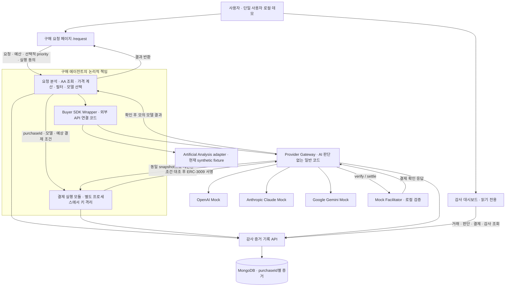
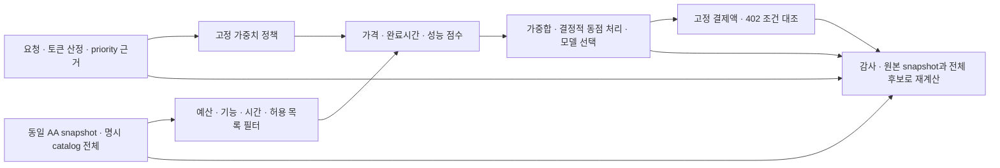

# AEGIS 단일 구매 구조

2026-09-09 확정 설계. **현재 구현 전환·검증 중**이며 아래 화살표 전체가 이미 E2E 검증됐다는 뜻은 아니다. 측정된 완료 범위는 [검증 기록](AEGIS_VERIFICATION.md)을 기준으로 한다.

## 실행 경로와 조회 경로

Gateway와 결제 실행 모듈은 MongoDB에 직접 접속하지 않는다. 감사 증거 기록 API가 필수 필드, 이벤트 순서, 해시 체인과 내부 조회 경계를 담당한다. 대시보드에는 구매 입력 폼이나 실험 실행기를 넣지 않는다.

## 선택과 감사

- 정책은 `aa-three-factor-v1`이다. 가격·완료시간·성능의 비중은 default 40/30/30, price 60/20/20, speed 20/60/20, intelligence 20/20/60이다.
- 결제액은 예상 입력 토큰과 최대 출력 토큰의 사전 고정액이다. 6자리 정수 단위로 올림하며 실제 사용량 사후 정산이 아니다.
- AA 완료시간은 벤치마크 참고치이고 실제 요청의 완료 보장이 아니다. Mock 실행시간은 모의 실행시간이다.
- 해시 체인은 저장 증거 내부의 연결 검사다. 온체인 Anchor 기준점이나 독립 Transfer 확인에 의한 보장을 주장하지 않는다.

## 실제 실행과 과거 기록의 경계

| 구분 | 신규 로컬 실행 | 과거 PBLC 기록 |
|---|---|---|
| 모델 응답 | 세 Provider 모두 Mock | 당시 기록 그대로 |
| AA 데이터 | synthetic fixture 표시, 실제 인증 API 검증은 외부 게이트 | 당시 정책/점수 그대로 |
| 결제 상태 근거 | Facilitator 응답, Mock 여부 명시 | 당시 결제 방식과 증거 그대로 |
| 토큰 | AEGIS 계약 준비, 실제 배포 전 | PBLC 및 당시 계약 주소 유지 |
| 평판·Anchor·독립 RPC 결제 검증 | 실행·점수에서 제외 | 저장된 상세 증거 읽기 유지 |
| 인증 | 단일 사용자 loopback 데모, 내부 API 보호 유지 | 신규 SIWE 로그인 요구 없음 |

실제 모드에서는 Facilitator가 블록체인 전송을 제출한다. 현재 로컬 검증은 실제 AEGIS 전송이 아니다. 잔액을 조회하지 않았다면 실제 온체인 잔액처럼 표시하지 않는다. 1 AEGIS = 1 USD는 명목 산정 규칙이며 달러 담보·상환 가치를 뜻하지 않는다.

사용자가 AWS 배포는 아직 이르다고 명시했다. AWS 실제 배포는 진행하지 않는다. 토큰 배포·자산 이동·실제 테스트넷 결제는 지갑·방식·예상 주소·가스·금액을 먼저 제시하고 별도 승인을 받는 경계로 남는다.
