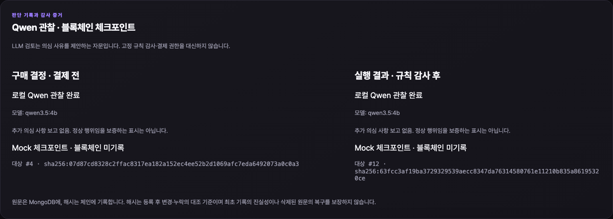

# Decision 관찰·채팅·체크포인트 검증 (2026-09-12)

## 최신: 구매 버튼 연결 복구

- 현장 증거: `curl http://127.0.0.1:3100/backend/health`가 연결 거부, 3100 리스너 없음. 최초 health 실패 뒤 재시도 없는 UI와 숨겨진 차단 사유를 수정하고 기존 격리 Mock preview를 재기동했다.
- health/저장 구매 조회 실패 → 같은 카드의 `연결 다시 확인` → 버튼 활성화 → 명시 실행을 브라우저에서 확인했다. 복구 전후 카드·미전송 초안·pending ID 보존, 재확인 쓰기 0, 반복 재확인 클릭 합치기, 같은 ID 재시도를 검증했다.
- 응답 없는 health/pending GET 각각 8초 제한 후 복구, 브라우저 저장소 접근 실패 후 복구, 404 ID 보존/상세 링크, 모드 미확인을 Mock으로 오표시하지 않음을 확인했다. StrictMode 재설정 중 mount 표시가 꺼진 채 남는 중간 오류는 리뷰에서 수정 후 검증했다.
- `scripts/chat_request_browser_smoke.mjs`: 응답 가로채기 기반 **15개 묶음 통과**. 최종 dashboard 테스트 **38/38**, 기본 전체 lint/타입 검사 및 dashboard production build 통과. 핵심 사용자 흐름 기준 최종 blocker 없음.
- 실제 3100 HTTP health는 `mock/AEGIS`, 별도 브라우저에서 메시지 전송 후 실행 버튼 활성화, 구매 POST **0건** 확인. 이번 패킷은 신규 Mongo 구매/로컬 Qwen 실행을 추가하지 않았다. 아래 이전 실 Mock 구매 검증을 이번에 재실행한 것으로 보지 않는다.
- 기존 거래 DB·`.env.local`·결제/Anchor 모듈은 수정하지 않았다. 광범위 backend/계약 반복, 새 AEGIS 정산, 체인 쓰기/배포, 유료 Provider, AWS는 실행하지 않았다. 임시 데모 서버가 종료되면 재기동이 필요하고, 조회 불가 기존 ID를 자동 폐기하는 기능은 추가하지 않았다.

## 최신: 채팅 UX 교정 검증

기존 폼 속 대화 초안을 단일 채팅으로 교정했다. 미전송 문구 경고와 자동 상세 이동을 제거하고, 메시지별 독립 확인 카드 → 명시 동의 → 같은 대화의 결과/오류를 제공한다. 예산·우선순위는 보내는 순간 고정되며 이전 요청의 문구를 합산하지 않는다. 완료 후 다시 보내기는 새 구매, 실패 재시도는 같은 purchaseId다.

| 이번 실행 범위 | 결과 |
|---|---|
| 브라우저 응답 가로채기 기반 핵심 경계 11개 묶음 | 모두 통과: 전송 쓰기 0·IME/줄바꿈·미전송 문구·이중 클릭·반복 요청·동일 ID 재시도·완료된 저장 ID·연결 미확인·HTTP200 미정산 3종·결제 전 실패 후 변경 요청·미확정 정산 우회 차단·live 표시 |
| 실제 격리 HTTP/Mongo + 로컬 Qwen + Mock 정산에서 같은 문구 연속 구매 | 2건 완료, create/run POST 총 4건, 각 `PAYMENT_SETTLED` 1개·checkpoint 2개·감사 기록 확인, `/request` 유지 |
| dashboard 단위/정적 경계 | Node26에서 38/38, skipped 0 |
| 전체 lint·타입 검사 / dashboard production build | 통과 |
| 390×844 화면 | 가로 overflow 없음, 설정을 펼쳐도 입력창 하단 727px로 화면 안에 위치 |

실제 Mock 구매 ID: `295f16f2-9ba3-4c1c-85fc-1671e2adc3cb`, `2603f095-5338-47e4-b059-912d65c53711`. `npm run aegis:observer:demo`의 별도 임시 DB에 남겨 두었으며 데모 종료 시 해당 임시 DB가 정리된다. 기존 사용자 거래 DB는 변경하지 않았다. 가로채기 테스트의 ID는 메모리 fixture이며 MongoDB에 저장하지 않는다.

코드와 별도의 핵심 흐름 리뷰에서 “결제 전 실패도 모든 다음 요청을 막음”을 blocker로 발견해 수정했다. PAYMENT_NOT_STARTED/PAYMENT_FAILED/RECONCILED_NO_TRANSFER만 변경된 새 요청을 허용하고 진행/미확정은 보호한다. 최종 핵심 blocker 없음. HTTP200이라도 settled 상태가 아니면 성공으로 표시하거나 pending ID를 없애지 않는다.

재현: `PLAYWRIGHT_MODULE=<로컬 Playwright 모듈 경로> node scripts/chat_request_browser_smoke.mjs`는 응답 가로채기 테스트만 실행한다. `--execute-mock`는 3100의 Mock 모드를 확인한 뒤 임시 DB 구매 2건을 추가하므로 실제 결제 환경에서는 실행하지 않는다.

이번 검증에서 생략: backend/계약 광범위 재검증, 탐지 정확도 평가, 부하·보안 강화, 실제 Facilitator 정산, 새 체인 Anchor, 유료 Provider 및 AWS. 아래 표는 앞선 기능 구현 당시의 결과이며 이번에 전부 재실행한 것이 아니다.

## 구현 상태

- 채팅 메시지는 브라우저 안에서만 갱신된다. 메시지별 고정 확인 카드에 명시적으로 동의한 경우에만 purchaseId/구매 실행 API를 호출한다. 다음 메시지를 입력 중이어도 기존 확인 카드를 실행할 수 있다.
- Python이 DECIDED/AUDITED 각각에 별도 Qwen 관찰을 기록하고 해당 event prefix를 고정한다. 관찰자는 자문이며 실패는 OBSERVER_UNAVAILABLE로 기록한다. 고정 정책·결제 권한은 바꾸지 않는다.
- protected Evidence API GET은 읽기 전용. POST checkpoint는 동일 phase/hash/count/mode의 재실행만 허용한다. TypeScript는 MongoDB에 직접 접근하지 않는다.
- 결정 checkpoint가 필요한 모드에서는 결제 서명 전에 확인한다. 감사 checkpoint 실패는 이미 완료된 결제를 다시 만들지 않는다. Mock proof에는 transaction hash를 만들지 않는다.
- 실제 Anchor 모드는 기존 Solidity EvidenceAnchor 및 확인 어댑터를 재사용한다. 저장된 decision proof는 live 결제·재실행·audit anchor 전에 체인의 동일 purchaseId/count/hash/tx와 대조한다. 새 계약 배포나 체인 쓰기는 실행하지 않았다.

## 실제 실행한 검증

| 범위 | 결과 |
|---|---|
| Mock 3 Provider 전체 구매+관찰+두 checkpoint+재실행 | OpenAI/Anthropic/Google 각 1회 정산·checkpoint 2건·observer 2건, 재실행 증가 없음 |
| gateway 전체 단위/통합 | 130 통과 (Mongo proof 조작 거부 포함) |
| Python checkpoint/API·Qwen 구조화 adapter 집중 | 6 통과 |
| Solidity EvidenceAnchor 권한·연속성 | 2 통과, 로컬 EVM만 |
| dashboard 경계 테스트 | 36 통과 (Node26) |
| lint / 타입 검사 / dashboard production build | 통과 |
| schema 경계 / 가격 비교 | 통과, 가격 8case 일치 |
| script 안전 경계 | 24 통과 |
| 브라우저 채팅 전송 | 구매 API 쓰기 0건, 390px 가로 overflow 없음 |
| 브라우저 명시 구매 실행 | 실제 preview3100에서 POST 2건(create/run), 결과 상세 이동·Mock checkpoint 2건 표시 |
| 실제 로컬 Qwen 전체 흐름 | qwen3.5:4b로 세 Provider 각 decision/audit 관찰 완료, replay 중 관찰/정산/checkpoint 추가 없음 |

독립 리뷰는 사용자 요청대로 Mock 데모의 핵심 흐름만 blocker로 평가했다. wire naming 문제 수정 후 blocker 없음. 이후 발견한 preview3100 origin 누락은 임시 stack의 명시 loopback allowlist에 추가했다. 실제 live 환경의 origin 정책은 완화하지 않았다.

실제 Qwen 검증은 `node scripts/decision_observer_smoke.mjs --qwen`이 exit0으로 완료됐다. 초기 시도의 timeout/잘린 JSON은 unavailable로 남겼고, 한국어 UTF-8 전송·observer timeout30초·최대2finding/출력768토큰으로 조정 후 새 구매에서 검증했다. 이는 대표 정상 구매 3건의 호출·스키마·연결 검증이며, 이상행위 탐지 정확도 평가를 완료했다는 뜻은 아니다.

브라우저 Mock 구매 예시: `92492734-639c-4caf-99a8-4b4d69dfb726` (격리 preview 임시 데이터, 실거래 아님).

## 모의와 실제의 구분

- 실제: 로컬 HTTP 서비스, 임시 replica-set MongoDB, 임시 테스트 키 서명, 브라우저, 로컬 Qwen, 로컬 Solidity 테스트.
- 모의: AA fixture, 세 Provider 응답, Facilitator 정산, Anchor 체크포인트.
- 기존 live `.env.local`, AEGIS 자산, 사용자 거래/감사 DB는 변경하지 않았다. 테스트 종료 때 삭제되는 것은 이 실행이 만든 임시 저장소뿐이다.
- 새 토큰 배포/민팅/송금, AEGIS 실제 결제, 새 EvidenceAnchor 배포/쓰기, 유료 모델 호출, AWS 배포 없음.

## Known limitations

- Qwen은 두 사건 시점의 자문이다. 매 토큰의 사고과정이나 누락된 모든 행위를 관찰하는 상시 프로세스가 아니다. 결과의 정확도는 별도 평가가 필요하다.
- 입력은 안전한 필드로 제한되고 원 요청은 최대 4,000자로 잘린다. 요청 재인용 금지 지시가 있어도 자유문 finding에 원문 일부가 포함될 수 있으므로 민감 정보 없는 데모 요청을 사용한다.
- Model timeout/잘못된 JSON/존재하지 않는 eventId는 unavailable. “추가 의심 없음”과 “감사 정상 보증”은 다르다.
- Anchor가 없는 Mock는 블록체인 무결성 보장이 없다. 실제 Anchor도 등록 전 조작·미기록·기록의 최초 진실성·삭제 원문 복구를 보장하지 않는다. DB 전체 삭제 탐지에는 체인 기록과 외부 기준 purchaseId의 대조가 필요하다.
- 신규 Anchor 배포·체인 쓰기·체인 장애 복구는 외부 승인 게이트다. 대시보드는 저장된 Anchor 확인 기록이지 페이지를 열 때마다 새 RPC 감사를 수행한 결과가 아니다. 주기적 전수 대조 및 미확정 제출의 장시간 복구 스트레스는 미수행이다.
- Anchor 재대조 어댑터는 최근 최대 10,000블록의 로그만 조회한다. 오래된 checkpoint를 찾지 못하면 성공으로 추정하지 않고 중단한다. 장기 이력의 receipt 기반 조회/범위 확장은 후속 과제다.
- 사용자 축소 범위에 따라 Python 완전 outbound 계측, 광범위 과거 자료 zero-write 회귀, Mongo failure stress, 광범위 전체 테스트 반복, 추가 보안·성능 강화는 생략했다.

## 배포 승인 계획 (읽기 전용 추정)

사용 지갑 후보: `0x043D966B3f30Ff9FAC08FD6b5eFeDa6ac895a0a3`.
Solidity `EvidenceAnchor(initialOwner=동일지갑)`의 CREATE 배포, pending nonce=6 당시 예상 주소:
`0x169358B1F8404353456F6B287F5bE9648aB23Af8`.
읽기 전용 추정 gas=350,998, maxFeePerGas=7,000,000wei, 실행 수수료 상한 추정=0.000002456986ETH + L1 데이터 수수료. 체크포인트당 gas cap=200,000, 구매당 2건.
토큰 이동 금액은 0이며 별도 승인 없이 실행하지 않는다. nonce/네트워크 수수료가 바뀌므로 실제 승인 전에 `node scripts/evidence_anchor_preflight.mjs <공개지갑주소>`로 다시 확인해야 한다.
