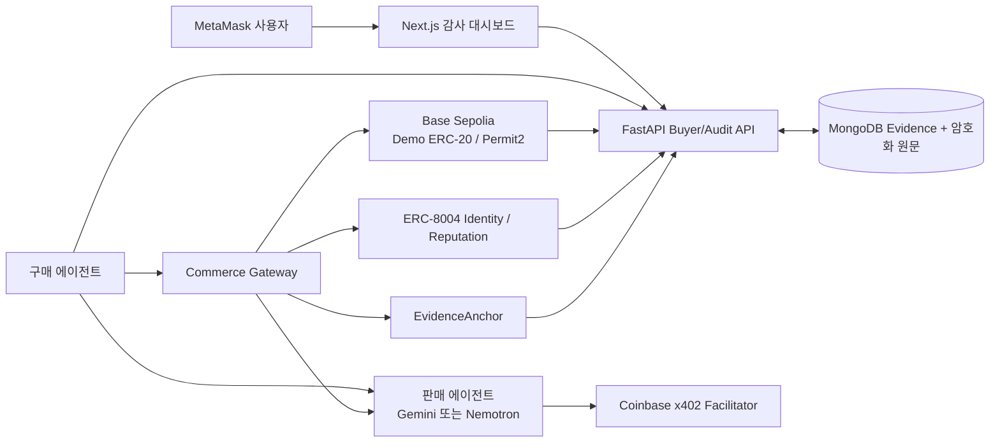

# 로컬 완료 및 외부 실행 인계

## 현재 로컬 완료 범위

요청·견적·결정·예산 예약·x402 Permit2 결제·독립 영수증 검증·전달·결정적 감사·ERC-8004 평판·외부 evidence anchor를 `purchaseId`로 연결하는 코드와 테스트가 완료됐다. Gemini/Nemotron은 공통 판매 계약 뒤에 있고, AI 추론 UI만 `apps/dashboard/src/features/ai-inference/`에 분리되어 다른 구매 도메인이 공통 결제·감사 코드를 재사용할 수 있다.



## 로컬 실행

시크릿은 채팅에 붙이지 않는다. 별도 터미널에서 다음을 실행한다.

```bash
cd /Users/vien/MyProjects/PBL
python3 scripts/setup_keys.py
python3 scripts/input_provider_keys.py  # 실제 provider smoke 직전에만
```

일반 개발:

```bash
npm run setup:python
npm run api
npm run dashboard
```

MongoDB·API·대시보드 Compose:

```bash
set -a
source .env.local
set +a
docker compose -f infra/docker/compose.yml --profile app up --build
```

실제 provider key, 배포 주소, ERC-8004 agent ID까지 채운 뒤 두 Seller와 Gateway를 함께 실행하려면:

```bash
docker compose -f infra/docker/compose.yml --profile app --profile agents up --build
```

Gateway는 `seller-gemini`와 `seller-nemotron`을 선택된 `sellerAgentId`로 라우팅한다. 외부 호출은 `GATEWAY_SERVICE_TOKEN` bearer 인증이 필요하다. hash 없는 `RECONCILIATION_REQUIRED`에서는 새 결제 서명이나 제출을 만들지 않고, 인증된 seller 복구 endpoint가 MongoDB의 durable `SUBMITTED`/`SETTLED` journal을 재개한다. 회수한 거래 hash는 별도 `PAYMENT_SUBMISSION_IDENTIFIED` CAS로 `None → tx` 한 번만 결속한다. 해당 journal도 없으면 안전하게 중단된 상태를 유지한다.

Provider 호출 직전에는 `PROVIDER_SUBMITTED`, 결정적 attempt ID, 호출자별 획득 토큰을 CAS로 먼저 저장한다. 동시 복구에서는 저장된 획득 토큰과 일치하는 단 한 호출자만 provider를 실행한다. 이 저장 이후 결과의 성공 여부가 불명확해지면 provider를 다시 호출하지 않고 전달 조정 필요 상태로 남겨, 중복 유료 추론보다 보수적 실패를 선택한다.

현재 MVP 배포 불변식은 seller별 활성 writer replica 1개와 Gateway 활성 writer replica 1개다. 프로세스 내부 single-flight, provider-attempt CAS 획득 토큰, MongoDB durable journal은 현 배포의 동시 요청과 재시작을 견디지만, 전체 active-active 수평 확장 전에 분산 lease 또는 nonce 조정 계층을 추가해야 한다.

검증:

```bash
npm run lint
npm test
npm run test:mongo:local
npm audit --omit=dev
```

## 실제 Base Sepolia smoke 순서

1. `DemoToken`과 `EvidenceAnchor`를 Base Sepolia에 배포하고 주소를 환경 변수로만 주입한다.
2. buyer와 provider 판매 에이전트를 ERC-8004에 등록하고 agent ID·agent wallet을 견적 설정에 주입한다.
3. admin만 demo token을 mint해 buyer-agent wallet에 전송한다.
4. buyer wallet은 x402 공식 Permit2 proxy에 데모에 필요한 제한 금액만 allowance한다.
5. Coinbase Facilitator URL/인증을 설정하고 한 요청을 실행한다.
6. Facilitator 응답과 별개로 RPC receipt의 status, token contract, 정확한 `Transfer(from,to,amount)`를 확인한다.
7. provider response hash를 기록하고 감사를 실행한다.
8. 감사 서버가 선택 agent ID·객관적 성공 100 또는 확정 실패 0·audit bundle hash를 먼저 확정한 뒤 ERC-8004 feedback을 제출한다.
9. 평판 tx의 정확한 `NewFeedback(agentId,value,tags,feedbackHash)`와 EvidenceAnchor event를 receipt에서 확인한 뒤 MongoDB evidence에 기록한다.
10. 대시보드 거래 상세에서 request→decision→tx→delivery hash→audit→reputation/anchor 링크를 캡처한다.

## AWS 인계

`infra/aws/terraform/`은 ECS Fargate task, CloudWatch, 명시적 Secrets Manager ARN 계약을 정의한다. 기본 `enable_services=false`이므로 실제 서비스와 비용은 생성하지 않는다. ALB/HTTPS/WAF, VPC ingress, ECR 이미지, MongoDB Atlas 네트워크, CloudWatch alarm은 팀 계정 정보가 정해진 뒤 추가한다.

## 공개 배포 전 차단 게이트

- 민감 prompt/response는 현재 MVP 정책 B에 따라 자동 삭제하지 않는다. **공개 AWS 배포 전에 TTL 또는 수동 삭제 정책과 시연 증거 보존 범위를 다시 결정해야 한다.**
- 실제 provider response ID, Base Sepolia payment tx, ERC-8004 registration/feedback tx, EvidenceAnchor tx가 아직 없다.
- 팀 GitHub 저장소 URL과 기본 브랜치가 아직 없다.
- AWS 비용·외부 쓰기 권한 승인이 아직 없다.
- Terraform CLI가 현재 로컬에 없어 `terraform validate`는 실행하지 못했다. 설치 후 `terraform fmt -check && terraform init -backend=false && terraform validate`를 실행한다.
