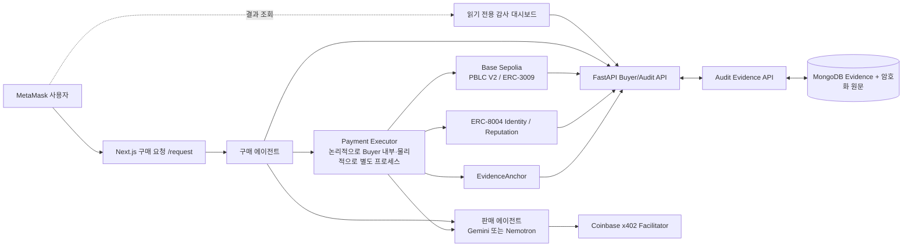

# 로컬 완료 및 외부 실행 인계

> **최신 범위 축소:** 발표용 로컬 데모만 완료한다. 세 Mock Provider E2E, 예산 초과·402 불일치·중복 결제 방지, dashboard build·기본 lint만 재검증한다. Python 포함 완전한 outbound 계측, 과거 증거 광범위 zero-write 회귀, Mongo 실패 정리 추가 스트레스, 광범위 테스트 반복 및 추가 보안·성능 강화는 Known limitations/후속 과제다. 기존 리뷰 발견이 해결된 것은 아니다. 2026-09-10 사용자 승인으로 Coder를 Terra로 바꿔 재개했다. 실제 배포·결제·AWS는 실행하지 않는다. 작업 기준: `../.agent/DEMO_SCOPE.md`.

> 2026-09-09: 이 문서의 아래 PBLC 구성·명령·실거래 결과는 **전환 전 역사 기록**이다. 신규 AEGIS/AA 구현의 현재 상태는 [AEGIS 검증 기록](AEGIS_VERIFICATION.md), [구조도](AEGIS_ARCHITECTURE.md), `.agent/CURRENT_STATE.md`를 따른다. 신규 Provider/Facilitator는 Mock이며 실제 AA 인증 API·AEGIS 배포·실제 결제는 미검증/미실행이다. 과거 smoke·키 설정·AWS 명령을 신규 로컬 데모의 다음 실행 단계로 사용하지 않는다. 사용자는 AWS 배포를 아직 원하지 않는다.

## 신규 AEGIS 로컬 인계 — 2026-09-09

구매 요청은 `/request`, 감사 대시보드는 읽기 중심 `/`이다. 신규 실행은 AA synthetic fixture와 OpenAI·Claude·Gemini Mock Gateway, Mock Facilitator를 사용한다. 결제 실행 모듈은 별도 프로세스의 임시 키로 ERC-3009 승인을 서명하지만 실제 블록체인 전송은 하지 않는다. 원문은 암호화해 분리 저장하고 내부 API 보호는 유지한다.

`npm run aegis:stack`은 별도의 임시 MongoDB와 로컬 서비스들을 시작한다. 출력된 Evidence API 주소를 대시보드의 `API_ORIGIN`으로 지정하고 대시보드는 허용 origin인 `127.0.0.1:3000`에서 실행한다. 이 runner가 소유한 임시 데이터는 정상 종료 때 정리된다. 기존 사용자 MongoDB에 연결하거나 그 기록을 수정하는 데 사용하지 않는다. 자세한 명령은 [README](../README.md)를 따른다.

2026-09-10 발표용 로컬 데모 범위를 완료했다. Terra의 핵심 E2E5건·402검사2건·dashboard build·기본 lint가 통과했고, 오케스트레이터 재검증7건과 Astra Light 최종 리뷰도 통과했다. 기존 UI·AA 정책·결제 런타임을 유지했으며 이번 재개에서 핵심 코드 추가 수정은 없었다. 정확한 범위·유예 검증은 [검증 기록](AEGIS_VERIFICATION.md)을 따른다. 결제 확인은 Facilitator 응답 기준이고 독립 RPC 검증을 의미하지 않는다. 미조회 잔액은 실제 잔액으로 표시하지 않는다.

실제 테스트용 HTTP·Mongo 저장과 임시 키 서명은 실행했지만, AA 데이터·Provider 응답·정산은 모의다. 테스트 서버는 종료했으므로 발표 때 README 명령으로 새 임시 실행을 시작한다. 새 데이터는 종료하면 사라진다. 기존 미커밋 AEGIS 작업과 원래 P6-03 worktree는 그대로 보존되어 있으며, 이 인계는 원격 게시나 AWS 배포 완료를 의미하지 않는다.

외부 게이트는 다음과 같이 분리한다.

- 실제 AA 인증 API: 서버 키가 없는 상태에서는 fixture 검증만 완료할 수 있다.
- AEGIS 배포·자산 이동·테스트넷 결제: 지갑, 방식, 예상 주소, 가스, 금액을 제시하고 별도 승인받기 전에는 실행하지 않는다.
- 실제 Provider API: 이번 범위에서 연결하지 않는다.
- AWS: 사용자가 아직 진행하지 않겠다고 명시했다. 배포하지 않는다. 공개 다중 사용자 접근 제어와 원문 보존 정책은 향후 별도 결정이다.

## 과거 PBLC 로컬 완료 범위 — 당시 구현 기록

요청·견적·결정·예산 예약·x402 ERC-3009 결제·독립 영수증 검증·전달·결정적 감사·ERC-8004 평판·외부 evidence anchor를 `purchaseId`로 연결하는 코드와 테스트가 완료됐다. Gemini/Nemotron은 공통 판매 계약 뒤에 있고, AI 추론 UI만 `apps/dashboard/src/features/ai-inference/`에 분리되어 다른 구매 도메인이 공통 결제·감사 코드를 재사용할 수 있다. 과거 Permit2 증거는 조회만 가능하고 다시 실행할 수 없다.



## 과거 PBLC 실행 방법 — 신규 데모에 사용하지 않음

시크릿은 채팅에 붙이지 않는다. 별도 터미널에서 다음을 실행한다.

```bash
cd /Users/vien/MyProjects/PBL
python3 scripts/setup_keys.py
```

기본 `PROVIDER_MODE=mock`에서는 Gemini/Nemotron API 키가 필요 없다. 실제 provider 응답을 검증할 때만 `python3 scripts/input_provider_keys.py`를 실행하고 `PROVIDER_MODE=real`로 바꾼다.

일반 개발:

```bash
npm run setup:python
npm run api
npm run dashboard
```

MongoDB·API·대시보드 Compose:

```bash
set -a
source .env.local
set +a
docker compose -f infra/docker/compose.yml --profile app up --build
```

실제 provider key, 배포 주소, ERC-8004 agent ID까지 채운 뒤 두 Seller와 Gateway를 함께 실행하려면:

```bash
docker compose -f infra/docker/compose.yml --profile app --profile agents up --build
```

Gateway는 `seller-gemini`와 `seller-nemotron`을 선택된 `sellerAgentId`로 라우팅한다. 외부 호출은 `GATEWAY_SERVICE_TOKEN` bearer 인증이 필요하다. ERC-3009 intent의 hash 없는 `RECONCILIATION_REQUIRED`에서는 새 결제 서명이나 제출을 만들지 않고, 인증된 seller 복구 endpoint가 MongoDB의 durable `SUBMITTED`/`SETTLED` journal을 재개한다. 회수한 거래 hash는 별도 `PAYMENT_SUBMISSION_IDENTIFIED` CAS로 `None → tx` 한 번만 결속한다. 해당 journal도 없으면 안전하게 중단된 상태를 유지한다. 과거 Permit2 미완결 intent는 재개하지 않고 조회 전용 상태로 남긴다.

Provider 호출 직전에는 `PROVIDER_SUBMITTED`, 결정적 attempt ID, 호출자별 획득 토큰을 CAS로 먼저 저장한다. 동시 복구에서는 저장된 획득 토큰과 일치하는 단 한 호출자만 provider를 실행한다. 이 저장 이후 결과의 성공 여부가 불명확해지면 provider를 다시 호출하지 않고 전달 조정 필요 상태로 남겨, 중복 유료 추론보다 보수적 실패를 선택한다.

현재 MVP 배포 불변식은 seller별 활성 writer replica 1개와 Gateway 활성 writer replica 1개다. 프로세스 내부 single-flight, provider-attempt CAS 획득 토큰, MongoDB durable journal은 현 배포의 동시 요청과 재시작을 견디지만, 전체 active-active 수평 확장 전에 분산 lease 또는 nonce 조정 계층을 추가해야 한다.

검증:

```bash
npm run lint
npm test
npm run test:mongo:local
npm audit --omit=dev
```

## 과거 PBLC V2 Base Sepolia smoke 재현 참고 — 실행 승인 아님

PBLC V2는 이미 배포됐다. 신규 배포 없이 현재 주소로 로컬 ERC-3009 runtime과 smoke만 실행한다.

```bash
cd /Users/vien/MyProjects/PBL
npm run erc8004:status
npm run smoke:erc3009:stack -- 0xDed7F4992D98eF31453dCebbB8c2A6b50d0284B3
# 다른 터미널에서
npm run smoke:x402 -- --base-url http://127.0.0.1:8100 --token-address 0xDed7F4992D98eF31453dCebbB8c2A6b50d0284B3
```

당시 기록된 Base Sepolia 배포:

- PBLC: [`0x9DFFfdDcF5d7E526Bda60728e4c8F79dBA50CeD9`](https://base-sepolia.blockscout.com/address/0x9DFFfdDcF5d7E526Bda60728e4c8F79dBA50CeD9)
- PBLC V2 ERC-3009: [`0xDed7F4992D98eF31453dCebbB8c2A6b50d0284B3`](https://base-sepolia.blockscout.com/address/0xDed7F4992D98eF31453dCebbB8c2A6b50d0284B3), [배포 tx](https://base-sepolia.blockscout.com/tx/0x5e5e6b1acde5d51e0d11f4c3784d64fc738fb6daa814f3bfe14afae1c8d4e83f)
- EvidenceAnchor: [`0x31691806C02ca6921a9Bac7AF0972302F8CfA101`](https://base-sepolia.blockscout.com/address/0x31691806C02ca6921a9Bac7AF0972302F8CfA101)
- buyer writer 등록: [`0x217ccb4ef2ec1f08019b4d73f5e8d195c67f798b027972b94ab8eb488ebabd1b`](https://base-sepolia.blockscout.com/tx/0x217ccb4ef2ec1f08019b4d73f5e8d195c67f798b027972b94ab8eb488ebabd1b)

당시 기록된 ERC-8004 판매 에이전트 등록:

- Gemini agent ID `9154`: [등록](https://base-sepolia.blockscout.com/tx/0xf8838103943775b7890becbf8d4afb8ce44a33b6ddecec99b6fd53277b83186a), [agent wallet 연결](https://base-sepolia.blockscout.com/tx/0xbd51221ea1ff82ab8d690dcf63493f8bfa58dad7799601296b9aa03a55541362)
- Nemotron agent ID `9155`: [등록](https://base-sepolia.blockscout.com/tx/0xc3d570a4cb87d9b854df8c3a875ec8bbcd3d59b101700dce1b290e879210e212), [agent wallet 연결](https://base-sepolia.blockscout.com/tx/0xdd5aeaa8e97f62295bb3be3f9d71dca40f88d36836f4d7799767eac41e26f1e8)
- 두 identity NFT의 owner는 deployer이고 `getAgentWallet`은 각각의 seller signer와 일치한다. `npm run erc8004:status`가 registry version과 두 결속을 RPC에서 다시 검증한다.

당시 PBLC V2 구매는 `assetTransferMethod=eip3009`, 랜덤 `bytes32` nonce를 사용했다. 당시 구현은 Facilitator 응답과 별개로 RPC receipt의 status, 정확한 `Transfer(from,to,amount)`, 동일 receipt의 `AuthorizationUsed(authorizer,nonce)`를 확인한 뒤 감사와 평판을 기록했다. 이 독립 검증·평판 경로는 신규 AEGIS 실행에서는 제외한다. 아래 잔액은 당시 측정값이며 현재 잔액이 아니다.

### 2026-09-02 과거 Permit2 실거래 결과 — 감사 조회 전용

- 성공 구매 ID: `14f37c54-e26c-4ab4-83e6-cbc7c2a7c473`
- buyer ETH 0 상태의 x402 결제: [`0xe8529c17bb1a4998a4ee75cf7b782a0b465cd286bb9005b0c318f22ddb33b680`](https://base-sepolia.blockscout.com/tx/0xe8529c17bb1a4998a4ee75cf7b782a0b465cd286bb9005b0c318f22ddb33b680)
  - buyer → Gemini seller, `100000` raw units = `0.1 PBLC`
  - buyer가 서명한 EIP-2612 permit을 x402.org Facilitator가 제출해 결제 가스를 부담했다.
  - 독립 RPC 영수증 검증 결과 block `46292655`, Transfer log index `23`, receipt status `1`이다.
- 감사 결과: `NORMAL`, findings `[]`, audit bundle `sha256:436eceace08c3f38d1615bc8cc9105993a558cbd342320d7f19589576c55af38`
- ERC-8004 feedback: [`0x5702e3ca225e3d0089a14bbc0e7aad851cebe2f6aebc4d230f1dad83d717f491`](https://base-sepolia.blockscout.com/tx/0x5702e3ca225e3d0089a14bbc0e7aad851cebe2f6aebc4d230f1dad83d717f491)
  - Gemini agent ID `9154`, value `100`, tags `pbl-audit`/`payment-outcome`, feedback hash가 위 audit bundle과 일치한다.
- EvidenceAnchor: [`0xe2a5991639316b16dd30385551d8de02b2838618b1fd88e1a4fc8f455ec21bb0`](https://base-sepolia.blockscout.com/tx/0xe2a5991639316b16dd30385551d8de02b2838618b1fd88e1a4fc8f455ec21bb0)
  - 온체인 checkpoint는 event count `11`, head `0xff6b...bb6a2`다.
  - MongoDB의 12번째 `EVIDENCE_ANCHORED` 이벤트가 해당 tx를 결속하므로 앵커 자신을 앵커링하는 순환 참조가 없다.
- 첫 실거래 `0xdcc3c9781e7ca5a38eadfd8d2a641110b4e2f70f013052a95a072e6c81f1d9c1`도 실제 `0.1 PBLC`를 정산했지만 mock model version 불일치로 전달 전에 중단됐다. `AUD-DELIVERY-MISSING` 규칙 대상이지만 해당 smoke DB에는 최종 `AUDITED` 이벤트가 없어, 완결된 이상 감사 사례가 아닌 정산 후 전달 실패 증거로 구분한다.
- x402 결제 두 건 뒤 buyer 잔액은 `999,999.8 PBLC`, permit nonce는 `2`, Permit2 allowance는 `0`이었다. 그 뒤 평판·앵커 쓰기 전용으로 `0.0001 ETH`를 별도 공급했다([funding tx](https://base-sepolia.blockscout.com/tx/0x052ced34cc6affb46d67f0807cbdbb3f2a920c879d6f39ae69d2b7cc44ca3336)).
- 재현 스크립트 `npm run smoke:x402`는 시크릿·원문 prompt·서명·provider 응답 본문을 출력하지 않는다.

## 2026-09-04 과거 Permit2 canonical 대시보드 거래 결과 — 감사 조회 전용

- 사용자 대시보드와 분리된 발표·개발용 `/experiments` 실행기에서 owner `0x043D966B3f30Ff9FAC08FD6b5eFeDa6ac895a0a3` 범위의 정상 거래를 실행했다.
- 완료 구매 ID: `378beb23-e352-49f0-b450-87da88791292`
- x402 결제: [`0x32562decbafa3c670280501bafbce01b72ce698d0391c63f4e3c5113f070a0a8`](https://base-sepolia.blockscout.com/tx/0x32562decbafa3c670280501bafbce01b72ce698d0391c63f4e3c5113f070a0a8)
  - block `46341684`, Transfer log index `117`, receipt success
  - buyer `0xa45C...cdaB` → Gemini seller `0xfE4D...A41F`, `100000` raw units = `0.1 PBLC`
- canonical `pbl_audit`에는 `REQUESTED → QUOTED → DECIDED → PAYMENT_INTENT_CLAIMED → PAYMENT_AUTHORIZED → DELIVERY_STAGED → PAYMENT_RECONCILIATION_REQUIRED → PAYMENT_SETTLED → DELIVERED → AUDITED` 10개 이벤트가 연결됐다.
- hash-chain head는 `sha256:7a5e5ab4a71dbd483b9364417c780479e928cba41d915f523052b0ac7e4614bc`, 감사는 `NORMAL`, findings 없음이다.
- provider 응답은 현재 mock Gemini다. 이 실행에서는 새 ERC-8004 feedback이나 EvidenceAnchor 거래를 자동 제출하지 않았다.
- 이전 시도 `14b7dd10-fba1-4ea0-afc9-fb44500d6b4b`는 RPC 제출 오류 뒤 transaction hash 없는 reconciliation 상태로 남았다. 실제 Transfer는 없으며 안전상 예약 `0.1 PBLC`와 append-only 기록을 유지한다. Permit2 실행 경로 제거 후에는 이 intent를 다시 정산하지 않는다.

## 2026-09-04 PBLC V2 ERC-3009 실거래 결과

- 완료 구매 ID: `451f8657-cbc0-4469-acb6-a7037b4d4865`
- x402 v2 `exact + eip3009` 결제: [`0x5b555e3c50629430cdee30c528db8f45f56441a3a058888e89ab0fb4797892ee`](https://base-sepolia.blockscout.com/tx/0x5b555e3c50629430cdee30c528db8f45f56441a3a058888e89ab0fb4797892ee)
  - block `46349821`, `AuthorizationUsed` log `196`, Transfer log `197`
  - buyer `0xa45C...cdaB` → Gemini seller `0xfE4D...A41F`, 정확히 `100000` units = `0.1 PBLC`
  - 구매자 V2 잔액 `999,999.9 PBLC`, Gemini seller V2 잔액 `0.1 PBLC`
- 동일 서명·nonce를 Facilitator `/verify`에 다시 제출하면 `invalid_exact_evm_nonce_already_used`로 거부된다.
- 감사 결과 `NORMAL`, findings 없음, audit bundle `sha256:3c4d3d5c53dbc275feb8bef02fd7eabd5a3c016468b9d1c2340a947dd17587d5`.
- 사전 두 시도는 온체인 Transfer 없이 `RECONCILIATION_REQUIRED`로 보존되며 V2 정책의 예약액 `0.2 PBLC`로 표시된다. 이는 삭제하지 않은 실패 증거이며 공개 데모 전에 운영자 검토가 필요하다.
- 재현: 먼저 `npm run smoke:erc3009:stack -- 0xDed7F4992D98eF31453dCebbB8c2A6b50d0284B3`, 그 다음 별도 터미널에서 `npm run smoke:x402 -- --base-url http://127.0.0.1:8100 --token-address 0xDed7F4992D98eF31453dCebbB8c2A6b50d0284B3`를 실행한다. 정상 사용자 UI에서는 `/request`를 사용한다.

## 과거 AWS 준비 자료 — 실제 배포하지 않음

`infra/aws/terraform/`은 ECS Fargate task, CloudWatch, 명시적 Secrets Manager ARN 계약을 정의한다. 기본 `enable_services=false`이므로 실제 서비스와 비용은 생성하지 않는다. ALB/HTTPS/WAF, VPC ingress, ECR 이미지, MongoDB Atlas 네트워크, CloudWatch alarm은 실제 배포 계정 정보가 정해진 뒤 추가한다.

## 공개 배포 전 차단 게이트

- 민감 prompt/response는 현재 MVP 정책 B에 따라 자동 삭제하지 않는다. **공개 AWS 배포 전에 TTL 또는 수동 삭제 정책과 시연 증거 보존 범위를 다시 결정해야 한다.**
- Base Sepolia x402 payment, ERC-8004 feedback, EvidenceAnchor checkpoint 증거는 위 실거래 결과로 완료됐다. provider 응답은 아직 `PROVIDER_MODE=mock`이므로 실제 Gemini/Nemotron response ID 검증은 남아 있다.
- 개인 GitHub 저장소는 `codenameVien/ai-agent-payment-audit`로 연결되어 있다. 2026-09-09 조회 결과 공개 저장소이며, 비공개로 변경하지 않았다.
- AWS 비용·외부 쓰기 권한 승인이 아직 없다.
- 과거 실거래 상세 캡처와 신규 Mock 브라우저 검증은 구분한다. 신규 브라우저 결과는 [AEGIS 검증 기록](AEGIS_VERIFICATION.md)에 별도로 기록한다.
- Terraform CLI가 현재 로컬에 없어 `terraform validate`는 실행하지 못했다. 설치 후 `terraform fmt -check && terraform init -backend=false && terraform validate`를 실행한다.
