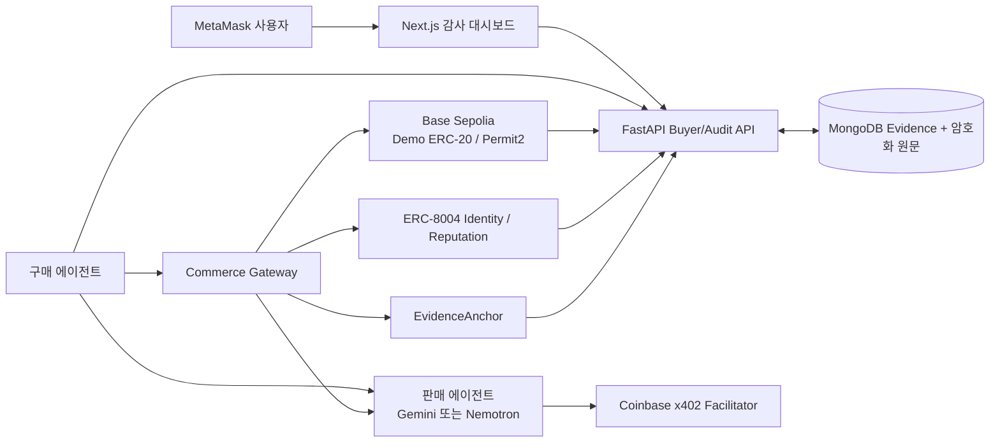

# 로컬 완료 및 외부 실행 인계

## 현재 로컬 완료 범위

요청·견적·결정·예산 예약·x402 Permit2 결제·독립 영수증 검증·전달·결정적 감사·ERC-8004 평판·외부 evidence anchor를 `purchaseId`로 연결하는 코드와 테스트가 완료됐다. Gemini/Nemotron은 공통 판매 계약 뒤에 있고, AI 추론 UI만 `apps/dashboard/src/features/ai-inference/`에 분리되어 다른 구매 도메인이 공통 결제·감사 코드를 재사용할 수 있다.



## 로컬 실행

시크릿은 채팅에 붙이지 않는다. 별도 터미널에서 다음을 실행한다.

```bash
cd /Users/vien/MyProjects/PBL
python3 scripts/setup_keys.py
```

기본 `PROVIDER_MODE=mock`에서는 Gemini/Nemotron API 키가 필요 없다. 실제 provider 응답을 검증할 때만 `python3 scripts/input_provider_keys.py`를 실행하고 `PROVIDER_MODE=real`로 바꾼다.

일반 개발:

```bash
npm run setup:python
npm run api
npm run dashboard
```

MongoDB·API·대시보드 Compose:

```bash
set -a
source .env.local
set +a
docker compose -f infra/docker/compose.yml --profile app up --build
```

실제 provider key, 배포 주소, ERC-8004 agent ID까지 채운 뒤 두 Seller와 Gateway를 함께 실행하려면:

```bash
docker compose -f infra/docker/compose.yml --profile app --profile agents up --build
```

Gateway는 `seller-gemini`와 `seller-nemotron`을 선택된 `sellerAgentId`로 라우팅한다. 외부 호출은 `GATEWAY_SERVICE_TOKEN` bearer 인증이 필요하다. hash 없는 `RECONCILIATION_REQUIRED`에서는 새 결제 서명이나 제출을 만들지 않고, 인증된 seller 복구 endpoint가 MongoDB의 durable `SUBMITTED`/`SETTLED` journal을 재개한다. 회수한 거래 hash는 별도 `PAYMENT_SUBMISSION_IDENTIFIED` CAS로 `None → tx` 한 번만 결속한다. 해당 journal도 없으면 안전하게 중단된 상태를 유지한다.

Provider 호출 직전에는 `PROVIDER_SUBMITTED`, 결정적 attempt ID, 호출자별 획득 토큰을 CAS로 먼저 저장한다. 동시 복구에서는 저장된 획득 토큰과 일치하는 단 한 호출자만 provider를 실행한다. 이 저장 이후 결과의 성공 여부가 불명확해지면 provider를 다시 호출하지 않고 전달 조정 필요 상태로 남겨, 중복 유료 추론보다 보수적 실패를 선택한다.

현재 MVP 배포 불변식은 seller별 활성 writer replica 1개와 Gateway 활성 writer replica 1개다. 프로세스 내부 single-flight, provider-attempt CAS 획득 토큰, MongoDB durable journal은 현 배포의 동시 요청과 재시작을 견디지만, 전체 active-active 수평 확장 전에 분산 lease 또는 nonce 조정 계층을 추가해야 한다.

검증:

```bash
npm run lint
npm test
npm run test:mongo:local
npm audit --omit=dev
```

## 실제 Base Sepolia smoke 순서

사전 상태 확인과 배포는 개인키를 출력하지 않는 전용 스크립트를 사용한다.

```bash
cd /Users/vien/MyProjects/PBL
npm run chain:status
npm run chain:deploy
npm run erc8004:status
npm run erc8004:register
npm run smoke:x402
```

배포 거래는 성공했지만 후속 writer 등록 또는 로컬 주소 저장 전에 중단됐다면 새 계약을 중복 배포하지 않는다. 온체인 주소와 owner·초기 buyer 잔액을 검증한 뒤 다음 복구 명령을 사용한다.

```bash
cd /Users/vien/MyProjects/PBL
npm run chain:recover -- <PBLC_ADDRESS> <EVIDENCE_ANCHOR_ADDRESS>
```

현재 Base Sepolia 배포:

- PBLC: [`0x9DFFfdDcF5d7E526Bda60728e4c8F79dBA50CeD9`](https://base-sepolia.blockscout.com/address/0x9DFFfdDcF5d7E526Bda60728e4c8F79dBA50CeD9)
- EvidenceAnchor: [`0x31691806C02ca6921a9Bac7AF0972302F8CfA101`](https://base-sepolia.blockscout.com/address/0x31691806C02ca6921a9Bac7AF0972302F8CfA101)
- buyer writer 등록: [`0x217ccb4ef2ec1f08019b4d73f5e8d195c67f798b027972b94ab8eb488ebabd1b`](https://base-sepolia.blockscout.com/tx/0x217ccb4ef2ec1f08019b4d73f5e8d195c67f798b027972b94ab8eb488ebabd1b)

현재 ERC-8004 판매 에이전트 등록:

- Gemini agent ID `9154`: [등록](https://base-sepolia.blockscout.com/tx/0xf8838103943775b7890becbf8d4afb8ce44a33b6ddecec99b6fd53277b83186a), [agent wallet 연결](https://base-sepolia.blockscout.com/tx/0xbd51221ea1ff82ab8d690dcf63493f8bfa58dad7799601296b9aa03a55541362)
- Nemotron agent ID `9155`: [등록](https://base-sepolia.blockscout.com/tx/0xc3d570a4cb87d9b854df8c3a875ec8bbcd3d59b101700dce1b290e879210e212), [agent wallet 연결](https://base-sepolia.blockscout.com/tx/0xdd5aeaa8e97f62295bb3be3f9d71dca40f88d36836f4d7799767eac41e26f1e8)
- 두 identity NFT의 owner는 deployer이고 `getAgentWallet`은 각각의 seller signer와 일치한다. `npm run erc8004:status`가 registry version과 두 결속을 RPC에서 다시 검증한다.

1. `npm run chain:status`에 표시되는 전용 deployer 주소에 계약 배포용 Base Sepolia ETH만 준비한다. buyer 주소에는 x402 결제용 ETH를 넣지 않는다.
2. `DemoToken`과 `EvidenceAnchor`를 deployer로 배포하고, buyer를 EvidenceAnchor writer로 등록한 거래와 온체인 상태를 확인한 뒤에만 주소를 `.env.local`에 주입한다.
3. 배포 constructor가 1,000,000 PBLC를 buyer-agent wallet에 직접 발행한다. PBLC는 admin이 추가 mint할 수 있으므로 token faucet을 사용하지 않는다.
4. buyer는 결제액과 같은 EIP-2612 permit만 오프체인 서명한다. x402.org Facilitator가 canonical Permit2 승인과 settlement 가스를 부담하며 수동 allowance 거래는 없다.
5. `npm run erc8004:register`로 Gemini/Nemotron 판매 에이전트를 ERC-8004에 등록한다. deployer가 NFT owner와 가스를 담당하고 각 seller는 자기 agent wallet 지정에 오프체인 서명하며, 검증된 agent ID는 `.env.local`에 저장된다.
6. API 키가 필요 없는 x402.org testnet Facilitator로 한 요청을 실행한다.
7. Facilitator 응답과 별개로 RPC receipt의 status, token contract, 정확한 `Transfer(from,to,amount)`를 확인한다.
8. provider response hash를 기록하고 감사를 실행한다.
9. 감사 서버가 선택 agent ID·객관적 성공 100 또는 확정 실패 0·audit bundle hash를 먼저 확정한 뒤 ERC-8004 feedback을 제출한다.
10. 평판 tx의 정확한 `NewFeedback(agentId,value,tags,feedbackHash)`와 EvidenceAnchor event를 receipt에서 확인한 뒤 MongoDB evidence에 기록한다.
11. 대시보드 거래 상세에서 request→decision→tx→delivery hash→audit→reputation/anchor 링크를 캡처한다.

### 2026-09-02 실거래 결과

- 성공 구매 ID: `14f37c54-e26c-4ab4-83e6-cbc7c2a7c473`
- buyer ETH 0 상태의 x402 결제: [`0xe8529c17bb1a4998a4ee75cf7b782a0b465cd286bb9005b0c318f22ddb33b680`](https://base-sepolia.blockscout.com/tx/0xe8529c17bb1a4998a4ee75cf7b782a0b465cd286bb9005b0c318f22ddb33b680)
  - buyer → Gemini seller, `100000` raw units = `0.1 PBLC`
  - buyer가 서명한 EIP-2612 permit을 x402.org Facilitator가 제출해 결제 가스를 부담했다.
  - 독립 RPC 영수증 검증 결과 block `46292655`, Transfer log index `23`, receipt status `1`이다.
- 감사 결과: `NORMAL`, findings `[]`, audit bundle `sha256:436eceace08c3f38d1615bc8cc9105993a558cbd342320d7f19589576c55af38`
- ERC-8004 feedback: [`0x5702e3ca225e3d0089a14bbc0e7aad851cebe2f6aebc4d230f1dad83d717f491`](https://base-sepolia.blockscout.com/tx/0x5702e3ca225e3d0089a14bbc0e7aad851cebe2f6aebc4d230f1dad83d717f491)
  - Gemini agent ID `9154`, value `100`, tags `pbl-audit`/`payment-outcome`, feedback hash가 위 audit bundle과 일치한다.
- EvidenceAnchor: [`0xe2a5991639316b16dd30385551d8de02b2838618b1fd88e1a4fc8f455ec21bb0`](https://base-sepolia.blockscout.com/tx/0xe2a5991639316b16dd30385551d8de02b2838618b1fd88e1a4fc8f455ec21bb0)
  - 온체인 checkpoint는 event count `11`, head `0xff6b...bb6a2`다.
  - MongoDB의 12번째 `EVIDENCE_ANCHORED` 이벤트가 해당 tx를 결속하므로 앵커 자신을 앵커링하는 순환 참조가 없다.
- 첫 실거래 `0xdcc3c9781e7ca5a38eadfd8d2a641110b4e2f70f013052a95a072e6c81f1d9c1`도 실제 `0.1 PBLC`를 정산했지만 mock model version 불일치를 감지해 `AUD-DELIVERY-MISSING` 위험으로 종결됐다. 이 실패 증거는 삭제하지 않는다.
- x402 결제 두 건 뒤 buyer 잔액은 `999,999.8 PBLC`, permit nonce는 `2`, Permit2 allowance는 `0`이었다. 그 뒤 평판·앵커 쓰기 전용으로 `0.0001 ETH`를 별도 공급했다([funding tx](https://base-sepolia.blockscout.com/tx/0x052ced34cc6affb46d67f0807cbdbb3f2a920c879d6f39ae69d2b7cc44ca3336)).
- 재현 스크립트 `npm run smoke:x402`는 시크릿·원문 prompt·서명·provider 응답 본문을 출력하지 않는다.

## AWS 인계

`infra/aws/terraform/`은 ECS Fargate task, CloudWatch, 명시적 Secrets Manager ARN 계약을 정의한다. 기본 `enable_services=false`이므로 실제 서비스와 비용은 생성하지 않는다. ALB/HTTPS/WAF, VPC ingress, ECR 이미지, MongoDB Atlas 네트워크, CloudWatch alarm은 실제 배포 계정 정보가 정해진 뒤 추가한다.

## 공개 배포 전 차단 게이트

- 민감 prompt/response는 현재 MVP 정책 B에 따라 자동 삭제하지 않는다. **공개 AWS 배포 전에 TTL 또는 수동 삭제 정책과 시연 증거 보존 범위를 다시 결정해야 한다.**
- Base Sepolia x402 payment, ERC-8004 feedback, EvidenceAnchor checkpoint 증거는 위 실거래 결과로 완료됐다. provider 응답은 아직 `PROVIDER_MODE=mock`이므로 실제 Gemini/Nemotron response ID 검증은 남아 있다.
- 개인 비공개 GitHub 저장소는 `codenameVien/ai-agent-payment-audit`로 연결되어 있다.
- AWS 비용·외부 쓰기 권한 승인이 아직 없다.
- 자동 브라우저 제어가 제공되지 않은 세션이라 실거래 상세 화면 캡처는 남아 있다. 대시보드 production build와 `/purchases/[purchaseId]` route 생성은 통과했다.
- Terraform CLI가 현재 로컬에 없어 `terraform validate`는 실행하지 못했다. 설치 후 `terraform fmt -check && terraform init -backend=false && terraform validate`를 실행한다.
